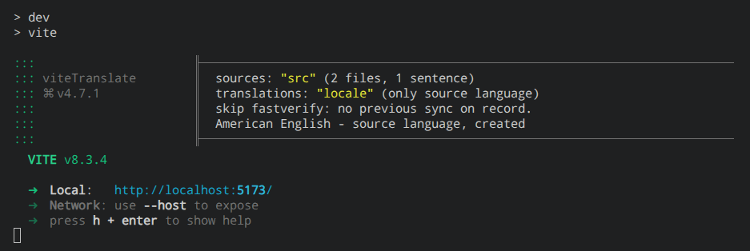
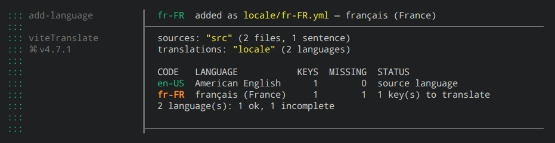
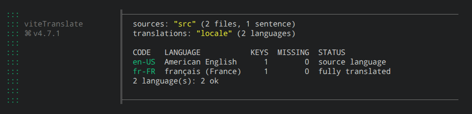

<div align="center">


**A simpler translation workflow for React and Vite.**

Write text naturally in JSX. viteTranslate extracts strings, keeps locale files in sync, and compiles translations as part of your Vite workflow. <b> No hand-written keys. No separate extraction workflow. No extra runtime dependencies.</b>

[](https://vite.dev)
[](https://www.npmjs.com/package/@sepoina/vitetranslate)
[](https://www.npmjs.com/package/@sepoina/vitetranslate)
[](#-why-vitetranslate)
[](https://marketplace.visualstudio.com/items?itemName=sepoina.vitetranslate-ide)

[**Playground**](https://sepoina.github.io/viteTranslate/playground/) · [**Quick start**](#-quick-start) · [**VS Code**](#vs-code-extension) · [**Guides**](#guides)

<a href="https://youtu.be/pNM9ybG0uO4">
  
</a>

</div>

---

## 🚀 Quick start

### 1. Install and register the plugin

```sh
npm install @sepoina/vitetranslate   # React 18/19, Node 18+
```

```js
// vite.config.js
import { defineConfig } from "vite";
import react from "@vitejs/plugin-react";
import { vitetranslate } from "@sepoina/vitetranslate";

export default defineConfig({
  plugins: [
    react(),
    vitetranslate({
      localeDir: "locale",
      sourceLanguage: "en-US",
    }),
  ],
});
```

### 2. Write text where it belongs

Wrap the app once:

```jsx
// src/main.jsx
import { TransContainer } from "@sepoina/vitetranslate/react";

<TransContainer initialLanguage="en-US">
  <App name="Ada" />
</TransContainer>
```

Then write sentences as they are, values and tags included:

```jsx
// src/App.jsx
import { Trans } from "@sepoina/vitetranslate/react";

export default function App({ name }) {
  return <Trans>Welcome back, <b>{name}</b>!</Trans>;
}
```

No key to invent, no duplicate string to maintain.

### 3. Start Vite: the source table writes itself

```sh
npm run dev
```



```yaml
# locale/en-US.yml
App_zn6492: "Welcome back, <b>{name}</b>!"
```

Keys are generated for you. The sync runs at every `vite dev` start and before every build: new keys in, stale ones out, and a string that moves keeps its translation.

### 4. Add a language

From a second terminal, the dev server can keep running:

```sh
npx vitetranslate --add fr-FR
```



```yaml
# locale/fr-FR.yml
App_zn6492: null
```

### 5. Translate

Replace each `null` by hand ([file format](doc/translations.md)) or let an [LLM](#llm-auto-translation) do it:

```yaml
# locale/fr-FR.yml
App_zn6492: "Bon retour, <b>{name}</b> !"
```

Then check where you stand. `--status` writes nothing, so it doubles as a CI check:

```sh
npx vitetranslate --status
```



Until a key is translated the page shows the source text, never a blank. In dev, saving a table reloads the page.

### 6. Switch language and ship

```jsx
import { useTransLanguage } from "@sepoina/vitetranslate/react";

const { proposeNewLanguage } = useTransLanguage();
<button onClick={() => proposeNewLanguage({ lang: "fr-FR" })}>Français</button>
```

`npm run build`: each language compiles to its own chunk, loaded when selected ([React API](doc/react-api.md#usetranslatelanguage)).

[**Try it in the playground 🡭**](https://sepoina.github.io/viteTranslate/playground/) · [StackBlitz 🡭](https://stackblitz.com/github/sepoina/viteTranslate/tree/main/demo/Vite_8/minimal?file=locale%2Fit-IT.yml)

<details>
<summary>🡷 <b>Next steps: plain strings, short names, plurals and dates</b></summary>

<br />

**Plain strings** — attributes, titles, anything that isn't JSX — go through `` trans`…` ``. Live in the [playground](https://sepoina.github.io/viteTranslate/playground/):

```jsx
import { Trans, useTrans } from "@sepoina/vitetranslate/react";

function App({ name }) {
  const trans = useTrans();
  return (
    <>
      <Trans>Nice to meet you, <b>{name}</b></Trans>
      <input placeholder={trans`Write to ${name}`} />
    </>
  );
}
```

`Trans`, `useTrans`, `TransContainer`, `useTransLanguage` are the short names of `Translate`, `useTranslateToString`, `TranslateContainer`, `useTranslateLanguage`: same functions, both work.

**Plurals and dates** go in a string marked `_%_…_%_`: see **[ICU messages](doc/icu.md)**. Prefer other delimiters? `markerStart`/`markerEnd` — see [plugin options](doc/plugin-options.md#markers).

</details>

<details>
<summary>🡷 <b>CLI commands: sync, add languages, CI check, LLM</b></summary>

<br />

Run `npx vitetranslate` from the project root. Tired of `npx`? This installs a tiny [launcher](launcher#readme) that runs each project's own version:

```sh
npm i -g vitetranslate
```

| Command | Does |
| :- | :- |
| `vitetranslate` | Full sync: new keys in, stale ones out, renamed strings keep their translation |
| `vitetranslate --add fr-FR de-DE` | Adds languages, each file listing every key with `null` to fill |
| `vitetranslate --status` | Reports every table and writes nothing. Exits `1` on errors only, so it works as a CI check |
| `vitetranslate --llm-translate` | Fills the `null` keys through an LLM — see [below](#llm-auto-translation) |

Full reference: **[doc/cli.md](doc/cli.md)**.

</details>

[**&nbsp;&nbsp; Full setup and React API 🡭**](doc/react-api.md)

>[!TIP]
> ##  What you get
>
> **Less manual work.** Extraction and sync run inside Vite, not as a separate command to remember.
>
>**A lightweight runtime.** 5 kB gzip, no extra runtime dependencies, and no message parsing at runtime.
>
>**Tools where you need them.** A CLI for sync, CI checks and guarded LLM translation; a VS Code extension showing every string and its status.
>
>**Ready for real interfaces.** [ICU](doc/icu.md) plurals, select, numbers and dates; lazy-loaded locales; the source text as fallback until translated; a safe subset of HTML tags.

## VS Code extension

Every marked string with its translation status, locale files opened at the key, Sync and LLM one click away.

[**Install from the Marketplace 🡭**](https://marketplace.visualstudio.com/items?itemName=sepoina.vitetranslate-ide) · [Extension guide 🡭](doc/ide-panel.md)

## LLM auto-translation

`npx vitetranslate --llm-translate` fills missing entries through any OpenAI-compatible API or your own driver. It prints the cost first, respects your budget, validates every result before writing, and never runs during `vite dev`.

[**LLM guide 🡭**](doc/llm.md) · [**Translated restaurant demo 🡭**](https://sepoina.github.io/viteTranslate/llmrestaurant/)

---

## ⚡ Why viteTranslate

<!-- LINKED-DATA: site/landing/src/Compare.jsx (ROWS) shows these rows too, License excluded. A mark changed here changes there, with its note below and the date. Feature links point to viteTranslate's own guide for that row: same targets as `doc` there, and its en-US labels (site/landing/locale/en-US.yml) use these words. -->

| Feature | viteTranslate | i18next | Lingui | FormatJS |
| :- | :-: | :-: | :-: | :-: |
| [LLM auto-translation](doc/llm.md) ¹ | ✅ | 🟡 | ❌ | ❌ |
| [Extraction inside the Vite lifecycle](doc/structure.md#auto-sync-at-config-time) ² | ✅ | ❌ | ❌ | ❌ |
| [Zero runtime dependencies](doc/requirements.md#it-never-reaches-your-bundle) | ✅ | ❌ | ❌ | ❌ |
| [Official Vite plugin](doc/plugin-options.md) | ✅ | ❌ | ✅ | ✅ |
| [Official VS Code extension](doc/ide-panel.md) | ✅ | ❌ | ❌ | ❌ |
| [Keyless / Natural text syntax](doc/react-api.md#write-jsx-inside-translate) ³ | ✅ | 🟡 | ✅ | 🟡 |
| [Tiny runtime (<6 kB gzip)](doc/structure.md#phase-4--runtime-the-resolution-chain) ⁴ | ✅ | ❌ | ✅ | ❌ |
| [ICU MessageFormat (plurals, select, dates)](doc/icu.md) | ✅ | 🟡 | ✅ | ✅ |
| [No message parsing at runtime](doc/structure.md#2b-table-compilation-pre-building-values) ⁵ | ✅ | ❌ | 🟡 | 🟡 |
| [Lazy-loaded locales](doc/react-api.md#preloading-suspense-and-the-initial-flash) | ✅ | ✅ | ✅ | ✅ |
| [License](LICENSE) | Apache-2.0 | MIT | MIT | BSD-3-Clause |

<small>✅ out of the box · 🟡 official add-on or extra setup · ❌ not offered. <br />As of September 2026: i18next 26 + react-i18next 17, Lingui 6, FormatJS (react-intl 12).</small>

<details>
<summary>
🡷 <b>Notes on the comparison, and what each feature buys you</b>
</summary>

<br />

- **How to read it:** a ❌ means the project's own tooling doesn't offer it — a third-party tool may still fill the gap. Every mark below says where it comes from.
- **¹ LLM auto-translation:** `npx vitetranslate --llm-translate` fills the untranslated keys through the model you configure — any OpenAI-compatible API, or your own driver. It prints the cost first, asks before spending, and a validator refuses anything that would break at runtime (lost `%s`, mangled tags). See [the LLM guide](doc/llm.md), 🎮 [the walkthrough](https://sepoina.github.io/viteTranslate/playground/#install-llm), or [the restaurant](https://sepoina.github.io/viteTranslate/llmrestaurant/) it translated. The i18next team offers AI translation through Locize, its paid hosted service, wired into `i18next-cli`. Lingui has an [open RFC](https://github.com/lingui/js-lingui/discussions/2392) and community tools; FormatJS leaves translation to your TMS.
- **² Extraction inside the Vite lifecycle:** the plugin extracts the markers and syncs one YAML table per language by itself — a quick check when `vite dev` starts, a full scan before every build. Missing keys added, stale ones removed, the rest reported; a string that moved keeps its translation. 🎮 [Live](https://sepoina.github.io/viteTranslate/playground/#install-sync). The others extract with a separate command: `i18next-cli extract` and `lingui extract` (both with a `--watch` mode) sync every language file; `formatjs extract` writes the source language only, the rest comes from your TMS.
- **Zero runtime dependencies:** none declared, and not on trust: the test suite asserts that the browser runtime imports nothing beyond React and the virtual module. `@babel/core` and Vite are _peer_ dependencies: they run the plugin on your machine and never enter the bundle. React is the one your app already ships. For comparison, `react-i18next` depends on three packages (i18next core on none), `@lingui/react` on `use-sync-external-store` plus Lingui's own packages, `react-intl` on three FormatJS packages.
- **Official Vite plugin:** viteTranslate's does the whole job — extraction, sync, compilation, one chunk per language — with the same code from Vite 5 to 8. Lingui's `@lingui/vite-plugin` compiles catalogs (its macros still need a Babel or SWC plugin); FormatJS's `@formatjs/unplugin` generates IDs and pre-parses messages. i18next has none, and needs none: there is nothing to compile.
- **Official VS Code extension:** [viteTranslate's](#vs-code-extension) lists every marked string with its translation status, opens the language file right on the key, runs Sync and the LLM in one click, and highlights marked strings as you type. It asks the library installed in your project, so the panel and the CLI never disagree. Still in preview. None of the others ships one of its own: i18next and react-intl rely on third-party extensions, such as Lokalise's [i18n Ally](https://marketplace.visualstudio.com/items?itemName=lokalise.i18n-ally) or inlang's [Sherlock](https://marketplace.visualstudio.com/items?itemName=inlang.vs-code-extension) (i18next only); neither lists Lingui among its supported libraries.
- **³ Keyless syntax:** the sentence you write in JSX is the source — values, tags and links included — and its key is generated at build time and resolved against the current table at runtime: no key to invent, nothing to keep in sync by hand. 🎮 [Live](https://sepoina.github.io/viteTranslate/playground/#static-text). Lingui does the same with its macros; FormatJS generates IDs through its Babel/SWC plugins or `@formatjs/unplugin`. i18next can use the sentence as the key (`keySeparator: false`, `nsSeparator: false`): possible, say its docs, but not recommended.
- **ICU MessageFormat:** plurals, `select`, numbers and dates — compiled at build time, same as everything else. One deliberate deviation: an apostrophe is always an apostrophe, never ICU quoting. i18next has its own plural and context syntax built in; ICU needs the official `i18next-icu` plugin. See [the ICU guide](doc/icu.md) — 🎮 [plurals](https://sepoina.github.io/viteTranslate/playground/#icu-plural), [select](https://sepoina.github.io/viteTranslate/playground/#icu-select), [dates](https://sepoina.github.io/viteTranslate/playground/#icu-format), 🧪 [edge cases](https://sepoina.github.io/viteTranslate/edge/#icu).
- **⁴ Runtime size:** viteTranslate's browser runtime weighs 5 kB gzip — `6036 bytes` exactly: 4842 B for the React runtime plus 1194 B for the ICU helpers, which ship only when a table uses ICU. Measured by `npm run estimateSize`, the source of truth for this number, on the whole API. The others, with the same tools (rolldown, minified, gzip, React left out) on what a basic app imports — provider, component, hook — in September 2026: Lingui 3 kB (smaller, yes), react-intl 13 kB (6 kB with its `no-parser` alias), i18next + react-i18next 19 kB. Imports, plugins and polyfills move every figure: read them as orders of magnitude.
- **⁵ No message parsing at runtime:** tables are compiled at build time into ready-made values. In a production build `<Translate>` parses nothing, neither ICU nor HTML — which is also why it renders server-side. Lingui precompiles ICU, but splits the `<0>…</0>` component tags of the translated string with a regular expression at every render (`formatElements`). FormatJS pre-parses with `formatjs compile --ast`, and drops the parser only if you alias it to its `no-parser` build. i18next interpolates at runtime, and `i18next-icu` parses there too.
- **Lazy-loaded locales:** each language is its own chunk, `import()`-ed only when selected — no loader to write. 🎮 [Live](https://sepoina.github.io/viteTranslate/playground/#language-switch). The others load catalogs through their API, from an `import()` you write, or a backend plugin for i18next.
- **Dev fallback, always visible:** until a translation exists you get the original text. Never a blank, never a crash — and a [mark](doc/diagnostics.md) says so, in development only.
- **Small, safe HTML subset:** `<b> <strong> <i> <em> <u> <small> <code> <br> <hr> <wbr>` and nothing else. Everything outside it is unwrapped to plain text, and no attribute is ever forwarded. 🎮 [Live](https://sepoina.github.io/viteTranslate/playground/#markup), 🧪 [broken markup included](https://sepoina.github.io/viteTranslate/edge/#html).

</details>


>[!IMPORTANT]
> ## Guides
>
> - **[CLI](doc/cli.md)** — sync, `--add`, `--status` as a CI check, and what to do when the sync stops
> - **[React API](doc/react-api.md)** — every component and hook, language switching, preloading
> - **[Plugin options](doc/plugin-options.md)** — everything `vitetranslate()` accepts: folders, auto-sync, markers, diagnostics
> - **[LLM translation](doc/llm.md)** — fill the `null`s with any OpenAI-compatible model, on a budget, validated
> - **[ICU messages](doc/icu.md)** — plurals, select, numbers and dates, compiled at build time
> - **[Translation file format](doc/translations.md)** — what's inside `locale/*.yml`, and how to add a language
> - **[VS Code panel](doc/ide-panel.md)** — every string and its status, tables opened at the key, Sync and LLM in one click
>
> More: [Architecture](doc/structure.md) · [Known limitations](doc/limitations.md) · [Requirements](doc/requirements.md) · [Live examples](doc/live-examples.md)
>
> ## Links
>
> [Live site](https://sepoina.github.io/viteTranslate/) · [Discussions](https://github.com/sepoina/viteTranslate/discussions) · [Issues](https://github.com/sepoina/viteTranslate/issues) · [Provenance](https://docs.npmjs.com/trusted-publishers/) · [Apache-2.0 license](LICENSE)


☕ [PayPal](https://www.paypal.com/paypalme/giancarloghigi) · [Buy Me a Coffee](https://www.buymeacoffee.com/giancarlogy)
if it saved you a few translation keys.
