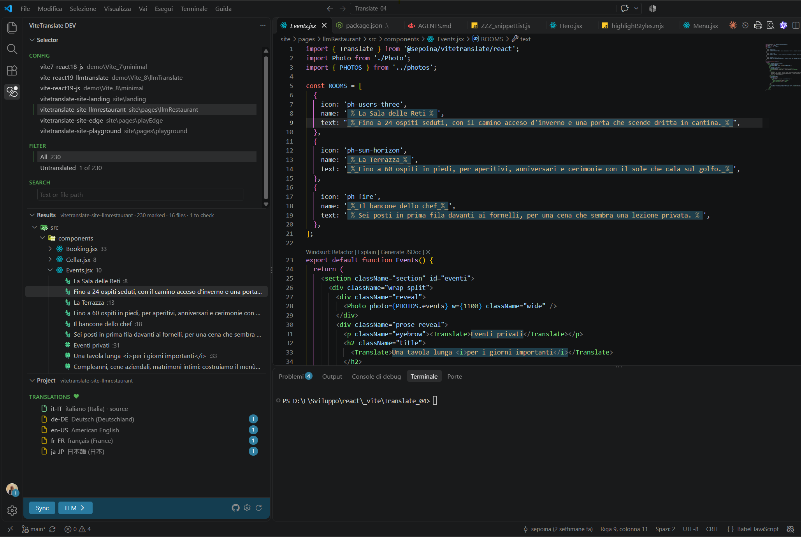
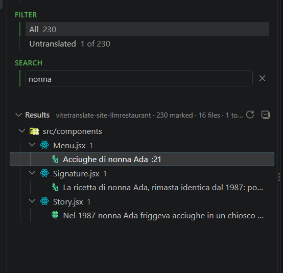
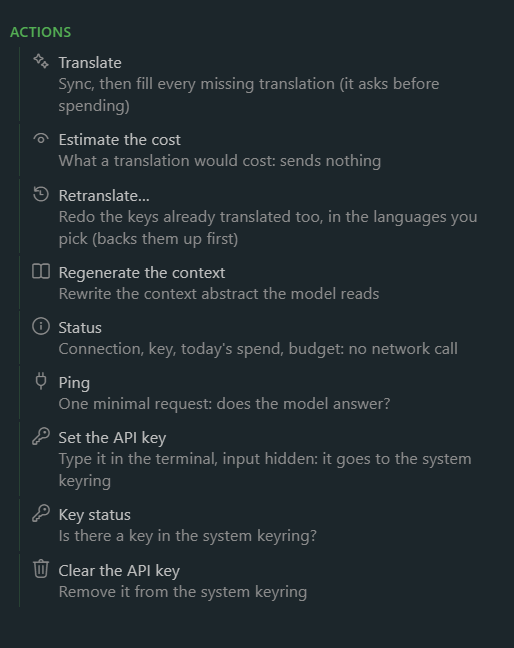
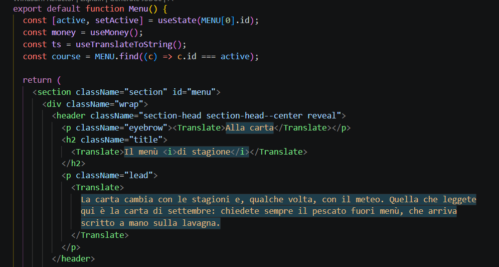

# The VS Code panel, piece by piece

> The [extension README](../idePlugin/README.md) covers what it does and how to start. This is the full tour: every section, every glyph, every button.

Click the % icon in the Activity Bar. At startup a single **Loading** page shows the logo and what it's reading; **Selector**, **Results** and **Project** take over once they have something true to say. Open and close them like any sidebar section.

## Selector

What you look at, and what to do with it. Top to bottom:

- **Config**: every Vite project in the workspace, one row each: its `package.json` name and its folder. Click one and it's *the* project, for **Results** and **Project**. Only one project? Nothing to choose, so no list.
- **Filter**: what **Results** shows. **All**, **Malformed** (‼️, unreadable files too), **Not synced** (🔄) or **Untranslated** (🔸 🔹), each with its count. Only the ones with something inside show up, and when all is well the filter steps aside.
- **Search**: narrows **Results** to the entries whose text, or file path, contains what you type. No case, no accents: `citta` finds *Città*. It shows up once there's something to search, and stays while you type, even when nothing matches. <kbd>Esc</kbd>, or the × on its right, clears it.

## Results

Every string the project marks for translation, file by file: the folders of `srcDir`, only the files that have something marked, and under each file its entries in source order. Click an entry and the cursor lands on it. Save a file (or a language file) and the list follows.

One glyph in front of each entry says how it's doing. Trouble wears the same glyphs your app shows on screen: your `errorSolve.mark` ([diagnostics](diagnostics.md)), or the defaults.

| | means |
| --- | --- |
| ‼️ | *malformed*: the extraction complained right there (nested or unpaired `_%_`, a rejected macro) |
| 🔄 | *not synced*: not in the language files yet. Run the sync (this one is the panel's own) |
| 🔸 | *untranslated*: `null` in every target language |
| 🔹 | *not fully translated*: still `null` somewhere |

All good is green, and the shade tells you how it's written:

| | written as |
| --- | --- |
| 🟢 | `"_%_…_%_"` in code |
| ✅ | marked JSX text or attribute |
| ❇️ | `<Trans>…</Trans>`, or a marked sentence with tags and values (`autoWrap`) |
| ✳️ | `` trans`…` ``, or a marked template with `${…}` |

Hover an entry for the details: which languages are missing, what the extraction said.

## Project

The selected project, and what to do with it. The languages scroll; the command bar stays put at the bottom.

- **Translations**: the language files in `localeDir`, one row each: the language code and its name in that language, the source first. Click one to open it. An entry selected in **Results**? It opens right on that key, cursor on the translation: fix it there. A ♥ next to the title says so (hover for the key); pick a file or a folder, or hide Results, and it's gone. The icon tells you how the file is doing: green for the source, yellow when translations are missing (the badge says how many), red when it can't be read, plain when it's complete. No files yet? One line says why.
- **The command bar**: **Sync** runs the project's own `vtranslate-cli` in a terminal, and **LLM** swaps **Results** for the [LLM page](#llm). On the right: GitHub, ⚙ [Settings](#settings), ↻ refresh.

Keep **Project** at least as tall as its command bar: drag it to nothing and the bar goes too.

## Pages that take over: Settings, LLM, Help

These take the panel for themselves: **Selector**, **Results** and **Project** step aside (nothing to pick while you're here) and the background takes a tint of your theme's accent. The command bar stays, same look: **← Back** on the left, plus the page's own commands if it has any; on the right, the page's icon. Back puts everything where it was (so does the ← in the section title).

### Settings

Click ⚙ in **Project**. On top, the logo. Then, under **CONFIG**, one row per setting:

- **Highlight style**: each style with a sample; click one, editors switch at once.
- **Vite config**: `vite.config`, opened right on the `vitetranslate({…})` options.
- **Detailed config**: the extension's own settings in VS Code.
- **Local file status**: what the selected project's files say.
  - **vitetranslate**: the plugin options as resolved: source language, locale folder, preloaded languages, auto-sync, `autoWrap`, `markers` (your delimiters, `_%_ … _%_` when default), ICU time zone, the `llm` block (model, endpoint, budget, the *name* of the key variable, never the key). Unset: `default`.
  - **package.json**: the dependencies that matter (`@sepoina/vitetranslate`, `vite`, …) as *declared → installed*, plus the scripts. Click to open.
  - **vite.config**: plugins in load order, server port and host. Click to open.

Under **VERSION**, who's who: this extension, the library installed in the project, the oldest library the extension accepts, and the IDE API (how **Results** talks to the library), present / requested. Yellow means missing or too old; hover for why.

### LLM

Click **LLM ›** in **Project**. On top, three lines that answer "can I go?":

- **API key**: *where* it is (an environment variable, `.env.local`, `.env`, the system keyring), never what it is. Not found? It says where it looked.
- **Settings**: which model, at which host, and whether prices are set (without them, costs and budgets count tokens, not money).
- **Ping**: does the model answer? One tiny request, in the background, once per project. No key, no knocking.

Below, the `--llm-*` actions, each explained: translate, estimate the cost, retranslate, regenerate the context, status, ping, set / check / clear the API key. Click one and it runs in a terminal, like Sync. *Check again*, in the bar, redoes the three lines; if one went wrong, the **?** next to it opens the setup guide. More on the flags: [LLM guide](llm.md).

No `llm` block in the plugin options? The button reads **LLM ?** and opens **Help** instead: how to add one, and a button that opens the options in `vite.config`.

### Library missing or too old

**Results** needs `@sepoina/vitetranslate` 4.6.4 or later in the project. No library at all, or an older one? **Results** and **Project** step aside for a page that says what's wrong and the `npm install` that fixes it (**Selector** stays only if there's another project to switch to). It leaves by itself once the library is there, or hit **Check again**.

## Highlighting

Marked strings stand out as you type, in `.js`, `.jsx`, `.ts` and `.tsx`: `_%_…_%_` (or your project's [`markerStart`/`markerEnd`](plugin-options.md#markers), read from its `vite.config`), `<Trans>…</Trans>`, `` trans`…` `` (and their long names). Same rules as the extraction: what lights up gets translated. Until `vite.config` has been read — or in a library older than 4.7.0, or in Restricted Mode, where it is never run — the default `_%_` is used. The sample in Settings stays on `_%_`: it previews the style, not your project. Comments, and code samples inside strings, stay plain. No panel needed.

Fifteen styles, all in your theme's colors. Pick one in [Settings](#settings), each with a sample. Or run **viteTranslate: Choose highlight style…**, which tries each on your code as you move through the list: <kbd>Enter</kbd> keeps it, <kbd>Esc</kbd> changes nothing. Or set `vitetranslate.highlightStyle`, `off` included.

| Style | Looks like | Style | Looks like |
| --- | --- | --- | --- |
| `framed-box` (default) | Box and frame | `link` | Dotted link |
| `badge` | Filled label | `neutral-italic` | Italic only |
| `dotted-escape` | Fine underline | `outlined-chip` | Chip with border |
| `escape-chip` | Chip and ruler | `pill` | Chip on content |
| `highlighter` | Marker effect | `placeholder` | Snippet style |
| `inlay-hint` | Like inlay hints | `quote` | Left accent bar |
| `inset` | Inset backdrop | `selection-veil` | Like selection |
| `keyword-mark` | Keyword accent | | |

## Which project

The one highlighted in **Config**, and it follows you around: switch to a file and its project takes the highlight, while **Results** jumps to that file with its entries open. Same project? Nothing redraws. Picked another one in **Config**? It stays until you switch editor, and across restarts. Until there is one, **Results** and **Project** wait for you.

It works the other way too: put the cursor on a line with a marked string and **Results** selects that entry (with *Filter* on *All*, *Search* empty, and the file saved). Your cursor stays put.

Everything refreshes by itself when a `package.json` or `vite.config.*` changes (and, for **Results**, a source or language file). ↻ does it on demand.

While it catches up, the panel never passes off old news as fresh: a project still loading says *Loading…*, a file you just saved shows ⏳, one with unsaved edits shows ✎, and their entries stop jumping (the lines may have moved) until the new scan lands.

## Under the hood

**Results** asks *your* installed `@sepoina/vitetranslate` (and its `@babel/core`), in a separate process: the same entries `vtranslate-cli` would find, no Babel shipped inside the extension. It's quick because every sync leaves an index of the entries in `node_modules/.viteTranslate/markers.json`, and the panel re-parses only what changed since. After a save Babel stays warm for two minutes, then the process goes away.

**vite.config** is run the way `vtranslate-cli` runs it: in a separate process, never through Vite. No plugin hook runs, nothing gets synced, nothing gets written. A config that hangs is dropped after 15 seconds, and whatever it prints ends up in the **viteTranslate** output channel. In **Restricted Mode** nothing runs: you get `package.json` only, no **Results** and no **Sync**. Trust the workspace to see the rest.

**Sync** and the LLM actions run in a terminal that tidies up after itself: when the CLI is done, press <kbd>Enter</kbd> within 10 seconds to keep it, any other key to close it now, or just look away. If something failed it stays until you press a key: the error is the part worth reading.

**Which runtime they use**: the editor's own. Except on Windows, where that runtime goes mute in a terminal: there they use the `node` in your PATH, the one Vite runs on. No Node in PATH? They still run and you see the output, but they can't ask you anything (*Translate*'s confirmation, the API key), and the terminal waits for a key the usual way. A warning says so, once.

Opening a JS or TS file wakes the extension for the highlighting only: `vite.config` is read, and the project scanned, when you open the panel.
