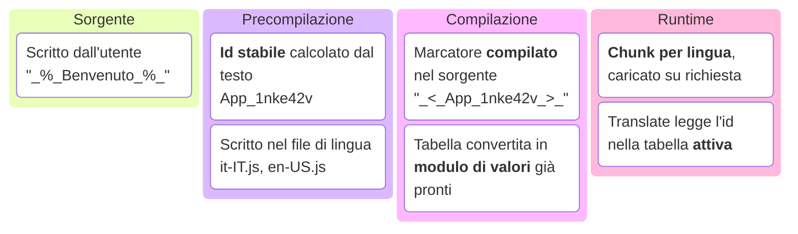
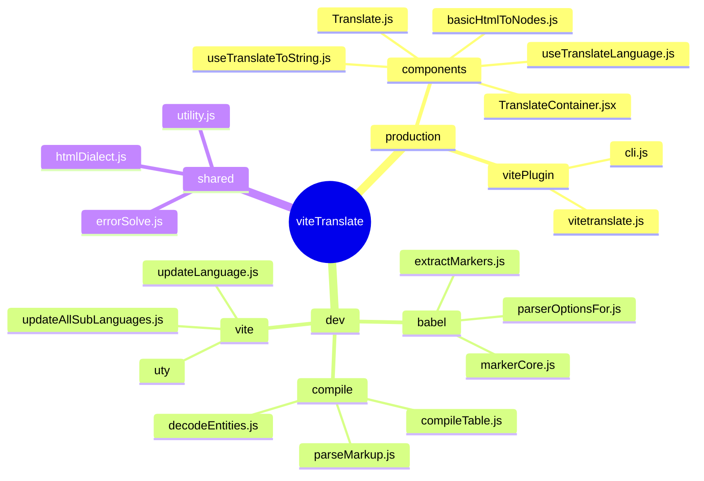
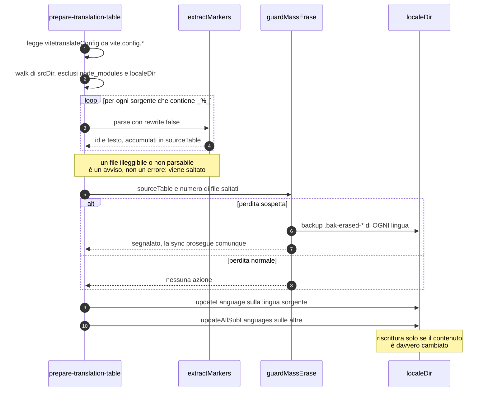
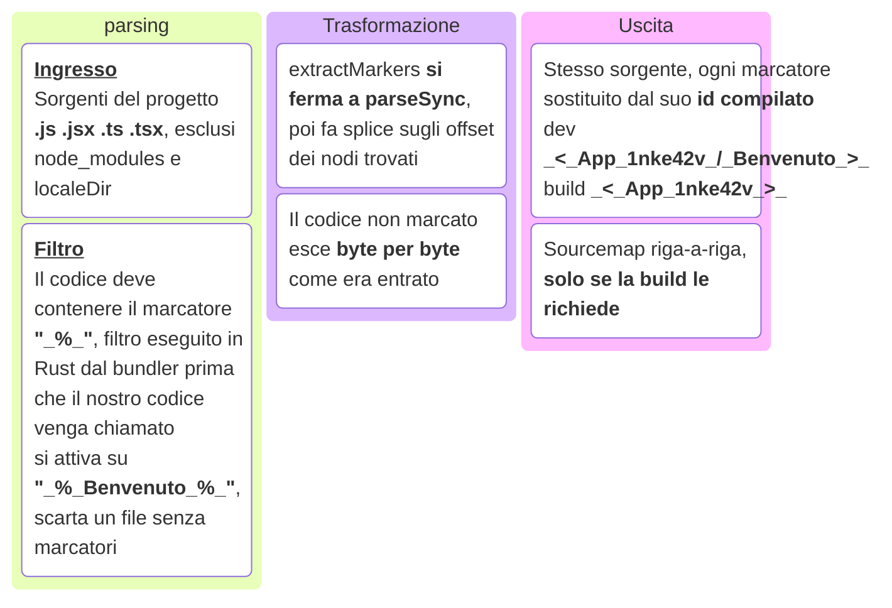
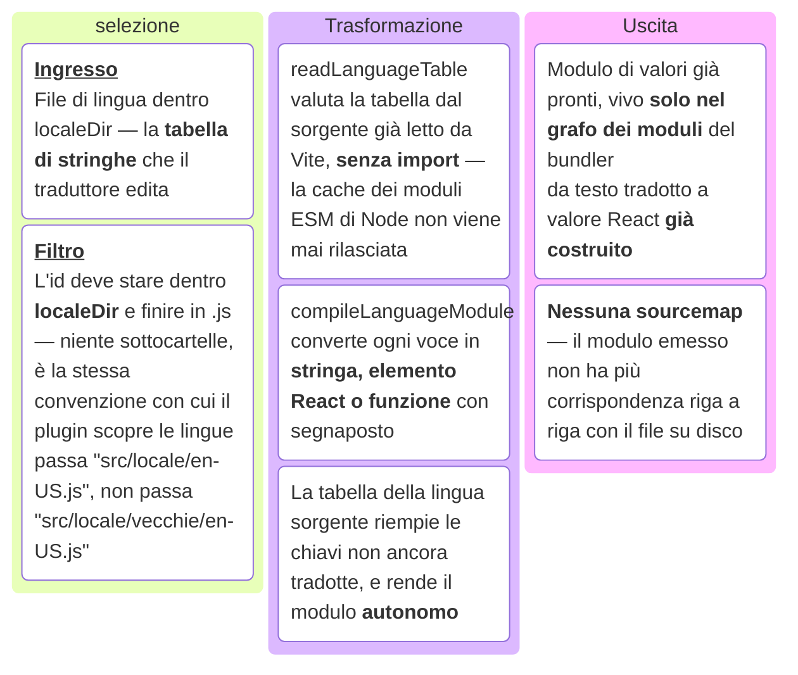
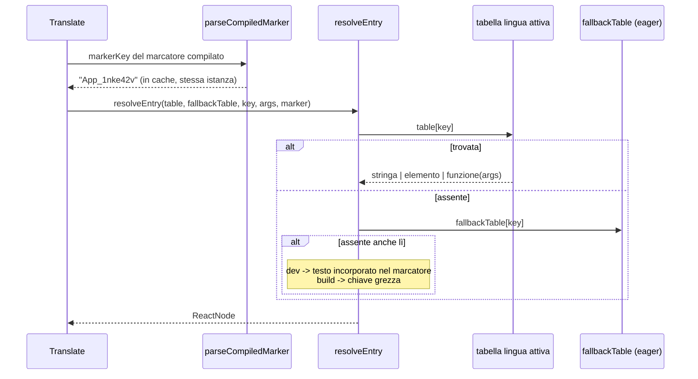
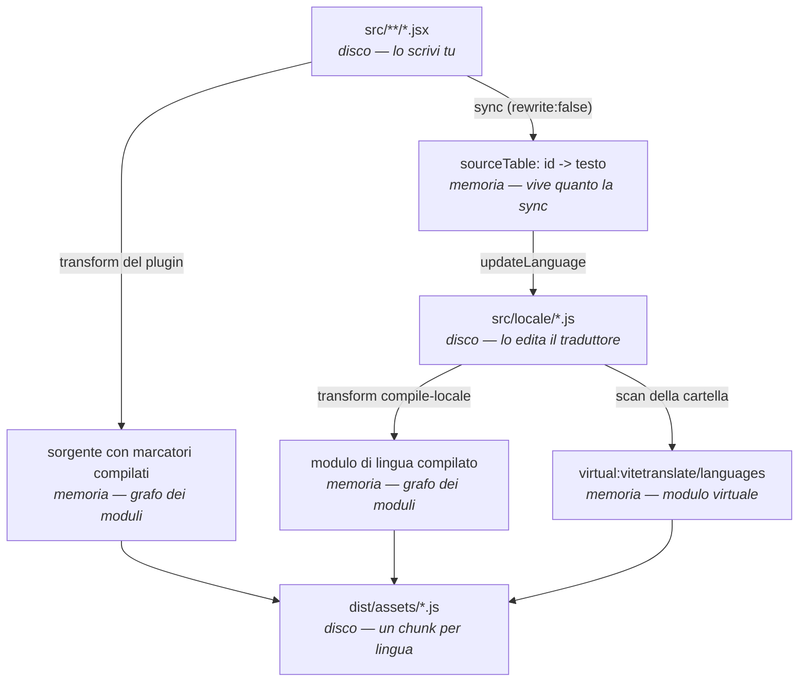
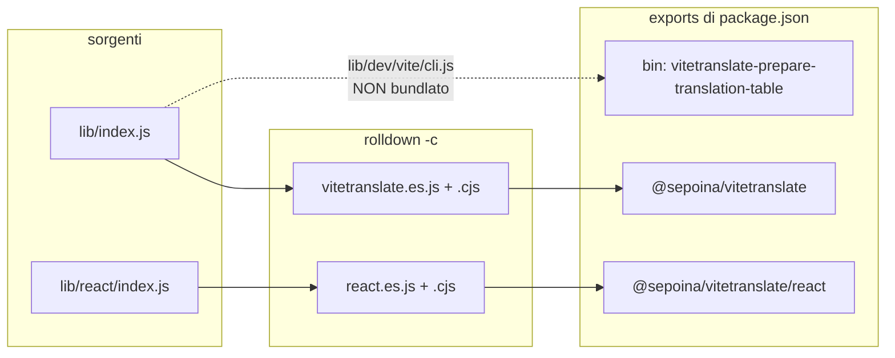

# Come funziona viteTranslate, dall'interno

> Documento di riferimento sull'architettura: cosa succede a una stringa marcata dal momento in cui la scrivi al momento in cui il browser la mostra, quali file la trasformano e quali artefatti intermedi esistono lungo la strada.
>
> Il [README](../README.md) racconta _come si usa_ la libreria; qui si racconta _come è fatta_.

## Manutenzione — leggere prima di modificare la libreria

**Questo documento è la fonte di verità sull'architettura, e va aggiornato nello stesso commit del codice che descrive.** Ogni sorgente in `lib/` porta in testa un puntatore alla sezione che lo riguarda: se stai cambiando il comportamento di un file, la sezione corrispondente è parte della modifica, non un lavoro successivo da ricordarsi.

Vale per chiunque, sessioni LLM comprese: se ti hanno chiesto di toccare `lib/`, leggi prima la sezione pertinente e la lista degli [invarianti](#invarianti-da-non-rompere), poi aggiorna il documento insieme al codice.

L'ordine dei conti, quando qualcosa non torna: **il codice è ciò che gira**, quindi se diverge dal documento è il documento a essere in debito e va corretto — non il contrario. I link puntano sempre al file che decide davvero, così la verifica costa un clic.

Per ritrovare i puntatori: `grep -rn "doc/structure.md" lib/`.

---

## Indice

- [Manutenzione](#manutenzione--leggere-prima-di-modificare-la-libreria)
- [L'idea in una pagina](#lidea-in-una-pagina)
- [Mappa dei file](#mappa-dei-file)
- [Fase 0 — Authoring: il marcatore](#fase-0--authoring-il-marcatore)
- [Fase 1 — Precompilazione: il comando di sync](#fase-1--precompilazione-il-comando-di-sync)
- [Fase 2 — Compilazione: i due transform di Vite](#fase-2--compilazione-i-due-transform-di-vite)
- [Fase 3 — Il modulo virtuale e il code splitting](#fase-3--il-modulo-virtuale-e-il-code-splitting)
- [Fase 4 — Runtime: la catena di risoluzione](#fase-4--runtime-la-catena-di-risoluzione)
- [I file intermedi, in ordine](#i-file-intermedi-in-ordine)
- [Distribuzione del pacchetto](#distribuzione-del-pacchetto)
- [I test](#i-test)
- [Invarianti da non rompere](#invarianti-da-non-rompere)

---

## L'idea in una pagina

Tutte le librerie di i18n chiedono di inventare una chiave (`welcome.title`) e di tenerla allineata a mano con una tabella. viteTranslate toglie quel passaggio: **la chiave la calcola il build** a partire dal testo stesso.

Scrivi `_%_Benvenuto_%_` nel sorgente. Da lì in poi:



L'id è `<nomefile>_<hash FNV-1a del testo in base36>`: deterministico, quindi lo stesso testo nello stesso file produce sempre la stessa chiave, senza che nessuno la scriva.

Le fasi sono tre, e **girano in momenti diversi**. È la cosa più importante da tenere a mente:

| Fase | Quando gira | Chi la esegue | Cosa produce |
| --- | --- | --- | --- |
| **Precompilazione** | prima del build, comando a parte | [`cli.js`](../lib/dev/vite/cli.js) | i file di lingua `.js` **su disco** |
| **Compilazione** | durante `vite dev` / `vite build` | il plugin Vite | marcatori compilati + tabelle compilate **in memoria** |
| **Runtime** | nel browser | il runtime React | il nodo da mostrare |

Perché due passaggi separati e non uno solo? Perché fanno cose diverse in momenti diversi. La **precompilazione** scrive i file di lingua su disco, e lo fa **prima** che il build parta. La **compilazione** lavora invece **dentro** il build: legge quei file già pronti e li trasforma soltanto in memoria, senza mai toccare il disco.

Se questi due compiti fossero uniti in un solo passaggio dentro il build, il risultato dipenderebbe da un dettaglio che nessuno controlla dall'esterno — in che ordine il build esegue le proprie fasi interne. Tenerli separati toglie quella dipendenza: quando il build comincia, i file di lingua sono già scritti e stabili, sempre, indipendentemente da come il bundler è organizzato al suo interno. (Per i dettagli implementativi vedi [`vitetranslate.js`](../lib/dev/vite/vitetranslate.js#L14).)

---

## Mappa dei file

Prima il quadro d'insieme: cosa il pacchetto **espone** e cosa resta macchina interna. L'elenco completo, file per file, è nell'albero subito sotto.



Poi la mappa letterale. Ogni file porta in testa il rimando alla sezione che lo riguarda:

```text
lib/
├── index.js .................... entry del plugin (esporta vitetranslate)
├── htmlDialect.js .............. tag HTML ammessi — unica fonte di verità, letta dai due parser
├── errorSolve.js ............... opzione errorSolve: default, controlli, risoluzione, gate console
├── utility.js .................. log colorato del comando di sync
├── index.d.ts · react.d.ts ..... tipi pubblici delle due entry
├── virtual.d.ts ................ dichiarazione di "virtual:vitetranslate/languages"
│
├── dev/ ........................ tutto ciò che gira in Node, mai nel browser
│   ├── babel/
│   │   ├── markerCore.js ....... regole del marcatore: hash, id, forma del marcatore compilato
│   │   ├── extractMarkers.js ... parse + splice del sorgente (il cuore dell'estrazione)
│   │   └── parserOptionsFor.js . quali plugin del parser servono per .js/.jsx/.ts/.tsx
│   ├── compile/
│   │   ├── compileTable.js ..... tabella di stringhe -> modulo JS di valori già pronti
│   │   ├── parseMarkup.js ...... parser HTML del dialetto, senza DOM (build time)
│   │   └── decodeEntities.js ... entità HTML -> caratteri
│   └── vite/
│       ├── vitetranslate.js .... i due plugin Vite + il modulo virtuale
│       ├── cli.js .............. comando "vitetranslate-prepare-translation-table"
│       ├── updateLanguage.js ... sync della lingua sorgente
│       ├── updateAllSubLanguages.js  sync di tutte le altre
│       └── uty/ ................ utilità della sync (lettura, scrittura, backup, ordinamento)
│
├── react/ ...................... il runtime che finisce nel bundle dell'utente
│   ├── index.js ................ superficie pubblica di "@sepoina/vitetranslate/react"
│   ├── TranslateContainer.jsx .. stato della lingua, Suspense, transition
│   ├── TranslateContext.js ..... il context (NON esportato di proposito)
│   ├── Translate.js ............ il componente
│   ├── useTranslateToString.js . ts() per le prop che vogliono una stringa
│   ├── useTranslateLanguage.js . lingua corrente, elenco lingue, cambio lingua
│   ├── languageResource.js ..... cache + Suspense + caricamento dei chunk
│   ├── resolveEntry.js ......... la catena di fallback (e i prefissi ⁑ / ∴)
│   ├── parseCompiledMarker.js .. marcatore compilato -> chiave (con cache)
│   ├── interpolate.js .......... %s sulle stringhe NON compilate
│   ├── normalizeSource.js ...... forma a oggetto { t, a } -> stringa o tupla
│   ├── withPrefix.js ........... attacca un prefisso diagnostico a una stringa o a un nodo
│   └── basicHtmlToNodes.js ..... parser HTML sul DOM (solo dev + API pubblica)
│
└── dist/ ....................... output di rolldown (generato, non si edita)
```

Regola di lettura veloce: **`dev/` non entra mai nel browser, `react/` non tocca mai il disco.** I due file condivisi fra i due mondi sono [`htmlDialect.js`](../lib/htmlDialect.js) e [`errorSolve.js`](../lib/errorSolve.js), che infatti non importano nulla — né React né Node. Sono regole con più di un lettore, e scritte una volta sola non possono divergere.

---

## Fase 0 — Authoring: il marcatore

L'utente scrive testo dentro `_%_..._%_`. Il riconoscimento è volutamente rigido: il valore del nodo deve essere **per intero** un marcatore.

```jsx
<Translate>_%_Benvenuto_%_</Translate>                    // ✔ JSXText
<Translate t={["_%_Ciao %s_%_", nome]} />                 // ✔ StringLiteral
ts(`_%_Ciao_%_`)                                          // ✔ TemplateElement
<Translate t="prefisso _%_Ciao_%_" />                     // ✘ non è tutto il valore
```

Il perché di questa rigidità sta in [`extractMarkers.js`](../lib/dev/babel/extractMarkers.js): siccome il nodo viene sostituito _interamente_, la riscrittura può essere uno splice di offset sul sorgente invece di una rigenerazione dell'AST. Le regole di riconoscimento vivono tutte in [`markerCore.js`](../lib/dev/babel/markerCore.js), che è l'unico posto in cui è scritto cosa sia un marcatore e come si calcoli il suo id.

Due casi limite sono segnalati con un `console.warn` invece che in silenzio, perché entrambi si vedrebbero solo a schermo, tardi:

- **marcatori annidati** (`"_%_uno_%_ e _%_due_%_"`): l'apertura del primo si accoppia con la chiusura del secondo, e ne esce **una** chiave sola;
- **collisione di id**: due testi diversi, stesso file, stesso hash a 32 bit → uno dei due sparirebbe dalla tabella.

---

## Fase 1 — Precompilazione: il comando di sync

```bash
npx vitetranslate-prepare-translation-table   # tipicamente come "prebuild"
```

È l'unico momento in cui qualcosa **scrive** nella cartella delle lingue.



Punti che vale la pena conoscere:

**Nessun file di config separato.** Il plugin espone la propria configurazione già risolta sull'oggetto che restituisce (`vitetranslateConfig`), e il CLI la rilegge da lì: una sola fonte di verità. Per questo [`cli.js`](../lib/dev/vite/cli.js) importa `vite.config.*` e cerca il plugin `name: "vitetranslate"` dopo un `flat(Infinity)` — il plugin restituisce un **array** di due plugin, e l'appiattimento serve a ritrovarlo.

Il config lo carica Node, non Vite: si cercano le sei estensioni che Vite stesso accetta (`.js .mjs .ts .cjs .mts .cts`, nel suo ordine di preferenza) e si accetta sia l'oggetto sia la forma a funzione di `defineConfig` (chiamata con `{ command: "build", mode: "production" }`). Il limite che resta è quello di Node: un config TypeScript richiede una versione che sappia togliere i tipi (23.6+, o `--experimental-strip-types`), e la sintassi che non si limita alle annotazioni non passa comunque — il messaggio d'errore lo dice invece di lasciare un `ERR_MODULE_NOT_FOUND` opaco.

**La scansione gira solo per il suo effetto collaterale.** `rewrite: false` si ferma al parse: il codice riscritto non servirebbe a nessuno, quindi non viene proprio prodotto.

**Un file rotto non fa cadere la sync**, viene saltato con un avviso — ma quel conteggio è poi uno dei segnali che accendono la guardia qui sotto.

**`guardMassErase`** ([file](../lib/dev/vite/uty/guardMassErase.js)) è la rete di sicurezza più importante del comando. La tabella estratta è la sola fonte di verità per la cancellazione: tutto ciò che non compare lì viene eliminato da ogni lingua. È il comportamento voluto, ma dà per scontato che la scansione abbia funzionato. Se uno di questi tre segnali è acceso — _nessun marcatore trovato_, _file saltati dalla scansione_, _oltre metà delle chiavi in cancellazione_ — la guardia non blocca nulla, ma **fotografa** lo stato di prima salvando un `.bak-erased-*` di ogni file di lingua e dicendolo a chiare lettere.

**I rename mantengono la traduzione.** Se un testo cambia file (quindi cambia id) ma resta lo stesso testo, `matchRenamedKeys` in [`updateLanguage.js`](../lib/dev/vite/updateLanguage.js) abbina la chiave decaduta a quella emergente con lo stesso valore, e le sub-lingue ereditano la traduzione già fatta invece di ripartire da `null`.

**Si riscrive solo se serve.** Il confronto passa da [`stableStringify`](../lib/dev/vite/uty/stableStringify.js) (chiavi ordinate a ogni livello) e [`splitAndSortEntries`](../lib/dev/vite/uty/splitAndSortEntries.js) (ordinamento con locale `"en"` **esplicito**, altrimenti lo stesso file si ordinerebbe in modo diverso su macchine con locale diverso e risulterebbe "cambiato" senza esserlo).

### Il file di lingua prodotto

```js
//  -------------------------------------------------
//      italiano (Italia) (sourceLanguage)
//       |    code: it-IT
//       |    missing key: 1
//       |    processed: 2026-07-27 12:37
//  -------------------------------------------------
export default {
  "__builder__": {"v":260727,"languageName":"italiano (Italia)","incomplete":true},
  "App_1nke42v": "Benvenuto",

  //  ----to be translated------------------------------------------
  "App_1wltsn1": "Ciao %s, come stai?",
};
```

Chiavi e valori escono da `JSON.stringify` (quindi sempre fra virgolette), ma il file **è un modulo JS, non JSON**: la virgola finale e il separatore a commento **dentro** l'oggetto sono legali come literal JS e sarebbero rifiutati da `JSON.parse`. L'intestazione e `__builder__` sono bookkeeping rigenerato a ogni sync — si guarda, non si edita; `incomplete` viene scritto solo quando è `true`, perché `false` è il valore implicito ripristinato in lettura.

Nelle sub-lingue le chiavi non tradotte valgono `null`. Nella lingua sorgente non c'è mai un `null`, ma le stesse chiavi finiscono sotto il separatore finché mancano **in almeno un'altra lingua**: è la scorciatoia documentata per copiare il blocco di testo vero e darlo a un traduttore (umano o LLM).

---

## Fase 2 — Compilazione: i due transform di Vite

[`vitetranslate(defs)`](../lib/dev/vite/vitetranslate.js) restituisce **due** plugin, non uno. Non è un dettaglio implementativo: lavorano su insiemi di file **disgiunti**, con filtri diversi, e ciascuno ignora completamente i file dell'altro.

### Plugin 1 — `vitetranslate`: trasforma i tuoi sorgenti

Gira sui `.js` `.jsx` `.ts` `.tsx` del progetto e sostituisce ogni marcatore con la sua forma compilata. Il testo `_%_Benvenuto_%_` diventa `_<_App_1nke42v_/_Benvenuto_>_` in sviluppo (con il testo di riserva incorporato) o `_<_App_1nke42v_>_` in build.



### Plugin 2 — `vitetranslate:compile-locale`: trasforma i file di lingua

Gira sui `.js` dentro `localeDir` e li converte da tabella di stringhe a modulo di valori già pronti da usare. Il file su disco non viene toccato: la conversione vive solo nel grafo dei moduli del bundler.



### Perché due e non uno

Un plugin Vite/Rollup espone **un solo** hook `transform`, e quell'hook ha **un solo** filtro. I due lavori non possono condividerlo, per due motivi indipendenti:

1. **Il filtro del primo è basato sul contenuto, non sul percorso.** È dichiarato come `filter: { code: "_%_" }`: il bundler lo valuta in Rust, prima ancora che il nostro codice venga chiamato, e scarta ogni file il cui testo non contenga quella sottostringa. Un file di lingua contiene testo già tradotto (`"Ciao %s"`), mai il marcatore `_%_`: per costruzione non supererà **mai** quel filtro, qualunque cosa scriva l'handler. Agganciare lì la compilazione delle tabelle produrrebbe codice morto, non un ramo alternativo.
2. **Anche allargando il filtro, resterebbe un solo handler per due trasformazioni opposte.** I sorgenti vogliono un `parseSync` chirurgico che tocca solo i marcatori (2a); i file di lingua vogliono rileggere l'intera tabella e ricostruirla da zero (2b). Sono due algoritmi diversi su due input diversi: tenerli in un solo `transform` vorrebbe dire smistare a mano dentro l'handler ciò che il filtro di Rust farebbe gratis fuori da JS.

Da qui la scelta: [`vitetranslate(defs)`](../lib/dev/vite/vitetranslate.js) restituisce **due oggetti plugin distinti** — ciascuno con il proprio `transform` e il proprio filtro — invece di uno solo con logica interna più complicata.

### 2a. Estrazione: parse e splice, non un transform

Il modo "ovvio" di sostituire un nodo con Babel è: parse, cammina l'AST con un visitor completo (`NodePath`, scope tracking), sostituisci il nodo, rigenera il sorgente con `generate()`. [`extractMarkers.js`](../lib/dev/babel/extractMarkers.js) salta tutto questo tranne il parse: trova gli offset dei nodi marcati nell'AST e li rimpiazza con un semplice taglia-e-cuci (`splice`) sulla stringa originale, senza mai rigenerare nulla.

Può permetterselo perché la sostituzione è puntuale — solo nodi il cui valore è **per intero** un marcatore — quindi bastano gli offset di inizio/fine. Misurato sui sorgenti del playground: **2,3 ms** per il solo parse contro **18,7 ms** per il transform completo con `generate()` e sourcemap: il parser non era il collo di bottiglia, lo era tutto il resto (visitor, scope, rigenerazione).

Il beneficio collaterale è che il codice non marcato esce **byte per byte** com'era entrato: commenti, formattazione e direttive (`@__PURE__`, `@vite-ignore`) comprese, che una rigenerazione avrebbe potuto alterare o perdere.

Questa scelta (offset e splice invece di un AST rigenerato) impone tre accorgimenti, altrimenti il risultato sarebbe codice sintatticamente valido ma sbagliato:

- **Dentro un nodo di testo JSX (`JSXText`), il rimpiazzo non può essere testo puro.** Il marcatore compilato contiene un `<` letterale (es. `_<_App_1nke42v_>_`), e un `<` dentro un nodo di testo JSX verrebbe letto come l'inizio di un nuovo tag, non come carattere. Va quindi incapsulato in un'espressione — `{"_<_App_1nke42v_>_"}` — che per JSX è una stringa qualunque, e lascia la struttura del markup intatta per chi legge il JSX dopo di noi.
- **Le righe consumate da un `JSXText` sostituito vengono restituite come newline in coda al rimpiazzo.** Un blocco di testo scritto su tre righe sorgente, se sostituito con un'espressione su una riga sola, sposterebbe in su di due tutto il resto del file. Non sarebbe un problema se tutti i passaggi successivi leggessero le posizioni da una sourcemap — ma il plugin React che gira dopo di noi scrive il numero di riga direttamente dentro ogni chiamata `jsxDEV(...)` come _valore letterale_ incorporato nel codice, non come voce di mappatura. Se lo spostamento di righe fosse reale, quel valore risulterebbe sbagliato (stack di errore e DevTools che puntano alla riga vecchia). Reincollare gli a-capo "inghiottiti" mantiene invariato il conteggio delle righe, a costo zero: sono a-capo dentro spazi bianchi, che JSX scarterebbe comunque.
- **Il plugin non compila il JSX, e dichiara solo i parser plugin necessari a farlo _leggere_ correttamente da Babel.** Gira con `enforce: "pre"`, cioè prima del plugin React del progetto: il suo unico compito è sostituire i marcatori lasciando il JSX così com'è, non trasformarlo in `jsxDEV(...)`. Per questo [`parserOptionsFor.js`](../lib/dev/babel/parserOptionsFor.js) attiva solo i plugin di parsing per JSX/TypeScript (necessari perché `parseSync` accetti quella sintassi), invece di caricare `@babel/preset-react` — che il JSX lo trasformerebbe davvero. Così `jsxDEV`, `jsxImportSource` e Fast Refresh restano decisioni del plugin React del progetto, non le nostre.

### 2b. Compilazione delle tabelle: il passaggio meno ovvio

Qui sta l'idea che distingue la versione attuale dalle precedenti. La tabella su disco è fatta di **stringhe**; il modulo che arriva al bundler è fatto di **valori già pronti**. [`compileTable.js`](../lib/dev/compile/compileTable.js) sceglie fra quattro forme:

| Il testo è… | Diventa… |
| --- | --- |
| testo semplice | una stringa letterale |
| testo + `%s` | `a => _cat(["...", _arg(a, 0), "..."])` |
| markup | un elemento React costruito **una volta sola** |
| markup + `%s` | `a => jsxs(...)` con i segnaposto come figli JSX |

Conseguenze concrete:

1. **Il parser HTML sparisce dal runtime.** Il markup viene interpretato a build time da [`parseMarkup.js`](../lib/dev/compile/parseMarkup.js), che non usa il DOM — quindi `<Translate>` funziona anche in SSR.
2. **Un argomento può essere un nodo React.** `t={["_%_Accesso come <b>%s</b>_%_", <Link/>]}` mette davvero l'elemento dentro il `<b>`, perché il `%s` è un figlio JSX, non un pezzo di stringa. E non è mai interpretato come HTML: React lo escapa come qualunque altro figlio.
3. **Le voci senza segnaposto hanno identità stabile fra i render**, il che permette a React di saltare la riconciliazione del sottoalbero. È il motivo per cui `<Translate>` non ha un `useMemo`: la stabilità arriva già dalla tabella.
4. **Ogni tabella compilata è autonoma.** Passando anche la `sourceTable`, ogni chiave `null` o assente porta con sé il testo della lingua sorgente, già compilato nella stessa forma. Chi consuma la tabella non ha più bisogno che la lingua sorgente sia caricata per mostrare qualcosa di sensato.

Il punto 4 ha però un prezzo, ed è il motivo per cui esiste `__untranslated__`: **dopo la sostituzione una voce non tradotta è indistinguibile da una tradotta bene.** L'informazione non è recuperabile più tardi — a runtime non resta niente da guardare. Con l'opzione `emitUntranslated` (accesa solo quando il prefisso `errorSolve.beginCharUntranslated` è acceso) il modulo porta quindi anche una chiave riservata:

```js
export default {
  "App_1nke42v": "Hello world",
  "App_1wltsn1": "Ciao %s",                      // riempita dalla sorgente: non tradotta
  "__untranslated__": { "App_1wltsn1": 1 },      // ...e questo è l'unico posto che lo dice
};
```

Ci finiscono sia le chiavi a `null` sia quelle che la lingua non ha proprio — dopo l'emissione si assomigliano anche loro. La forma è una mappa a `1` e non un array perché il lettore ([`prefixFor`](../lib/react/resolveEntry.js)) fa un lookup per chiave a ogni render, non una scansione. Con i default in produzione non viene emessa affatto.

Gli helper `_arg` e `_cat` sono emessi **inline in ogni chunk** invece di essere importati dal runtime: il chunk resta autosufficiente, non dipende dalla risolvibilità di un path del pacchetto da dentro la cartella dell'utente, e il minifier li accorcia comunque a un carattere.

`_cat` merita una riga: ricompone un testo senza markup i cui `%s` sono già risolti. Nel caso normale restituisce una stringa; ma se anche **uno solo** degli argomenti non è primitivo, diventa un frammento. Una concatenazione con `+` avrebbe prodotto `"[object Object]"` in silenzio, e per giunta in modo dipendente dalla lingua.

> Il file su disco **non viene mai toccato** da questa fase. La compilazione vive solo nel grafo dei moduli del bundler: il lato Node continua a leggere le stringhe di cui ha bisogno.

### Il dialetto HTML, in un posto solo

`<b> <strong> <i> <em> <u> <small> <code> <br> <hr> <wbr>`. Qualunque altro tag viene **sciolto conservando il contenuto** (`<div>ciao</div>` → `ciao`), nessun attributo sopravvive mai.

Le liste stanno in [`htmlDialect.js`](../lib/htmlDialect.js) e sono lette da entrambi i parser — quello di build e quello sul DOM. Erano scritte a mano in due posti con un commento che chiedeva di tenerle allineate: la prima divergenza avrebbe prodotto un testo che si comporta in un modo in sviluppo e in un altro nel bundle, senza che nulla lo segnalasse.

L'unica divergenza nota fra i due parser sono i **tag incrociati** (`<b>x <i>y</b> z</i>`): il browser riapre `<i>` sul testo che segue (la "adoption agency" di HTML), il build no. È segnalata con un avviso invece di essere replicata.

---

## Fase 3 — Il modulo virtuale e il code splitting

`virtual:vitetranslate/languages` è l'unico punto di contatto fra il lato build e il lato browser. Viene generato da `generateLanguagesModule()` in [`vitetranslate.js`](../lib/dev/vite/vitetranslate.js) e ha questa forma:

```js
import __vt_pre_0 from "/percorso/src/locale/it-IT.js"; // precaricate: import STATICO

export const languages = {
  "it-IT": { name: "italiano (Italia)", preloaded: true, table: __vt_pre_0, load: () => Promise.resolve({ default: __vt_pre_0 }) },
  "en-US": { name: "English (US)", preloaded: false, load: () => import("/percorso/src/locale/en-US.js") }, // -> chunk a parte
};
export const sourceLanguage = "it-IT";
export const fallbackTable = __vt_pre_0;
export const errorSolve = { malformed: "⁂", untranslated: "⁑", notFullyTranslated: "∴", noArg: "[?]", warn: true };
export const partiallyTranslated = { "App_1wltsn1": 1 };
```

Una lingua = una riga, con tutto ciò che il runtime deve sapere. Erano tre mappe parallele da tenere allineate a mano.

Gli ultimi due export sono la diagnostica, e portano già i valori **risolti**: `onlyInDev` e la scelta fra `warningDev` e `warningBuild` sono state applicate qui, dove `isProduction` è noto, così il runtime legge dei valori invece di doverli interpretare — non ragiona su `import.meta.env` e non conosce l'opzione dell'utente. Un carattere vuoto è un prefisso spento, ed è quello che una build di produzione con i default emette per tutti e tre.

`partiallyTranslated` è l'unico posto in cui può stare: dice quali chiavi restano non tradotte in **qualche** lingua, e per rispondere servono tutte le tabelle insieme. Una tabella compilata sa dire cosa manca a sé stessa (`__untranslated__`, § 2b), non altrove. Qui le tabelle ci sono già, lette poco sopra per costruire il manifest, quindi non costa nessun accesso al disco in più. Vuoto quando quel prefisso è spento.

**Quali lingue sono eager** dipende dall'ambiente, ed è una delle regole più sottili del progetto:

| | eager |
| --- | --- |
| **dev** | `[...preloadedLanguages, sourceLanguage]` — la sorgente è sempre inclusa: è la lingua che stai scrivendo, averla sincrona evita una sospensione a ogni ricarica |
| **build** | `preloadedLanguages` se ce ne sono, altrimenti `sourceLanguage` |

In build la sorgente smette di essere obbligatoria proprio perché ogni tabella compilata è autonoma: spedirla sarebbe una seconda copia degli stessi contenuti.

L'ordine però è vincolato: la sourceLanguage va **in coda**, non in testa, così "la prima precaricata" vale `preloadedLanguages[0] ?? sourceLanguage` in entrambi gli ambienti. Altrimenti un'app che non passa `initialLanguage` partirebbe in una lingua durante lo sviluppo e in un'altra una volta pubblicata.

Il flag `preloaded` **viaggia nel bundle** invece di essere dedotto a runtime: è ciò che permette a `TranslateContainer` di avvisare _anche in produzione_ se la lingua iniziale non è precaricata — in dev il controllo direbbe sempre di sì.

### Perché il plugin si auto-esclude dal pre-bundling

`lib/dist/react.es.js` importa `virtual:vitetranslate/languages`, un id che esiste **solo** attraverso questo plugin. Il pre-bundling delle dipendenze però gira in un processo esbuild separato, che i plugin del progetto non li vede: su Vite ≤ 7 il dev server muore in partenza con

```text
✘ [ERROR] Could not resolve "virtual:vitetranslate/languages"
    node_modules/@sepoina/vitetranslate/lib/dist/react.es.js:6:57
Error: Error during dependency optimization
```

Per questo l'hook `config()` dichiara `optimizeDeps: { exclude: ["@sepoina/vitetranslate"] }` (il prefisso copre anche `/react`, che è poi l'unico sottopercorso che entra nel grafo del browser). L'esclusione la dichiara il plugin, non il consumer: è una conseguenza di come è fatta la libreria, non una scelta di chi la usa.

⚠️ **Il playground non copre questo caso**: usa `"@sepoina/vitetranslate": "file:.."`, e i pacchetti linkati non vengono pre-bundlati. Il guasto si vede solo installando da npm — cioè su ogni progetto vero. Vale come regola generale: prima di considerare verificato un cambiamento su `lib/dist/`, provarlo su un progetto con la libreria **installata dal registry**, non linkata.

### Il ciclo di dev

`configureServer` mette in ascolto `localeDir` e distingue due casi:

- **file aggiunto/rimosso** → cambia l'_insieme_ delle lingue → invalida il modulo virtuale;
- **file modificato** → il manifest resta valido, ma serve comunque un full-reload, perché le tabelle vivono in una cache a livello di modulo lato client che un hot update non svuoterebbe. E se il file modificato è la **lingua sorgente**, vengono invalidati _tutti_ i moduli compilati: ogni lingua incorpora il testo sorgente per le chiavi non tradotte, e Vite non può dedurlo dal grafo — quel testo entra durante il transform, non attraverso un import.

Al secondo caso c'è **un'eccezione**, ed è il prefisso `∴`: `partiallyTranslated` è calcolato leggendo tutte le lingue, quindi tradurre una stringa lo cambia. Con quel prefisso acceso il manifest va rigenerato anche quando cambia solo il contenuto di un file — altrimenti il `∴` resterebbe a schermo su una stringa appena tradotta, fino al riavvio. Spento (ogni build di produzione con i default) la rilettura non avviene e la regola resta quella di sopra.

Il filtro sull'estensione `.js` non è cosmetico: senza, i backup `.bak-corrupted-*` / `.bak-erased-*` lasciati lì accanto dalla sync facevano ricaricare la pagina.

### Lingue create al volo

Il plugin è tollerante in modo asimmetrico, e la ragione è la stessa in entrambi i casi — la dichiarazione esplicita vale più dello scan:

- un `.js` trovato nella cartella ma **vuoto** → è una lingua nuova, viene popolata al volo con le chiavi della sorgente a `null`;
- un `.js` **invalido** (sintassi rotta) → escluso con un errore chiaro, mai sovrascritto alla cieca: dentro potrebbe esserci lavoro recuperabile;
- una `preloadedLanguages` il cui file **manca del tutto** → creata al volo, perché è una dichiarazione esplicita in `vite.config.js`, non una scoperta.

---

## Fase 4 — Runtime: la catena di risoluzione



Ordine completo: **lingua attiva → `fallbackTable` → fallback incorporato nel marcatore (solo dev) → chiave grezza.** Il principio è "mostra sempre qualcosa": nemmeno un chunk che non si carica produce un crash — [`readLanguage`](../lib/react/languageResource.js) ricade sulla tabella eager.

Il fallback incorporato esiste per una condizione precisa e **normale in sviluppo**: hai appena scritto una stringa nuova, il marcatore compilato esiste già, ma il file di lingua la conoscerà solo dopo la sync. In produzione `includeFallback` è `false` per default (la sync gira nel prebuild, quindi sarebbe ridondante) e il ramo sparisce dal bundle insieme al suo import di `basicHtmlToNodes` — verificato ricostruendo il playground: il bundle resta byte-identico.

### I prefissi diagnostici

"Mostra sempre qualcosa" ha un rovescio: se qualcosa si vede sempre, non si vede mai che è andata storta. `errorSolve` mette un carattere davanti al testo — **in sviluppo**, di default — e chiude il buco senza toccare il principio.

| Prefisso | Condizione | Chi lo sa |
| --- | --- | --- |
| `⁂` | testo che la traduzione non ha mai visto (salvo `skipMark`), o prop incompatibili fra loro | `Translate.js` / `useTranslateToString.js`, sul posto |
| `⁑` | la lingua attiva non ha una traduzione per questa chiave | `table.__untranslated__` (§ 2b), oppure la chiave che dalla tabella manca |
| `∴` | tradotta qui, ma assente in almeno un'altra lingua | `partiallyTranslated` dal modulo virtuale (§ Fase 3) |

**Uno solo per stringa, e il primo della lista vince.** Se manca la traduzione proprio nella lingua che si sta guardando, dire anche che ne manca una altrove non aggiunge niente. Lo stesso vale nel percorso di salvataggio: quando `⁂` ha già vinto, il testo recuperato attraversa la catena con la variante `diag.malformedOnly`, che ha gli altri due spenti — altrimenti si prenderebbe un secondo prefisso per strada.

`⁂` si porta dietro un cambio di contratto: **una stringa non marcata non è più un errore fatale.** Prima in sviluppo `<Translate>` lanciava e rendeva `[...]`, cancellando il testo; ma non tutto il testo che passa da una prop è traducibile — un numero di telefono, il nome di un campo configurato altrove, una descrizione che arriva dal server. Chi ne aveva doveva ispezionare il marcatore _prima_ di chiamare il componente, cioè riscrivere fuori una decisione che è di qui. Ora il marcatore è il discriminante e ad applicarlo è il componente.

Per la stessa ragione gli usi scorretti non lanciano più: `salvage()` recupera il miglior testo disponibile fra `o`, `t` e `children` — la stringa, il primo elemento della tupla, il campo `t` dell'oggetto — e lo rende preceduto da `⁂`. Un oggetto senza campo `t` non è la forma `{ t, a }` e non contiene testo: è una variante di `null` e rende vuoto come lui, senza prefisso, prima ancora del salvataggio. `[...]` resta per i valori che il salvataggio non può proprio leggere — una funzione, un simbolo. La differenza si vede in produzione: prima un errore nelle _tue_ prop lo pagava chi legge lo schermo.

### Cosa può stare nella posizione del testo

Il marcatore discrimina, ma non tutto ciò che arriva a `t` / `o` / `children` è una stringa che un marcatore potrebbe avere. Il caso che li genera tutti è lo stesso: **una prop sola, servita da un solo componente foglia, che a volte porta testo traducibile e a volte no.** Il chiamante non sempre sa quale delle due gli arriverà, e prima doveva deciderlo _fuori_ — cioè riconoscere il marcatore da sé, duplicando `_%_` e `_<_`, che sono formato interno.

Guardati in ordine di percorso in [`Translate.js`](../lib/react/Translate.js):

| Valore in posizione testo | Cosa fa | Perché |
| --- | --- | --- |
| `false`, `null`, `undefined`, `""` | `""` | niente da mostrare — `false` è anche la sentinella delle prop non passate |
| numero, bigint | reso così com'è, **nessun prefisso** | dato di dominio: un conteggio, un interno, un codice. Marcato non ci può passare |
| elemento React | restituito così com'è, **nessuna diagnostica** | non è ambiguo, e sa già renderizzarsi |
| oggetto senza `t` | `""` + segnalazione | una variante di `null`: non è la forma `{ t, a }` e testo non ne contiene |
| tutto il resto non-stringa | `salvage()` + `⁂` | funzione, simbolo: qui il testo non c'è davvero |

⚠️ Due limiti voluti, e vanno tenuti: la **tupla** `[testo, ...argomenti]` non partecipa alle prime due righe — nel primo posto c'è il testo, e un elemento lì è davvero un errore da segnalare (un elemento _fra gli argomenti_ è invece supportato da sempre). E **`ts()` non accetta elementi**: deve restituire una stringa primitiva, quindi un nodo montato resta un errore — con un messaggio suo, che dice proprio quello.

Il controllo del vuoto è `source === false || null || undefined || ""` e non `!source`, che è la differenza fra la sentinella e il valore: con `!source` un `t={0}` spariva dallo schermo senza segnalazione, perché il controllo nato per intercettare il default delle prop prendeva anche i conteggi a zero. Resta indistinguibile un `t={false}` esplicito, che come testo non ha comunque senso; chiuderlo del tutto vorrebbe dire un simbolo privato al posto di `false`.

### `skipMark`: dichiarare che il non marcato è normale

Resta il caso che nessuna ispezione del valore può risolvere: una **stringa** non marcata ha due significati opposti — marcatore dimenticato, oppure valore che un marcatore non l'avrà mai (un numero di telefono, una uri, il nome di un campo configurato in un pannello di amministrazione, il messaggio di un'eccezione). Da dentro il componente si vedono identici. A saperlo è solo il punto di chiamata.

`skipMark` è quella dichiarazione, e ha esattamente due effetti quando il testo **non** è marcato: niente `⁂` e niente `reportOnce`. Tutto il resto — `stripSourceMarker`, l'interpolazione dei `%s` — non cambia.

```jsx
<Translate t={row.label} skipMark />
ts(row.label, args, { skipMark: true })   // stessa via d'uscita per la variante stringa
```

Su un testo **marcato** la prop non ha alcun effetto: la catena di risoluzione procede normalmente e `⁑` / `∴` restano accesi. Questo è il punto, e non un dettaglio: non vuol dire "non tradurre", vuol dire "qui il non marcato non è un errore" — che è ciò che serve alla prop che porta l'uno o l'altro a seconda della riga. Nemmeno copre le prop incompatibili fra loro: quelle restano un errore e continuano a passare da `salvage()`.

L'alternativa che sembra equivalente ma non lo è: `errorSolve.beginCharMalformed: false` spegne la diagnostica **ovunque**, cioè anche dove il marcatore era davvero dimenticato. `skipMark` la spegne dove è stato dichiarato e la lascia accesa altrove.

### La console, e il suo interruttore

`warningDev` / `warningBuild` governano **tutto** l'output che la libreria stampa nel browser, non solo le diagnostiche nuove: ogni chiamata passa da `report()` in [`errorSolve.js`](../lib/errorSolve.js). Chi mette a tacere il pacchetto in produzione si aspetta che taccia.

⚠️ Conseguenza da tenere presente: con il default `warningBuild: false` tacciono anche le segnalazioni di guasto vero — chunk di lingua non caricato, tag inesistente, `initialLanguage` non precaricata. Quest'ultima era deliberatamente fuori dal gate `import.meta.env.DEV`, perché in dev direbbe sempre che va tutto bene; ora l'ultima parola ce l'ha l'opzione, ed è una scelta di chi configura. `warningBuild: true` le riaccende tutte.

I messaggi del plugin — lato Node, a build time, prefissati `[vitetranslate]` — restano fuori: non sono output di runtime.

### Suspense e cambio lingua

[`languageResource.js`](../lib/react/languageResource.js) tiene una cache a livello di modulo condivisa da tutte le istanze del container. È ciò che rende usabile Suspense: `readLanguage` va chiamata **durante il render** e, se la lingua non è pronta, lancia la Promise — stesso meccanismo di `React.lazy`. Senza una cache stabile ogni render lancerebbe una Promise nuova, cioè un loop infinito di sospensione.

Un caricamento **fallito non resta in cache come tale**: un chunk può fallire per un buco di rete, e tenerne memoria per sempre significherebbe che quella lingua non è più selezionabile per tutta la vita della pagina.

Il cambio lingua passa da `React.startTransition`: React tiene visibile la lingua corrente finché la nuova non è pronta, invece di mostrare il fallback di Suspense. Siccome il render legge sempre lo stato `lang` corrente, le risposte lente di richieste ormai superate vengono ignorate da sole — niente guardia "last request wins" da mantenere.

#### Il ritentativo, e perché lo stato è un oggetto

Lo stato del container è `{ tag, epoch }` e non il solo tag. `epoch` non lo legge nessuno: esiste per dare un'**identità nuova** all'oggetto, che è l'unica cosa che fa ri-renderizzare.

La ragione è il caso del ritentativo. Dopo un caricamento fallito il tag è **già** quello richiesto — è stato impostato prima che il chunk fallisse — quindi riproporlo, cioè il pulsante "riprova" di un language switcher, faceva `setLang(stessoTag)`: React incontra il bailout sullo stato eager e non pianifica nessun render. `ensureLanguage` riarmava davvero il caricamento, il chunk arrivava, `onDone(true)` diceva che era andata bene, e a schermo restava la tabella di fallback finché un render qualunque, per tutt'altra ragione, non ripassava da `readLanguage`.

[`nextLanguageState`](../lib/react/languageResource.js) distingue i due casi e restituisce `prev` — cioè "niente da fare" — solo quando la proposta non cambia nulla di osservabile. `hasFailedLanguage(tag)` va campionata **prima** di `ensureLanguage`, che riarmando cancella la traccia dell'errore.

#### `id` è la lingua che si vede, non quella che si è chiesta

Quando il caricamento fallisce `readLanguage` ricade sulla tabella eager: a schermo c'è **quella** lingua. Il context espone quindi `firstPreloadedLanguage`, non il tag richiesto — altrimenti `useTranslateLanguage().id` risponderebbe `"fr-FR"` mentre la pagina è in italiano, e un selettore evidenzierebbe una voce che non corrisponde a niente, senza avere modo di accorgersene.

La lingua della tabella eager è `firstPreloadedLanguage` per costruzione: il plugin emette `fallbackTable` dal primo tag precaricato, che è anche il primo di `preloadedLanguages`.

La sospensione avviene in `TranslateProvider`, un componente **interno** al boundary: se avvenisse in `TranslateContainer` non sarebbe il suo `<Suspense>` a catturarla.

### Cosa NON è esportato

`TranslateContext` resta privato di proposito: il valore del context contiene `table`, la mappa interna delle traduzioni, che deve restare libera di cambiare forma. Lingua corrente, elenco e cambio passano tutti da `useTranslateLanguage()`.

### Cosa è congelato, e perché

Tutto ciò che è insieme **condiviso da tutta l'app** e **consegnato a codice che non controlliamo** è `Object.freeze`-ato:

| valore | dove |
| --- | --- |
| `languages`, array e singole voci | [`useTranslateLanguage.js`](../lib/react/useTranslateLanguage.js) |
| l'oggetto restituito dall'hook | idem — è memoizzato, quindi condiviso da tutti i componenti finché la lingua non cambia |
| `preloadedLanguages` | [`languageResource.js`](../lib/react/languageResource.js) |

Non è simmetria estetica: `languages` è un singleton di modulo, e una singola scrittura di troppo lo corrompe **per tutti i lettori e per tutta la vita della pagina**, con il sintomo che compare lontanissimo dalla causa. Il caso reale che ha portato al freeze è un `filter(l => l.tag = id)` — `=` invece di `===` — dentro un language switcher: azzerava il `tag` di ogni lingua al primo render, e sembrava un bug della libreria. I moduli ESM sono sempre in strict mode, quindi ora quella riga lancia un `TypeError` sul posto. Il `.d.ts` dichiara gli stessi campi `readonly`, così TypeScript lo segnala già a compile time.

Il congelamento vale **anche in produzione**, come tutte le altre garanzie di questa libreria: un comportamento che cambia fra dev e build è un comportamento che non è stato verificato. Il costo è due `Object.freeze` all'inizializzazione del modulo, non uno per render.

Restano **non** congelati, di proposito: il valore del context (privato, non lo tocca nessuno da fuori) e le tabelle compilate (una passata su ogni voce di ogni lingua, per proteggere una struttura che il codice utente non vede).

⚠️ Conseguenza da tenere presente: `languages.sort()` e `languages.reverse()` ora lanciano. Chi riordina l'elenco deve farlo su una copia, `[...languages]` — che è poi ciò che andrebbe fatto comunque su un valore condiviso.

---

## I file intermedi, in ordine

Il punto che confonde più spesso: **quali artefatti esistono davvero su disco e quali vivono solo in memoria.**



| Artefatto | Dove vive | Chi lo scrive | Si edita a mano? |
| --- | --- | --- | --- |
| `src/locale/it-IT.js` (sorgente) | disco | la sync, interamente | **no**, è autogenerato |
| `src/locale/xx-XX.js` (altre) | disco | la sync per le chiavi, **tu** per i valori | sì, solo i valori |
| intestazione + `__builder__` | disco, dentro i file sopra | la sync | **no**, riscritti ogni volta |
| `.bak-corrupted-*` / `.bak-erased-*` | disco, accanto ai file | le reti di sicurezza | sono copie, si leggono |
| tabella compilata | solo nel grafo dei moduli | il plugin `compile-locale` | non esiste come file |
| modulo virtuale | solo nel grafo dei moduli | il plugin | non esiste come file |
| `lib/dist/*` | disco, nel repo | `rolldown -c` | **no**, output di build |

Per **vedere** una tabella compilata — cioè quello che il bundler riceve davvero — c'è uno strumento apposta:

```bash
npm run dump   # test/exampleLangCompile.mjs -> test/exampleCompiled/ (git-ignored)
```

---

## Distribuzione del pacchetto



Quattro output da [`rolldown.config.js`](../rolldown.config.js), due entry point più un binario. Le scelte che contano:

- **il CLI non è bundlato**: `bin` punta direttamente a [`lib/dev/vite/cli.js`](../lib/dev/vite/cli.js), che gira come sorgente ESM in Node;
- **externals del plugin**: `path`, `fs`, `url`, `vm`, `@babel/core` — Babel resta una peer dependency **opzionale**, non entra mai nel bundle;
- **externals del runtime**: `react`, i due jsx-runtime e `virtual:vitetranslate/languages`, che per definizione lo risolve il consumer attraverso il plugin;
- **`.jsx` compilato da Babel** in un plugin locale del config, con `runtime: "automatic"`;
- **il CJS definisce `import.meta.env` a `{}`**: non ha un bundler che lo fornisca, quindi si comporta sempre come produzione, ed è reso esplicito per non generare warning;
- **`version` è inlinata** dal `package.json` a build time — niente `fs` a runtime nel browser, e chi consuma la libreria può mostrare la versione senza duplicarla a mano.

Il campo `files: ["lib"]` fa sì che sul pacchetto npm finisca `lib/` per intero: sia `dist/` sia i sorgenti di `dev/`, che servono al CLI. `playground/`, `test/` e `doc/` restano fuori.

La pubblicazione avviene da GitHub Actions con npm trusted publishing (OIDC): ogni versione porta un'attestazione di provenienza che lega il tarball al commit esatto.

---

## I test

`npm test` esegue [`test/run.mjs`](../test/run.mjs), che lancia ogni `test/list/*.test.mjs` in un processo separato. Nessun framework: un test è un file che esce con `0`. La scoperta è automatica — "cosa gira" è il contenuto di una cartella, non una lista da tenere aggiornata.

```bash
npm test                    # tutta la suite
npm test -- markup marker   # solo i test il cui nome contiene una di queste parole
npm test -- -v              # mostra anche l'output dei test che passano
```

La scelta metodologica interessante: dove un comportamento ha un **riferimento reale**, i test si confrontano con quello invece che con aspettative scritte a mano.

| Test | Confrontato contro |
| --- | --- |
| `decodeEntities` | il pacchetto [`entities`](https://github.com/fb55/entities), dev dependency mai spedita |
| `markupParity` | una registrazione vera di Chrome, congelata in `list/markupExpected.mjs` |
| `babelTranslate` | un'implementazione Babel lineare, `list/babelTranslateReference.mjs` |

Quest'ultimo merita una nota: `extractMarkers` è veloce perché fa splice invece di rigenerare, e il modo "ovvio" di fare la stessa cosa è conservato come termine di paragone. Le **regole semantiche** stanno però in [`markerCore.js`](../lib/dev/babel/markerCore.js), condiviso dai due: se divergessero produrrebbero id diversi per lo stesso testo — cioè traduzioni che spariscono senza che nulla lo segnalasse. Tenendo lì tutto ciò che è semantico, al confronto resta da mettere alla prova la sola meccanica della riscrittura, che è il punto.

Un'aspettativa scritta a mano è giusta solo quanto il giorno in cui è stata scritta.

### Il runtime React

Tre test partono da punti diversi della stessa catena, ed è voluto: presi insieme coprono dalle prop del componente fino allo stato della lingua.

| Test | Da dove parte |
| --- | --- |
| `translateComponent` | le prop di `<Translate>` e le chiamate a `ts()`, e guarda l'HTML che ne esce |
| `languageResource` | la giuntura fra il manifest generato dal plugin e il runtime che lo consuma |
| `translateContainer` | il componente montato: sospensione, lingua iniziale, chunk che non arriva |

`translateContainer` compila il `.jsx` con Babel come fa `rolldown.config.js`, e si scrive un manifest a mano perché serve un `load()` pilotabile — è l'unico modo per far fallire un chunk a comando. Ogni scenario carica **copie private** dei moduli: la cache delle lingue vive a livello di modulo, e due scenari che se la condividessero si racconterebbero l'un l'altro caricamenti già andati. Per la stessa ragione le copie si importano senza query di cache-busting: una query renderebbe l'istanza del test diversa da quella che il container importa per percorso relativo, cioè due cache invece di una.

Un limite dichiarato: `react-dom/server` non ha stato fra un render e l'altro, quindi `proposeNewLanguage` non si può guidare fino allo schermo senza un DOM (jsdom non è una dipendenza, e non vale un test). Il meccanismo del ritentativo si verifica dove è stato messo apposta per essere verificabile — `hasFailedLanguage` e `nextLanguageState`, funzioni con un nome e una ragione, non artefatti di test. Resta scoperta la sola riga di cablaggio dentro il `useCallback`.

---

## Invarianti da non rompere

Raccolta delle cose che, se cambiate senza accorgersene, rompono qualcosa in modo **silenzioso** — il tipo di rottura che si vede solo a schermo, tardi, in produzione.

1. **`markerCore.js` è l'unica definizione di cosa sia un marcatore e di come si calcoli il suo id.** Cambiare l'hash invalida ogni traduzione esistente di ogni utente.
2. **`htmlDialect.js` è l'unica lista dei tag ammessi.** I due parser devono leggerla, mai riscriverla. Vale identico per [`errorSolve.js`](../lib/errorSolve.js), che ha quattro lettori — chi scrive l'opzione, il plugin che la normalizza, il plugin che la risolve, il runtime che ne legge l'esito.
3. **La prima lingua precaricata deve essere la stessa in dev e in build** (`preloadedLanguages[0] ?? sourceLanguage`), altrimenti l'app parte in una lingua diversa una volta pubblicata.
4. **La sync scrive, il plugin no.** Se il plugin cominciasse a scrivere file di lingua durante il build, tornerebbe la dipendenza dall'ordine degli hook che ha portato a estrarre il CLI.
5. **Il transform dei sorgenti non deve toccare `localeDir`**, nemmeno se una stringa tradotta contiene `_%_` per coincidenza: sono dati, non sorgente.
6. **`readLanguageTable` prima di `import()`.** La cache dei moduli ESM di Node non viene mai rilasciata e non ha API di sfratto: misurato, 24 kB trattenuti per ogni salvataggio del traduttore, 7 MB dopo 300 salvataggi. L'`import()` resta solo come ripiego per moduli di lingua non generati da noi, con una query di cache-busting che è un **hash del contenuto** e non l'mtime (la granularità del timestamp è troppo grossolana: due contenuti diversi scritti nello stesso tick condividerebbero la chiave di cache).
7. **`splitAndSortEntries` ordina con locale esplicito.** Senza, la stessa tabella si ordina diversamente fra macchina di sviluppo e CI, e i file risultano "cambiati" senza esserlo.
8. **Ogni divergenza fra build e runtime va segnalata, non nascosta.** È la regola che ha prodotto gli avvisi su marcatori annidati, collisioni di id e tag incrociati.
9. **La diagnostica non deve costare niente dove è spenta.** `errorSolve` è risolto a build time, quindi con i default una build di produzione non spedisce né i prefissi né i dati che li alimentano: `__untranslated__` non viene emesso nei chunk di lingua e `partiallyTranslated` resta vuoto. Chi aggiunge un prefisso nuovo aggiunge anche la condizione che ne evita l'emissione — altrimenti ogni visitatore paga byte per un'informazione che nessuno leggerà. Vale anche per i **messaggi**: un template literal si valuta prima della chiamata, quindi un messaggio che contiene `describeValue()` — cioè un `JSON.stringify` — va passato a `reportOnce` come lambda insieme a una chiave statica, altrimenti gira a ogni render pure con la console spenta, che in produzione è il default.
10. **Un solo prefisso per stringa.** La precedenza è `⁂` → `⁑` → `∴`, e il percorso di salvataggio usa `diag.malformedOnly` proprio per non sommarne un secondo. Due glifi davanti allo stesso testo non dicono più del primo, e rendono illeggibile ciò che si stava cercando di mostrare.

---

## Riferimenti rapidi

| Vuoi capire… | Leggi |
| --- | --- |
| come si riconosce un marcatore | [`markerCore.js`](../lib/dev/babel/markerCore.js) |
| come viene riscritto il sorgente | [`extractMarkers.js`](../lib/dev/babel/extractMarkers.js) |
| che forma ha una voce compilata | [`compileTable.js`](../lib/dev/compile/compileTable.js) |
| il dialetto HTML ammesso | [`htmlDialect.js`](../lib/htmlDialect.js) · [`parseMarkup.js`](../lib/dev/compile/parseMarkup.js) |
| i due plugin e il modulo virtuale | [`vitetranslate.js`](../lib/dev/vite/vitetranslate.js) |
| il comando di sync | [`cli.js`](../lib/dev/vite/cli.js) · [`updateLanguage.js`](../lib/dev/vite/updateLanguage.js) |
| le reti di sicurezza sui dati | [`guardMassErase.js`](../lib/dev/vite/uty/guardMassErase.js) · [`backupLanguageFile.js`](../lib/dev/vite/uty/backupLanguageFile.js) |
| Suspense e cambio lingua | [`languageResource.js`](../lib/react/languageResource.js) · [`TranslateContainer.jsx`](../lib/react/TranslateContainer.jsx) |
| la catena di fallback | [`resolveEntry.js`](../lib/react/resolveEntry.js) |
| i prefissi diagnostici e l'interruttore console | [`errorSolve.js`](../lib/errorSolve.js) · [`withPrefix.js`](../lib/react/withPrefix.js) |
| i tag BCP 47 | [`bcp47.md`](bcp47.md) |
| come contribuire, come girano i test | [`CONTRIBUTING.md`](../CONTRIBUTING.md) |