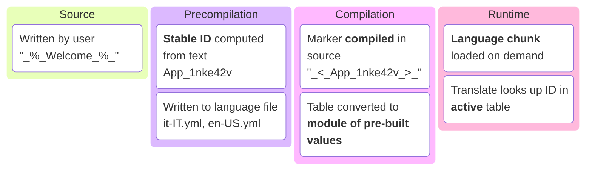
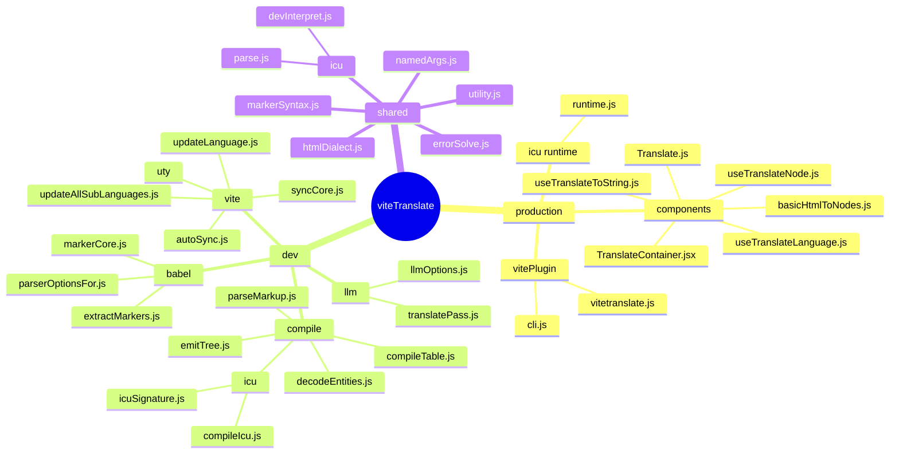
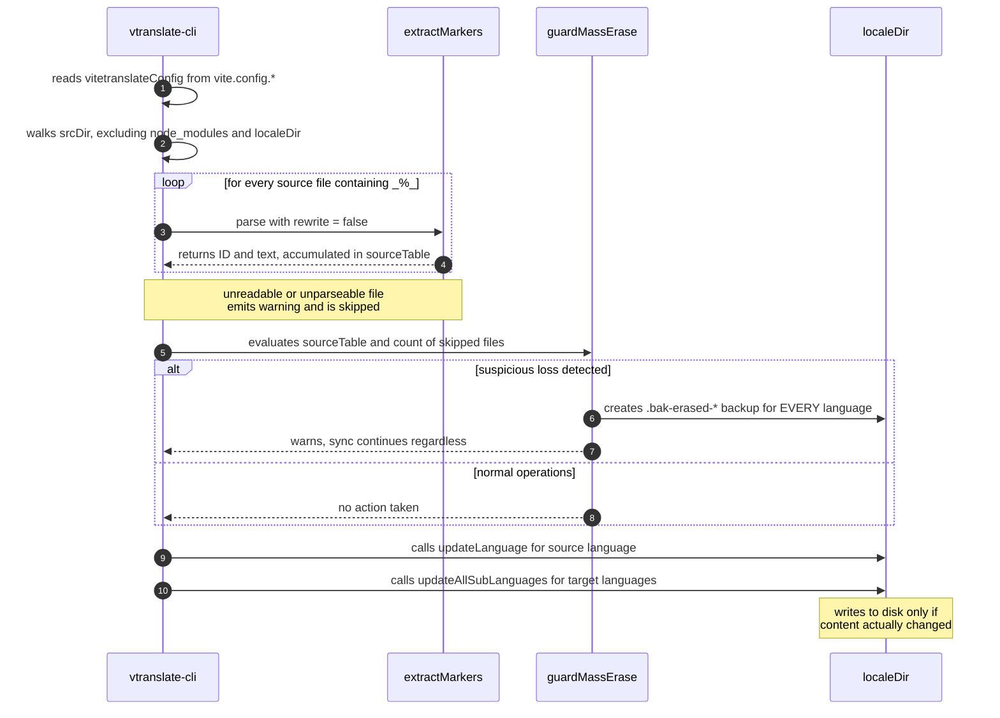
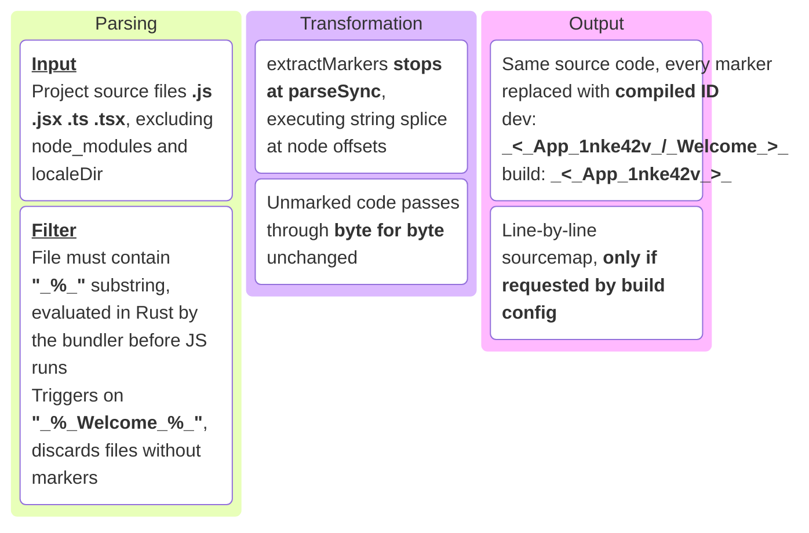
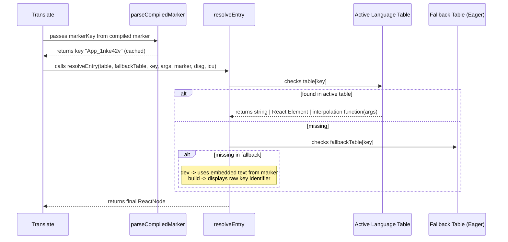
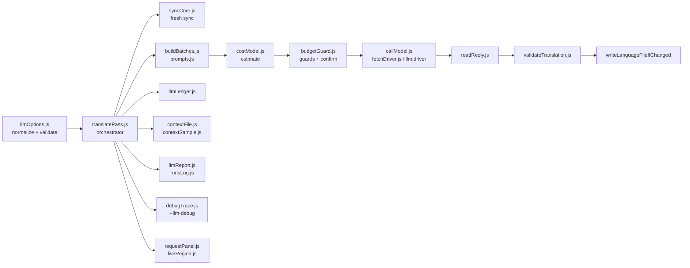
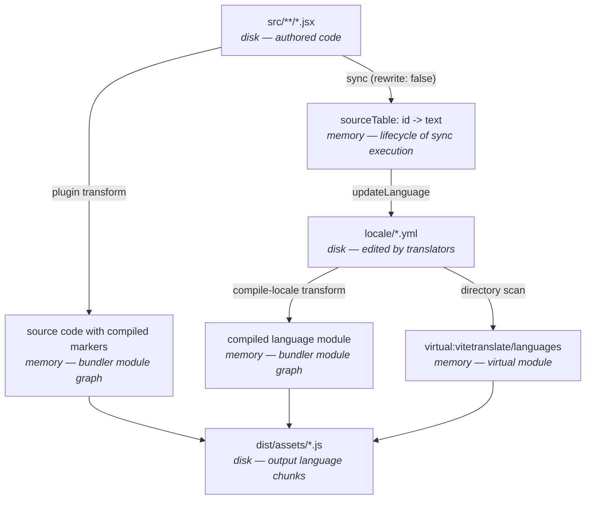
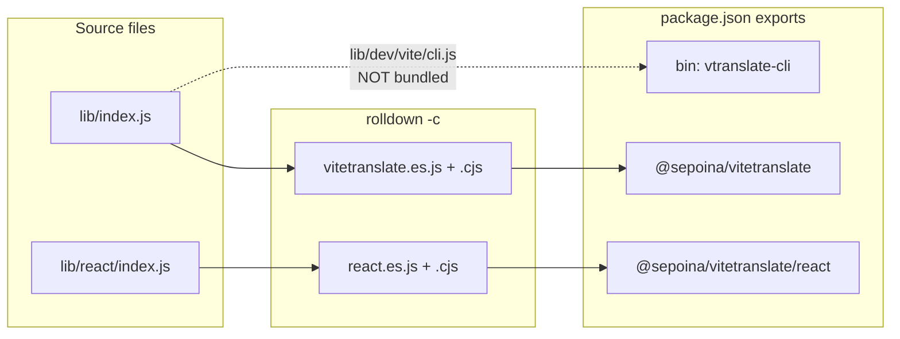

# How viteTranslate Works Under the Hood

> Architecture reference document: what happens to a marked string from the moment you write it to when the browser displays it, which files transform it, and what intermediate artifacts exist along the way.
>
> The [README](../README.md) covers _how to use_ the library; this document covers _how it is built_.

Strings move through four stages: **extraction**, **compilation**, **resolution**, and **delivery**. During extraction, Babel finds `_%_..._%_` markers and assigns each string an id. During compilation, translation tables become ready-made values for the browser. At runtime, components resolve those ids against the current locale. Finally, locales are delivered as lazy-loaded chunks, while eager locales can be included in the initial bundle.

Every compiled table is **self-contained**: untranslated entries already contain the source text, so the application does not need to ship a separate fallback table alongside each locale.

## Maintenance — read before modifying the library

**This document is the source of truth for the architecture and must be updated in the same commit as the code it describes.** Every source file in `lib/` carries a pointer at the top referencing the relevant section: if you are changing a file's behavior, updating the corresponding section is part of the change, not a follow-up task to remember later.

This applies to everyone, including LLM sessions: if you are asked to touch `lib/`, read the relevant section and the list of [invariants not to break](#invariants-not-to-break) first, then update the document alongside the code.

The order of truth when something doesn't match: **the code is what actually runs**, so if it diverges from the document, it's the document that needs to be fixed — not the other way around. Links always point directly to the file that makes the actual decision, making verification a single click away.

To find all pointers in the codebase: `grep -rn "doc/structure.md" lib/`.

---

## Table of Contents

- [Maintenance — read before modifying the library](#maintenance--read-before-modifying-the-library)
- [The core idea in one page](#the-core-idea-in-one-page)
- [File map](#file-map)
- [Phase 0 — Authoring: the marker](#phase-0--authoring-the-marker)
- [Phase 1 — Precompilation: the sync command](#phase-1--precompilation-the-sync-command)
- [Phase 2 — Compilation: the two Vite transforms](#phase-2--compilation-the-two-vite-transforms)
- [Phase 3 — The virtual module and code splitting](#phase-3--the-virtual-module-and-code-splitting)
- [Phase 4 — Runtime: the resolution chain](#phase-4--runtime-the-resolution-chain)
- [Phase 5 — LLM auto-translation](#phase-5--llm-auto-translation)
- [Intermediate files, in order](#intermediate-files-in-order)
- [Package distribution](#package-distribution)
- [Testing](#testing)
- [Invariants not to break](#invariants-not-to-break)
- [Quick reference](#quick-reference)

---

## The core idea in one page

All i18n libraries ask you to invent a key (`welcome.title`) and keep it manually aligned with a translation table. viteTranslate removes that step: **the key is computed during build** directly from the text itself.

You write `_%_Welcome_%_` in your source code. From there on:



The ID is `<sanitized name>_<FNV-1a base36 hash>`: the checksum covers the text **and the file's relative path** (normalized to `/`), while the prefix is the basename reduced to `[A-Za-z0-9]` — prefixed with `n` if it starts with a digit, or `unNamed` if it collapses to nothing. Deterministic: the same text in the same file always produces the same key, without anyone having to write it.

There are three phases, running at **different moments in time**. This is the most important concept to keep in mind:

| Phase | When it runs | Executed by | Output produced |
| --- | --- | --- | --- |
| **Precompilation** | before the build, via CLI command | [`cli.js`](../lib/dev/vite/cli.js) | language `.yml` files **on disk** |
| **Compilation** | during `vite dev` / `vite build` | Vite plugin | compiled markers + compiled tables **in memory** |
| **Runtime** | in the browser | React runtime | the React node to render |

Why two separate steps instead of one? Because they perform different tasks at different times. **Precompilation** writes language files to disk **before** the build starts. **Compilation** works **inside** the build: it reads those pre-built files and transforms them in memory, without ever touching the disk.

If these two tasks were combined into a single step inside the build process, the result would depend on an internal build detail that no one controls from the outside — the order in which the bundler executes its internal hooks. Keeping them separate removes that dependency: when the build starts, the language files are already written and stable, always, regardless of how the bundler is organized internally. (For implementation details, see [`vitetranslate.js`](../lib/dev/vite/vitetranslate.js#L14).)

---

## File map

First, the high-level picture: what the package **exposes** versus what remains internal machinery. The complete file-by-file list follows right below.



Now the literal map. Each file carries a header reference to its relevant section:

```text
lib/
├── index.js .................... plugin entry (exports vitetranslate)
├── htmlDialect.js .............. allowed HTML tags — single source of truth for both parsers
├── errorSolve.js ............... errorSolve option: default, checks, resolution, console gates
├── markerSyntax.js ............. marker delimiters, %s, ICU_TRIGGER_RE and __untranslated__ — one source for all sides
├── namedArgs.js ................ isNamedArgs/argAt/argNamed — argument reading outside a compiled chunk (4.6.3)
├── utility.js .................. color logging for the sync command
├── index.d.ts · react.d.ts ..... public types for the two entry points
├── virtual.d.ts ................ type declaration for "virtual:vitetranslate/languages"
│
├── icu/ ......................... ICU MessageFormat, shared by Node and browser (4.6.3, § 2c)
│   ├── parse.js ................. trigger, %s normalization, parse + validation (imports lib/dist/icuParser.js)
│   ├── runtime.js ............... the four formatting helpers + Intl cache — ships to the browser, no imports
│   └── devInterpret.js .......... dev-only interpreter for an unsynced ICU key (never in production)
│
├── dev/ ........................ everything running in Node, never sent to browser
│   ├── babel/
│   │   ├── markerCore.js ....... marker rules: hashing, ID format, compiled marker shape
│   │   ├── extractMarkers.js ... parse + splice of source code (the extraction core)
│   │   ├── componentScan.js .... which functions are React components, for autoWrap's hook injection
│   │   └── parserOptionsFor.js . parser plugins required for .js/.jsx/.ts/.tsx
│   ├── compile/
│   │   ├── compileTable.js ..... string table -> JS module of pre-built values
│   │   ├── emitTree.js ......... ARG/pushTextParts/nodesExpr/… shared by the %s and ICU compilers (4.6.3)
│   │   ├── icu/
│   │   │   ├── icuSignature.js .. a text's argument "signature" + compareIcu (4.6.3)
│   │   │   └── compileIcu.js .... ICU AST -> JS expression (4.6.3)
│   │   ├── parseMarkup.js ...... HTML dialect parser without DOM (build time)
│   │   └── decodeEntities.js ... HTML entities -> characters
│   ├── vite/
│   │   ├── vitetranslate.js .... the "vitetranslate" plugin: options, transform, virtual module hooks
│   │   ├── buildManifest.js .... the virtual module content (languages, preloads, fallback table, icu/icuDev)
│   │   ├── compileLocale.js .... the "vitetranslate:compile-locale" transform
│   │   ├── cli.js .............. "vtranslate-cli" CLI entry: argument parsing, calls syncCore.js / llmCommands.js
│   │   ├── syncCore.js ......... the sync itself, extracted from cli.js — two callers: cli.js and autoSync.js
│   │   ├── autoSync.js ......... the fourteen guards deciding WHETHER to sync from the plugin's `config` hook
│   │   ├── updateLanguage.js ... source language synchronization
│   │   ├── updateAllSubLanguages.js  sync for all target languages
│   │   └── uty/ ................ sync utilities (listing, reading, writing, backup, sorting) —
│   │       incl. cliName.js, icuOptions.js, loadConfig.js, posix.js, readLanguageForSync.js,
│   │       scanSource.js, setupFailure.js, syncReport.js, writeLanguageFile.js
│   └── llm/ ..................... LLM auto-translation — CLI-only, see § Phase 5 below.
│       Never imported from lib/react/ or lib/index.js, except llmOptions.js (validated by
│       the plugin, byte-cheap — see the invariant on this below).
│       llmOptions.js, validateTranslation.js, readReply.js, costModel.js, buildBatches.js,
│       prompts.js, llmLedger.js, budgetGuard.js, contextFile.js, contextSample.js, apiKey.js,
│       keyringPeer.js, fetchDriver.js, callModel.js, translatePass.js, llmReport.js,
│       requestPanel.js, liveRegion.js, runsLog.js, debugTrace.js, llmCommands.js
│
├── react/ ...................... runtime included in user's bundle
│   ├── index.js ................ public surface of "@sepoina/vitetranslate/react"
│   ├── TranslateContainer.jsx .. language state, Suspense, transition logic, `timeZone` prop (4.6.3)
│   ├── TranslateContext.js ..... React context (intentionally NOT exported)
│   ├── Translate.js ............ main component
│   ├── useTranslateToString.js . ts() helper for string-only props
│   ├── useTranslateNode.js ..... hook form of <Translate>, for autoWrap's injected children (4.4.0)
│   ├── useTranslateLanguage.js . current language, list of languages, language switcher
│   ├── languageResource.js ..... cache + Suspense + chunk loading
│   ├── resolveEntry.js ......... fallback resolution chain (and 🔸 / 🔹 diagnostic prefixes)
│   ├── parseCompiledMarker.js .. compiled marker -> key (cached)
│   ├── interpolate.js .......... %s replacement for uncompiled strings (argAt-based, 4.6.3)
│   ├── normalizeSource.js ...... object shape { t, a } -> string or tuple
│   ├── readSource.js ........... shared verdict: EMPTY / ELEMENT / NOT_TEXT / TEXT (§ Phase 4)
│   ├── withPrefix.js ........... attaches diagnostic prefix to string or React node
│   └── basicHtmlToNodes.js ..... DOM-based HTML parser (dev mode + public API only)
│
└── dist/ ....................... output generated by Rolldown (do not edit manually)
    └── icuParser.js ............ vendored @formatjs parser (4.6.3), gitignored, rebuilt by `npm run build`
```

Quick reading rule: **`dev/` never enters the browser, `react/` never touches the disk.** The files shared between both worlds are [`htmlDialect.js`](../lib/htmlDialect.js), [`errorSolve.js`](../lib/errorSolve.js), [`markerSyntax.js`](../lib/markerSyntax.js) and, from 4.6.3, [`namedArgs.js`](../lib/namedArgs.js) and `icu/` — none of them import React or Node built-ins. `icu/` is its own case: `parse.js` and `devInterpret.js` are Node-*and*-dev-browser (the CLI, the plugin, and, only in development, the browser's fallback interpreter), while `runtime.js` is the one file in this list that ships to a **production** browser — it has no imports at all, not even from its own siblings.

---

## Phase 0 — Authoring: the marker

The author writes text inside `_%_..._%_`. Detection is intentionally strict: the value of the node must be **entirely** a marker.

```jsx
<Translate>_%_Welcome_%_</Translate>                    // ✔ JSXText
<Translate t={["_%_Hello %s_%_", name]} />                 // ✔ StringLiteral
ts(`_%_Hello_%_`)                                          // ✔ TemplateElement
<Translate t="prefix _%_Hello_%_" />                     // ✘ not the full value
```

The reason for this strictness lies in [`extractMarkers.js`](../lib/dev/babel/extractMarkers.js): because the node is replaced _in its entirety_, the rewriting can be implemented as an offset splice on the source string rather than full AST regeneration. Marker detection rules all live in [`markerCore.js`](../lib/dev/babel/markerCore.js), which is the single place defining what constitutes a marker and how its ID is generated.

Two edge cases trigger a `console.warn` instead of failing silently, as both would otherwise only be noticed late on screen:

- **Nested markers** (`"_%_one_%_ and _%_two_%_"`): the opening tag of the first pairs with the closing tag of the second, resulting in **one** single combined key;
- **ID collision**: two different texts, same file, same 32-bit hash → one of the two texts would vanish from the translation table.

---

## Phase 1 — Precompilation: the sync command

```bash
npx vitetranslate   # --add, --status, --migrate — the flags you reach for on purpose
```

The bin is `vtranslate-cli` from 4.1; the previous name, `vitetranslate-prepare-translation-table`, stays registered in `"bin"` as an alias so existing `prebuild` scripts keep working. The messages show neither: `CLI_NAME` in [`cli.js`](../lib/dev/vite/cli.js) is the single place the displayed name is written, and it reads `vitetranslate` — the separate [launcher](#the-global-command-launcher)'s name, since `npx vitetranslate` works whether or not this package is a project dependency yet, unlike `npx vtranslate-cli`. A command that names itself two different ways is worse than one that picks.

This is the only phase that **writes** into the localization directory.

### Auto-sync at config time

Since 4.2, running this command by hand at every dev server start or before every build is no longer required: the plugin does it for you, from inside Vite's `config` hook — the one moment before a server exists, before a module has been resolved, before anything could see a half-written table (see [invariant 4](#invariants-not-to-break)). Same code, same output, called for you instead of a `predev`/`prebuild` script you had to remember to write and keep in sync across every project.

The fourteen guards that decide **whether** to run live in [`autoSync.js`](../lib/dev/vite/autoSync.js); the sync itself was extracted out of `cli.js` into [`syncCore.js`](../lib/dev/vite/syncCore.js), so the CLI and the plugin call the exact same function instead of two copies of the same logic drifting apart. In short, cheapest first:

- `VITETRANSLATE_NO_SYNC` (any non-empty value) turns both off without touching `vite.config.*` — the way in from a read-only checkout.
- Never runs under Vitest or `vite preview`, and never a second time for the same build's SSR pass.
- `autoSyncDev` and `autoSyncBuild` gate `serve`/`build` independently (see [plugin options](plugin-options.md)); only `false` turns one off.
- Concurrent or repeated calls for the same config wait on the same run instead of starting a second one — keyed on the **config**, not a process-level flag, because Vite reimports `vite.config.*` on every dev-server restart while this module stays in Node's module cache; a boolean would survive the restart and block the very resync a changed `sourceLanguage` needs.
- A missing `@babel/core` degrades to a warning that names the CLI, because the message it carries is one nobody else carries: the tables were left untouched. It is not the last word on the problem: auto-sync runs in the `config` hook, and `configureServer`/`buildStart` stop the run immediately afterwards — except under Vitest, where guard G9 already silenced this one and the two hooks stand down as well.
- 3.x language files (`<tag>.js`) sitting next to no migrated source table stop it, pointing at `--migrate`, rather than let auto-sync create a brand new source table as if they never existed.
- In dev it uses the same fast verify `--fastverify` uses, cross-checked against the **live** config (see [Fast verify](#fast-verify-the-two-stage-check)); in build it always runs the full scan. The fast path is silent when there is nothing to do — no header, no line, nothing.
- A real failure is printed and re-thrown, so `vite dev`/`vite build` exits non-zero — the same outcome a failing `predev` used to produce.

Set `autoSyncDev: false` and `autoSyncBuild: false` to get back exactly the pre-4.2 behavior: nothing runs until `vtranslate-cli` is called by hand.



Key aspects worth knowing:

**No separate config file.** The plugin exposes its resolved configuration directly on the object it returns (`vitetranslateConfig`), and the CLI re-reads it from there: a single source of truth. For this reason [`cli.js`](../lib/dev/vite/cli.js) imports `vite.config.*` and searches for the plugin with `name: "vitetranslate"` after applying `flat(Infinity)` — the plugin returns an **array** of two plugins, and flattening is necessary to find it.

Config loading is handled by Node, not Vite: it searches for the six file extensions accepted by Vite (`.js .mjs .ts .cjs .mts .cts`, using Vite's preference order) and accepts both raw config objects and the factory function form of `defineConfig` (invoked with `{ command: "build", mode: "production" }`). The remaining limitation is Node's own runtime capability: loading a TypeScript config requires a Node version capable of stripping type annotations (23.6+, or `--experimental-strip-types`), and non-type TS syntax will fail — throwing an explicit error message instead of an opaque `ERR_MODULE_NOT_FOUND`.

**A missing `@babel/core` is reported, not dumped, and it stops the run.** It is a required peer dependency, so npm and pnpm install it on their own; yarn only warns, and nothing stops anyone from removing it by hand, which is why the check exists at all. Note that it no longer arrives by reflection from `@vitejs/plugin-react`, which since version 6 does not depend on Babel. Without it nothing can be extracted, and the markers reach the browser in their source form: the app looks like it works and is untranslated in every string. That is why `configureServer` and `buildStart` now refuse to proceed, the same treatment `checkSetup` gives a missing locale directory. A warning was the wrong shape for it, because a build that succeeds is never read again.

Two details about _when_ it is asked for. The plugin asks at startup, before reading a single file, so a project with no markers yet is stopped too — that is deliberate, since the plugin is in the config precisely to translate, and the alternative is a green build that translates nothing. The CLI keeps the older, laxer rule: `extractMarkers` is loaded at first use, so `--help` and a run with nothing to do never touch Babel. And under Vitest neither hook stops anything ([`motivoBabel`](../lib/dev/vite/vitetranslate.js)), for the same reason auto-sync has guard G9: the test runner executes these hooks, and killing its process over a dependency the tests never reach would be someone else's suite failing for our reason.

The old failure was the worst kind: [`cli.js`](../lib/dev/vite/cli.js) imported `extractMarkers` at the top, so the module blew up before `main()` ran, before the `catch` that formats errors, and on `--help` too, which has nothing to do with Babel. What came out was Node's raw `ERR_MODULE_NOT_FOUND` stack. Now `loadConfig` — which is where the missing package actually surfaces, since loading the config pulls in the plugin — names the package and the one-line cure instead of relaying the raw message.

Two failures wear the same `VT_NO_BABEL` code and carry different cures ([`babelPeer.js`](../lib/dev/babel/babelPeer.js) holds both, so no caller rewrites the wording). Babel absent asks for an install. Babel 8 present on a Node older than 22.12 cannot be `require()`d at all, and telling that user to install what they already have is how an afternoon gets lost; they are told to move Node or stay on Babel 7.

**The sync reports, it does not narrate.** [`updateLanguage`](../lib/dev/vite/updateLanguage.js) and [`updateAllSubLanguages`](../lib/dev/vite/updateAllSubLanguages.js) no longer log their steps; they **return** what happened — the source file's action, and one `{ tag, missing, note }` per language — and the CLI turns that into three kinds of line: the source file and what changed in it, one grouped line for every language with nothing left to do, and one line per language that still has work. What used to be one line per language, all identical but for the name, hid the only thing worth reading: who still has keys to translate. Warnings and errors are the exception and stay immediate — they are not the account of a job that went right, and holding them back to the end would detach them from the file that caused them.

**Paths are written relative to the project root**, with forward slashes, by [`shortPath`](../lib/dev/vite/uty/shortPath.js) — `locale/it-IT.yml`, not `D:\L\…\playEdge\locale\it-IT.yml`. Two effects, and the second is the one that matters: the line stops spending half its width on the part nobody reads, and VS Code's terminal turns it into a link, because it resolves relative paths against its own cwd. That is also why the root is `process.cwd()` rather than the `package.json` directory found by walking up: they are the same directory in every supported invocation — the command demands `vite.config.*` in the cwd — and where they could differ, the cwd is the one that makes the link resolve. A path outside the project stays absolute: shortening it would produce a `../../..` of the same length, ambiguous about where the file actually is. The marker warnings get this for free — [`registerMarker`](../lib/dev/babel/markerCore.js) already computes the relative path for the checksum.

**A directory, a file name, or a language tag sitting inside a sentence is colored, not just quoted.** `colorize("nome", …)` — the same style the `CODE` column of `--status` uses — marks *this is a value, not part of the sentence*, the same job italics do in prose. It shows up wherever one of the three is interpolated into a message that reaches the log column: the header's two folders, a corrupted or bootstrapped file's name, a nested-marker or malformed-marker warning's path, a tag rejected by `--add`. It does **not** show up in a thrown `Error`'s message (`main().catch` in `cli.js` already wraps the whole line in its own red, and colour codes baked into a message that might be read by something other than a terminal — a CI log, an IDE panel — would show up as literal escape sequences) nor in the handful of plain `console.warn`/`console.error` calls that sit outside the column system on purpose (the `[vitetranslate]` fallback in `markerCore.js`'s `defaultWarn` — mirrored by `parseMarkup.js` for the same reason, and by `normalizeErrorSolve`'s own default in [`errorSolve.js`](../lib/errorSolve.js), for whoever calls it without a channel of its own — and the "no valid language in preloadedLanguages" line in `vitetranslate.js`). The plugin itself never hits that `normalizeErrorSolve` default: it passes `logWarning`, so a typo in `errorSolve` prints through the same coloured column as everything else instead of a bare `console.warn`. Where a value sits inside a line already coloured for another reason (a `stale`/`incomplete` language's summary in `printSyncSummary`), the two colours sit **side by side**, never nested — `colorize` doesn't restore the outer colour after its own reset, so wrapping one inside the other would leave the rest of the outer segment in the terminal's default colour instead of the one intended.

**Everything the command prints goes through one column** — or, with `--simpleLog` (or the plugin's `simpleLog: true`), through a plainer rendering of the same information: no label column, no rules, same colors, shorter lines. [`setLogStyle`](../lib/utility.js) is module state rather than a parameter threaded through every call, because the print sites number in the dozens across four files, and the first one forgotten would print in the other form. [`logEchoColored`](../lib/utility.js) wraps at 120 columns and continues under the same gutter, indented by two so a wrapped line cannot be mistaken for a new message; `displayWidth` counts CJK and fullwidth characters as the two columns they occupy, so the alignment holds for the very languages this library exists for. Anything that went wrong goes through `logWarning` / `logError` instead: they open the block with an empty gutter line and light the label up — orange (256-colour, so it does not blend into the yellow of everything else in a terminal) for `WARNING`, red for `ERROR`. The blank line is as much of the signal as the colour: these are the two lines you look for by scanning the output, not by reading it, and a successful sync is twenty near-identical lines for them to hide in. Anything that opens a block of its own takes the label; the lines that belong to that block stay `logEchoColored("", …)` — hence the `detail` flag on [`backupLanguageFile`](../lib/dev/vite/uty/backupLanguageFile.js), so the guard's one-backup-per-language does not read as five separate problems. Warnings raised during extraction — nested markers, id collisions — used to reach the console on their own, with the `[vitetranslate]` prefix: the right shape inside Vite's output, but in the middle of a sync they landed out of column, reading like a line from another program. [`registerMarker`](../lib/dev/babel/markerCore.js) now takes a `warn` channel (default: the console with the plugin prefix) that [`extractMarkers`](../lib/dev/babel/extractMarkers.js) passes through, so the message says what happened and whoever receives it decides how to frame it. `--status` uses the same channel to collect them and report them in its own block instead. The channel carries a `kind` alongside the message (`nested`, `collision`, `malformed`, and — since 4.4.0 — `marker-split`, `marker-newline`, `autowrap-noscope`, `autowrap-placeholder`) — not because the plugin cares, it ignores the second argument, but because the two commands report them differently: see `printWarnings` below. The one writer outside this system is the live request panel of `--llm-translate` ([Phase 5](#phase-5--llm-auto-translation)), which has to move the cursor — and even it builds its rows with `logLineRows`, from the same prefixes.

**Blocks are separated by a rule, not by a blank line.** `logRule` draws `╟` in the `║` column and a short rule to its right. A blank gutter line was already spoken for — it is what `logWarning`/`logError` use to announce themselves — so using it for structure too made the structure and the alarm look alike. The rule is short on purpose: it separates blocks, it is not a frame, and drawn to 120 columns it would become the most conspicuous thing on screen when what has to be conspicuous is the warnings. Where a rule already separates, `logWarning`/`logError` take `{ stacco: false }`: two separators in a row spend a line to make a weaker signal, not a stronger one. The version is read from `package.json` by [`packageVersion.js`](../lib/dev/vite/uty/packageVersion.js) rather than kept in a constant — a constant is a second copy of the number, and `npm version patch` updates only one of them.

**The header is the same for both commands**, printed by [`printHeader`](../lib/dev/vite/uty/syncReport.js) before either report, which is why `scanSource` prints nothing at all any more: it used to print the header itself and `--status` had to silence the whole function to draw its own, so there were two headers that could drift apart. It opens with a bare rule (`logRule()`, no label — the command name has nowhere fixed to sit once the header is two independent rows instead of one), then two rows built with plain `logEchoColored`: `viteTranslate` labels the `sources:` row (path, file count, and the key count found **in the code** — how many each table should hold, not how many any file does; where those disagree, the `KEYS` column of `--status` says so row by row), and `⌘ vX.Y.Z` labels the `translations:` row (path and how many language files sit in it right now). That count is a snapshot taken before `localeDir` may even exist — the very first run creates it further down, in `runSync` — with one exception: a sync (not `--status`) always writes the source file, so the source counts even before it exists. Without it, `--add en-US` on a fresh project headed a two-language table with `(only source language)`; `--status` on a fresh project still says `0 languages`, which is the honest answer there. A count of exactly `1` reads as `(only source language)` instead of `(1 language)`: a single file on disk can only be the source (no sub-language can exist without it), and the number alone would say that without saying the thing worth knowing — that there is nothing translated yet.

**`printWarnings` is shared, and it is what differs between the two commands.** It lives in [`languageStatus.js`](../lib/dev/vite/uty/languageStatus.js) because both print it, and everything about it except one flag is deliberately identical in the two outputs — the same problem shown two ways reads as two problems. The flag is `dettaglio`: `--status` lists every warning in full, since that is the command you run to ask *what is wrong and where*, while the plain sync keeps a `Set` of kinds — `malformed`, and since 4.4.0 also `marker-split`, `marker-newline`, `autowrap-noscope`, `autowrap-placeholder` — as a count and points at `--status`. Those are the kinds that scale: one typo in a component used everywhere, or one text-only tag outside any recognised component, produces dozens of identical lines, and at the end of a sync they would bury the summary. Nested markers and id collisions stay in full in both, being rare and each about a different place in the code.

**A string that contains `_%_` without being wrapped in it is now reported.** Recognition looks at the start and the end of a value, so `<p>hello _%_world_%_</p>` extracts nothing at all — and until now the only symptom was a translation that never appeared, discovered on screen much later. `extractMarkers` warns (`kind: "malformed"`) and moves on: it is not a syntax error and stops nothing. The heuristic cannot tell a forgotten delimiter from a string that legitimately quotes the marker — documentation and code samples about this very library trip it, as the playground's own snippets do — which is why it is a warning, why it is detailed only under `--status`, and why the plain sync collapses it to a count. A scan that finds **no marker at all** is reported the same way: not an error, since a freshly configured project looks exactly like that, but also the shape a mistyped `srcDir` takes, and without saying so the only clue would be an empty table at the end of the output.

**The sync summary names languages, the `--status` table names files.** The summary uses `shortAutonym` — the autonym minus the parenthesised region, `italiano` rather than `italiano (Italia)` — because it lists languages inline on one line, where the region is almost always noise: the languages of a project differ by language, not by variant. That short name is **not** an identifier, and the code treats it as such: the region is not always parenthesised (`português europeu`, `español de México` fold it into the phrase and survive intact), and where it is, two variants can collapse onto one name — `zh-CN` and `zh-TW` are both `中文`. `nomeLingua` in [`cli.js`](../lib/dev/vite/cli.js) therefore looks at every tag in the summary together and, wherever one name covers more than one tag, puts the file name beside it. Rows with work left always carry the file name anyway, because that is what you open to do the work, and they are coloured whole rather than only on the count: what has to be seen is *which* language, not how many keys.

**`--status` reports and exits, writing nothing.** It runs the same source scan as the sync — the reference is the table just extracted from the **code**, not the source language file — and then reads every language file to report keys, missing translations, tables out of sync with the code, and errors. That reference is the whole point: comparing the tables against each other would only say whether they agree, while the question worth asking is whether they agree with the source as it is now. It returns **before** the `mkdirSync` of `localeDir`, so a command meant to tell you what state things are in never changes that state — not even by creating an empty directory. The report prints through the same gutter as everything else, and the language code goes in the table's own `CODE` column, not in the label on the left: that label says *which part of the command is talking*, and a data field is not that. The cell is coloured by the row's level, which saves a column of symbols that would say the same thing — which is also why `displayWidth` skips ANSI sequences, since counting them would make a coloured cell measure twice its width and throw off the whole table around it. Levels, from mildest to worst, are `ok < incomplete < stale < warning < error`; a row shows every note but is summarised by its worst one, and the process exits `1` on `error` only. An incomplete table is not an error: it is the normal state of a project still being translated, and failing on it would mean turning the CI check off on day one. The checks live in [`languageStatus.js`](../lib/dev/vite/uty/languageStatus.js), split into `collectStatus` (what is true) and `formatStatus` (how it reads), because the two change for different reasons.

**`--add <tag>...` creates language files, falls through to the normal sync, and closes with the `--status` report.** The new file is written **empty** on purpose: that is the documented way to add a language (see the "empty file" branch in [`updateAllSubLanguages.js`](../lib/dev/vite/updateAllSubLanguages.js)), and the same run then fills it with every key set to `null` — no second command to remember, and no file format written in two places. The report at the end is there because it answers the question `--add` was run to ask: the language just added, with its keys waiting for a translator. The plain sync does not print it — there it would be a second reading of the same lines. A tag already present is left untouched, so the flag stays idempotent and re-adding an already translated language cannot wipe it.

Tags are checked by [`validateLanguageTag.js`](../lib/dev/vite/uty/validateLanguageTag.js), on two distinct axes: **form** (`^[a-z]{2,3}-[A-Z]{2}$` — our own convention, matching the file names and [doc/bcp47.md](bcp47.md); the `{2,3}` is there because `fil-PH` is in that list) and **existence** (`Intl.DisplayNames` echoes back a code it does not know, which is the only way to tell `xy-AB` from `fr-FR` — no enumerable list of languages or regions exists). Form alone would not be enough: a typo passing the regex becomes a language file like any other, synced, compiled and shipped in the bundle, and the only symptom is one extra entry in the language selector months later. Display names are resolved in `"en"`, the one locale a `small-icu` Node always carries; if the runtime cannot answer at all, the tag passes — a local ICU limitation is not a reason to reject a real language. Every tag is validated **before** the first file is written, so `--add fr-FR xy-AB` creates nothing rather than half the request.

**`--help` (or `-h`) short-circuits before config loading.** It prints usage and the two flags, then exits `0`. The order matters: help is most often asked for right after the command failed — typically because it was run from the wrong directory — and answering `no Vite config found` to a `--help` would be the worst possible moment to be pedantic.

**Scanning runs purely for its side effects.** Setting `rewrite: false` stops right after AST parsing: rewritten code is not needed here, so it is never generated.

**A broken source file does not abort the sync process.** It is skipped with a warning — but that skip count acts as one of the signals evaluating safety in the guard below.

**`guardMassErase`** ([file](../lib/dev/vite/uty/guardMassErase.js)) is the primary safety net of the command. The extracted translation table is the sole source of truth for key deletion: anything not present in it gets removed from all language files. This is intended, but assumes the scan succeeded cleanly. If any of three triggers fire — _no markers found_, _skipped source files_, _more than half of keys scheduled for deletion_ — the guard does not block execution, but **snapshots** the prior state by saving a `.bak-erased-*` file for every language and printing a prominent warning.

**A backup is a copy of the bytes, not a transcription.** [`backupLanguageFile`](../lib/dev/vite/uty/backupLanguageFile.js) uses `copyFileSync` and falls back to writing the text it was handed only if the copy fails. The difference is the whole value of the backup: a file saved in something other than UTF-8 — which is itself one of the reasons a file reads as corrupted — decoded as UTF-8 and written back is not the same file, because every byte the decoder could not read has become a replacement character. Since the caller is about to overwrite the original, that copy is the only one left. And when there is nothing to save at all, no backup is written: an empty file named `.bak-corrupted-*` is a copy in name only, and the caller has to be able to know one does not exist.

**Renames preserve translations.** If text moves to a new file (changing its ID) while keeping identical contents, `matchRenamedKeys` in [`updateLanguage.js`](../lib/dev/vite/updateLanguage.js) matches the deprecated key to the newly introduced key with identical value. Target languages inherit the existing translation instead of resetting to `null`.

**Disk writes occur only when necessary.** Content comparison uses [`stableStringify`](../lib/dev/vite/uty/stableStringify.js) (sorting keys at every nesting level) and [`splitAndSortEntries`](../lib/dev/vite/uty/splitAndSortEntries.js) (sorting with an **explicit** `"en"` locale, preventing identical files from sorting differently on machines configured with different system locales).

### Generated language file format

```yaml
#  -------------------------------------------------
#      Italian (Italy) (sourceLanguage)
#       |    code: it-IT
#       |    missing key: 1
#       |    processed: 2026-09-05 12:37
#       |    TableVersion: 260905
#  -------------------------------------------------
#
App_1nke42v: "Welcome"

#  ----to be translated------------------------------------------
App_1wltsn1: "Hello %s, how are you?"
```

### Why `.yml` and not `.js` (since 4.0)

Up to 3.x the file was a JS module (`export default { … }`). It worked, but **reading** data required **executing** code, and an entire subsystem grew out of that: a globals-free `vm` context for the flat form, a fallback to `import()` for everything else, and with it Node's ESM module cache — which is never flushed, has no eviction API, and retained ~24 kB per translator file save — plus a cache-busting query that had to be a hash of the content rather than the mtime, because two writes within the same filesystem tick shared the key and Node silently served the previous version. A language file is data: it is now read with `readFileSync` and parsed, and that whole class of bug has nowhere left to live.

The extension only changes **who reads the file from disk**, not what ends up in the bundle: language files never enter the module graph as they are — the `vitetranslate:compile-locale` transform replaces them (see Phase 2). The output is still one `.js` per language, identical to before.

### The format: a STRICT subset of YAML

It is not YAML: it is a subset that **YAML reads the same way**. The difference is the whole point, because full YAML fails silently on this content — and these are values a translator really writes:

| written unquoted | what YAML makes of it |
| --- | --- |
| `App_a: %s is ready` | **syntax error** (`%` is a reserved indicator — and it is our placeholder) |
| `App_a: price 5 # discount` | `"price 5"` — **silently truncated** |
| `App_a: Note: important` | syntax error |
| `App_a: 1.20` / `007` | the number `1.2` / `7` |
| `App_a: null` | the "to be translated" `null`, not the text "null" |
| `App_a: [one, two]` | an array |
| `App_a:·· padded ··` (with edge spaces) | edge spaces lost |

So the parser accepts little, and strictly. The permitted forms, one per line, **all at column 0**:

```yaml
# whole-line comment                 (the generated header is made of these)
#  ⋮   TableVersion: 260905          (the ONE comment line any code reads back — see below)
Key_abc: "text"                      # JSON.parse of the value
Key_abc: null                        # not yet translated
Key_abc:                             # same — what remains after deleting the null
```

Everything else is an error carrying the **line number**: unquoted value (an object literal on any key included — nothing may hold one, not even the header), indented line, colon without a following space (`Key:"x"` is a string to YAML, not a map), trailing comment on a line with a value, duplicate key (js-yaml itself rejects them, and a line-based parser would silently let the last one win). The parser is [`parseLanguageFile.js`](../lib/dev/vite/uty/parseLanguageFile.js), ~40 lines, no dependencies.

Two more rejections exist for one reason each — both used to parse cleanly and fail somewhere else, far from the line that caused it:

| rejected | because |
| --- | --- |
| `toString:`, `constructor:`, `__proto__:`, … | names every object already has. `__proto__` does not even create a property; the others do, but they were "present" before the file existed — and the sync decides with `key in table`, which walks the prototype. Such a key never counts as surplus, so it is never removed: it stays in the file forever. `sanitizeName` cannot produce any of them. |
| a NUL byte anywhere | the file is not UTF-8. A language file saved as UTF-16 (Windows Notepad, "Unicode") reads back as the right text with a NUL between every character; the error used to talk about syntax, and the encoding was unguessable. |

Error messages quote the offending line, and that quote is stripped of control characters first: the text comes from a file that is by definition not what we expected, and an ANSI sequence left in it would not appear in the message — it would recolour it, or erase the line it is being written on.

The rule that holds it all together lives on the writing side: **every value goes through `JSON.stringify` and nothing else**. JSON is a subset of YAML 1.2, so what we write is read identically by both sides. It only takes "prettifying" a line by hand — quoting a number, say, to make it look intentional — for the two to start reading different things without saying so. `languageFileIO.test.mjs` checks exactly this: it serializes a table of hostile values and compares our parser against `js-yaml`, line by line — and asserts that no value in the round-tripped table is ever an object, only a string or `null`.

Keys need no quotes and cannot ever need them: `sanitizeName` in [`markerCore.js`](../lib/dev/babel/markerCore.js) reduces them to `[A-Za-z0-9]` plus the checksum, so they never contain `:` — and that is what makes it safe to cut the line at the first `:` character.

The header is bookkeeping regenerated on every sync — look, don't edit. It carries exactly one line any code reads back: `TableVersion`, matched by a regex anchored to the leading `#`, so a translated value that happens to contain that literal text on a non-comment line can never be mistaken for it. A file written by 4.0.6 or earlier carried the version in a `__builder__` table entry instead; that entry is still recognized on read (for compatibility, once) and then discarded — it never reappears in the table, and the next sync rewrites the file in the current format. The header's last line is a bare `#`: no information in it, just visual breathing room before the first key — a comment rather than a blank line, so the header stays a block of comments with no odd line in the middle.

### Empty, emptied, unreadable

Three states that look alike from a distance and lead to three different decisions — but only two of them are still told apart by the parser:

- **empty file** (zero bytes, or whitespace only) → this is the documented way to add a language: it gets populated with the source keys set to `null`, with no backup, because there is nothing to lose;
- **file with content, however little** → `parseLanguageFile` returns whatever table it finds, even an empty one (`{}`). Before 4.0.7 a table with zero entries was rejected on the spot, because `__builder__` counted as an entry and its absence meant "every real key was deleted by hand" — a shape the parser alone could tell apart from a brand-new file. Without that sentinel, an **emptied** file (entries deleted, header left behind) and a legitimately **empty** table look identical from the parser's side: both come back as `{}`. Telling them apart now needs the reference table from the source scan, which only the caller has: [`updateAllSubLanguages.js`](../lib/dev/vite/updateAllSubLanguages.js) backs up the file — under `.bak-corrupted-*`, same as any other corruption — and repopulates it whenever the reference table has keys but the file has none. The source language file gets no equivalent check: it is fully regenerable from the source scan, so the normal sync just rewrites it;
- **file that does not open at all** (a *directory* named `fr-FR.yml`, permissions, a dangling symlink) → we do not know what is in it, so it is neither backed up nor rewritten: **nothing that could not be read is ever overwritten**. It is reported and left exactly where it is, while every other language syncs as usual. Backing it up would have written an empty file and called it a copy; rewriting it would have replaced unknown content with a table reconstructed from the scan.

[`readLanguageFile`](../lib/dev/vite/uty/readLanguageFile.js) returns `{ table, meta }`: `table` is `undefined` for the first case, an object (possibly empty) for the second, and reading throws for the third — with `unreadable: true` on the error. The error also carries the text it was parsing (`sourceText`), so the caller that has to back it up does not read the file a second time: between the two reads the file can change, and the backup would then snapshot something other than what caused it.

One side effect is accepted knowingly: `checkSetup` no longer reports `source-invalid` for a source file that has been emptied by hand — it only checks `table !== undefined`, and an emptied table is `{}`, not `undefined`. The dev server starts with an empty table, and the next sync rebuilds it. It is a startup gate, not a data guard.

### Migrating from 3.x

`vtranslate-cli --migrate` converts the `<tag>.js` files in `localeDir` into `<tag>.yml` and renames the originals to `.bak-migrated-*` instead of deleting them; then you re-run the command without the flag to resync. It runs only on explicit request — it rewrites files, and doing that on its own inside a `prebuild` nobody is watching would be the wrong thing. If the plugin finds `localeDir` still full of `.js`, it stops and says exactly that instead of the generic "sourceLanguage not found". [`migrateLegacyLanguages.js`](../lib/dev/vite/uty/migrateLegacyLanguages.js) is the only place left in the library where code is still executed to read data, and it lives in a command you run by hand, once.

In target languages, untranslated keys hold `null` values. In the source language file, keys are never `null`, but missing translations remain listed below the separator comment as long as they lack translation **in at least one other target language**: this provides a documented shortcut to copy the block of missing source strings directly to a translator (human or LLM).

### The cross-session cache

A successful run of `vtranslate-cli` leaves two small files inside `<baseDir>/node_modules/.viteTranslate/`, both outside git and cleared by a reinstall — same convention as Vite's own `.vite/`, and exactly the right lifetime for a convenience cache.

**`session.json`**, written by [`sessionStore.js`](../lib/dev/vite/uty/sessionStore.js), holds `localeDir`, `sourceLanguage`, and `lastLanguage` (the last `--add`, or otherwise the last language the sync touched) — not written by `--status`, which writes nothing at all. The store is built around one rule: it must never be the reason a build fails. `readSession` returns `null` — never throws — on a missing file, a corrupted one, or one written by a schema version other than the one this code expects; `writeSession` does nothing at all if `node_modules` does not exist yet (a project not `npm install`ed, or a package manager in a mode that skips it), and otherwise writes through a temp file plus `rename` in the same directory, so a `vite dev` and a `vtranslate-cli` run from another terminal at the same time do not corrupt each other's write. The plugin writes to the same file at dev server startup once its own setup check passes (see [Phase 3](#phase-3--the-virtual-module-and-code-splitting)), and the dev reporter records the signature of the last warnings shown (see [Console output during dev](#console-output-during-dev)) — three writers, one merge-and-rewrite helper, `version`/`updatedAt`/`pkgVersion` always stamped by the store itself rather than by whoever calls it.

**`scan.json`**, written by [`scanRecord.js`](../lib/dev/vite/uty/scanRecord.js), is a separate file rather than a few more fields on `session.json`: on a few thousand source files it runs to roughly 200 kB, and `session.json` is parsed at every dev server startup just to print one line — making that read pay for a record it never needs would be the exact waste `--fastverify` exists to remove. It has a second reader since 4.2: the plugin's own auto-sync (see [Auto-sync at config time](#auto-sync-at-config-time)) calls `fastVerify` too, from inside the `config` hook. It shares `sessionStore.js`'s two disk-safety helpers (`leggiJson`/`scriviJson`: read never throws, write does nothing without `node_modules`) but differs on two points, both deliberate: `writeScan` **replaces** the record instead of merging into it — it is rebuilt whole on every sync, and a merge would leave stale entries for deleted files lying around — and there is a `clearScan`, which `session.json` has no equivalent for: a sync that skipped files on the way (see `skipped` in [Phase 1](#phase-1--precompilation-the-sync-command)) must **remove** the old record rather than leave it describing a state that is no longer true.

#### Fast verify: the two-stage check

`--fastverify` (see [the CLI guide](cli.md)) exists because loading `vite.config.*` — not walking the source tree — is where a `predev` re-scan actually spends its time. Measured on this repo's 17-file `playground`, `import()`-ing the config costs **668 ms**, 386 of which are `@babel/core` pulled in by the plugin's own import chain (see [Phase 2's note on lazy Babel](#lazy-babel-why-createrequire-and-not-a-dynamic-import) below); measured on a synthetic 3000-file tree, walking every source file and `stat`-ing it costs 26 ms, and reading and hashing only the handful that changed since the last sync costs less still. A cache that still loads the config to decide whether to skip the rest would save perhaps 3% of that — so [`fastVerify.js`](../lib/dev/vite/uty/fastVerify.js) is built to answer "is there anything to do?" without ever importing `vite.config` at all, reading `scan.json` and the filesystem instead. That 668 ms figure is the CLI's cost, run as a separate process that has to `import()` the config from scratch. Called from inside the plugin's own `config` hook (see [Auto-sync at config time](#auto-sync-at-config-time)), Vite has already paid that cost on the caller's behalf — what is left is the same `stat` walk, 26 ms on the synthetic 3000-file tree, and it is what makes running this check at every dev server start affordable in the first place.

The check runs in two stages, cheapest first: stage one `stat`s every file under `srcDir` and compares `[mtimeMs, size]` against the record — an unreadable, deleted, or renamed marked file is caught here too, since its path simply stops appearing; stage two reads and hashes only the files stage one flagged as changed, distinguishing a real edit (`source-changed`), a marker deleted from a file that had one (`markers-removed`), and a file touched or rewritten byte-for-byte identical (nothing — the record stays fresh). Both `vite.config.*`'s own `[mtimeMs, size]` and a signature of `localeDir` (file count, an FNV hash of the sorted names, the newest `mtimeMs`) are checked first and cheaply, since either changing invalidates everything that follows. Two invariants hold regardless of which branch runs: **nothing is ever written on the basis of a cached config** — the fast path only ever decides whether to *exit early*, never what to write, so the moment it finds anything to double-check it falls through to the exact same full sync as running the command with no flags at all; and **`fastVerify` never throws** — an unreadable `srcDir`, a `localeDir` that turned into a plain file, a corrupted `scan.json`, all collapse to "run the full sync" rather than to a crash, because the one mistake this check cannot afford is reporting "nothing changed" when something did.

An optional `expect` parameter (`{ srcDir, localeDir, sourceLanguage }`) lets a caller cross-check the record against a config it holds live in memory, not just against `vite.config.*`'s own `mtime`/`size` — the two can diverge without the file changing at all: an environment variable the config reads, a config built inline, a second project in a monorepo sharing the same `node_modules` and therefore the same `scan.json`. The CLI can never pass it — it has not loaded anything yet, which is the entire point of `--fastverify` — so it stays optional and the CLI's own path is untouched; the plugin's auto-sync (see [Auto-sync at config time](#auto-sync-at-config-time)) is the one caller with a live config to compare against, and a mismatch reports `config-mismatch` the same way any other change would.

---

## Phase 2 — Compilation: the two Vite transforms

[`vitetranslate(defs)`](../lib/dev/vite/vitetranslate.js) returns **two** plugins, not one. This is an architectural boundary: they operate on **disjoint** sets of files using different filters, and each plugin completely ignores the other's targets.

### Plugin 1 — `vitetranslate`: transforms your source files

Runs on project source files (`.js`, `.jsx`, `.ts`, `.tsx`) and replaces every marker string with its compiled representation. Text like `_%_Welcome_%_` becomes `_<_App_1nke42v_/_Welcome_>_` in dev mode (embedding the fallback string) or `_<_App_1nke42v_>_` in production build.



### Plugin 2 — `vitetranslate:compile-locale`: transforms language files

Runs on the `.yml` files inside `localeDir` and converts them from a string table into a JS module of ready-to-use values. The file on disk is never touched: the conversion lives only in the bundler's module graph.

```mermaid
kanban
  lin[Selection]
    l1[<b><u>Input</u></b><br/>Language files in localeDir — the <b>string table</b> edited by translators]
    l2[<b><u>Filter</u></b><br/>Module ID must reside inside <b>localeDir</b> and end in .yml — no subdirectories, the same convention the plugin uses to discover languages<br/>Matches "locale/en-US.yml", ignores "locale/old/en-US.yml"]
  llavoro[Transformation]
    l3[parseLanguageFile reads the table from the content Vite already loaded — <b>parsed, not executed</b>: no import(), no vm, nothing left behind]
    l4[compileLanguageModule converts each entry into <b>string, React element, or interpolation function</b>]
    l5[Source language table fills untranslated keys, rendering the module <b>self-contained</b>]
  lout[Output]
    l6[Pre-compiled value module, residing <b>exclusively in module graph</b><br/>from translation text to <b>pre-constructed</b> React values]
    l7[<b>No sourcemap emitted</b> — transformed module no longer correlates line-by-line with disk representation]
```

### Why two plugins instead of one

A Vite/Rollup plugin exposes **one** `transform` hook, bound to **one** filter. The two compilation steps cannot share a single transform for two independent reasons:

1. **The first plugin's filter is content-based, not path-based.** It is declared as `filter: { code: "_%_" }`: the bundler evaluates this in Rust before invoking JavaScript, discarding any file whose code lacks that substring. A language translation file contains translated text (`"Hello %s"`), never the marker syntax `_%_`: by definition, it would **never** pass that filter regardless of handler logic. Attaching translation table compilation there would result in dead code.
2. **Even with a wider filter, a single handler would have to process two opposite transformations.** Source files need a surgical `parseSync` modifying only markers (2a); language files need to read full tables and rebuild them completely from scratch (2b). These are different algorithms operating on different inputs: combining them into one `transform` would force manual JS dispatching for work that Rust filters execute natively.

Therefore, [`vitetranslate(defs)`](../lib/dev/vite/vitetranslate.js) exports **two distinct plugin objects** — each with its dedicated `transform` hook and filter — avoiding complex conditional dispatch logic inside a single handler.

### 2a. Extraction: parse and splice, not a transform pipeline

The conventional AST transformation approach in Babel is: parse code, traverse the full AST using visitor patterns (`NodePath`, scope tracking), replace nodes, and re-generate code with `generate()`. [`extractMarkers.js`](../lib/dev/babel/extractMarkers.js) skips everything after parsing: it identifies exact character offsets of marked nodes in the AST and replaces them via string `splice` on the original source code.

This is feasible because replacements are strictly bounded — affecting only nodes whose value is **entirely** a marker string — requiring only start/end character offsets. Benchmarked on playground sources: **2.3 ms** for parse-only versus **18.7 ms** for full AST visitor transformation with `generate()` and sourcemaps. Parsing was never the bottleneck; AST traversal and code generation were.

A side benefit is that unmarked code remains **byte-for-byte identical** to the source input: retaining original comments, formatting, and annotations (`@__PURE__`, `@vite-ignore`) that AST code generation might otherwise mutate or strip.

Using string slicing instead of AST regeneration requires three specific handling rules to maintain syntax validity:

- **Inside JSX text nodes (`JSXText`), replacements cannot be raw strings.** A compiled marker contains literal `<` characters (e.g., `_<_App_1nke42v_>_`). A literal `<` inside JSX text would be parsed as an opening element tag rather than text. It must be wrapped in a JSX expression — `{"_<_App_1nke42v_>_"}` — which JSX treats as a standard string expression, preserving valid markup syntax.
- **Newlines spanned by a replaced `JSXText` node are re-appended at the end of the replacement string.** Replacing a multi-line string block with a single-line replacement expression would shift subsequent line numbers upward. While sourcemaps handle position mapping for many tools, React's compilation plugin injects source line numbers directly as *literal runtime arguments* inside `jsxDEV(...)` calls. If line counts shifted, DevTools and error stack traces would point to incorrect source lines. Re-injecting swallowed newline characters preserves exact line counts at zero cost (as JSX collapses trailing whitespace newlines anyway).
- **The plugin does not compile JSX syntax; it configures Babel parser plugins solely to *parse* it.** Running with `enforce: "pre"`, it executes before the project's React transformation plugin. Its sole duty is substituting marker syntax while leaving JSX intact. Consequently, [`parserOptionsFor.js`](../lib/dev/babel/parserOptionsFor.js) enables syntax parsing options for JSX/TypeScript without applying `@babel/preset-react`. This leaves decisions regarding `jsxDEV`, `jsxImportSource`, and Fast Refresh entirely to the project's configured React plugin.

#### `autoWrap`: rewriting a marked JSX text or attribute (4.3.0, extended 4.4.0)

A fully-marked `JSXText` with no `<Translate>` around it (`<p>_%_hi_%_</p>`), or a fully-marked JSX attribute with no `ts()` around it (`title="_%_hi_%_"`), still gets its marker compiled — `registerMarker` runs unconditionally, before any decision about rewriting — but the compiled marker then lands on screen verbatim: nothing renders it, because neither a bare text child of a host element nor an attribute value ever passes through a component. `errorSolve`'s diagnostics live inside `Translate` and `ts()`, so none of them ever fire either. `autoWrap` (default `false`) closes that gap by rewriting the emission for both cases. With the option off, output is byte-for-byte what it was before 4.3.0 for any input except the entity/whitespace normalization described below — the option (and the normalization) are additive.

`autoWrap` accepts `true` or a `RegExp`. `true` covers every host tag except the four listed below; a `RegExp` narrows the *children* rewrite further to the tags it matches (`g`/`y` flags are stripped, since a stateful `.test()` would answer differently for the second tag checked in the same file) — attributes are unaffected by the `RegExp`, since a value is a value regardless of which host tag carries it.

**1. Tag classes.** [`tagClassOf()`](../lib/dev/babel/extractMarkers.js) classifies a `JSXText`'s parent into one of four buckets: `"none"` (a component, `<Foo.Bar>`, `<svg:rect>`, or no parent at all — left alone, the compiled marker is forwarded to whatever component receives it), `"wrappable"` (an ordinary host element or a fragment — accepts any child), `"textOnly"` (`script`, `style`, `title`, `textarea` — measured in SSR with React 19: these render `[object Object]`, or in `<script>`'s case drop the content outright, when handed a child *element*, so they only ever receive the string-hook form, never a node), and `"opaque"` (a host tag excluded by the caller's `RegExp` — today's output, no warning, since excluding a tag is a deliberate choice). `TEXT_ONLY_TAGS` wins over a matching `RegExp`: a `RegExp` narrows what gets touched, it never re-admits a tag the library knows is unsafe to hand an element to.

**2. Text normalization.** [`markerCore.js`](../lib/dev/babel/markerCore.js)'s `rawTextOf()` no longer reads `node.value` for a `JSXText` or an attribute string: it reads the raw source slice instead, for one reason — Babel decodes HTML entities inside both of those (not inside a plain JS string literal), and that decoding used to compound with `decodeEntities` at table-compile time, so `_%_&lt;b&gt;hi&lt;/b&gt;_%_` — written to *show* the tag — ended up rendering an actual `<b>`. Reading raw fixes that, at a cost: the same text written as an entity and written as the character it represents now produce two different ids, in every position — which is how every position outside JSX already behaved (`ts("_%_a &amp; b_%_")` and `ts("_%_a & b_%_")` were never the same key). `cleanJsxText()` additionally reproduces Babel's own JSX whitespace rule (`cleanJSXElementLiteralChild`, tabs to spaces first, then interior lines trimmed and joined by one space) on a `JSXText`'s raw slice, so the id no longer depends on the source's indentation — reformatting a file no longer orphans a translation. The same rule is **not** applied to an attribute string: Babel doesn't collapse whitespace inside one either, so `title="_%_Home\nline two_%_"` keeps its newline verbatim (that's the author's content, not the tool's formatting) — the only normalization there is folding `\r\n`/`\r` to `\n`, because a CRLF is the one thing that would otherwise make the same file produce different ids on Windows and on Linux, for no rendering difference at all. A newline that does survive inside a marked attribute gets a `marker-newline` warning instead, since it's usually a line manually wrapped for the editor, not a deliberate line break, and joining it is enough to make the id match the equivalent `JSXText` form.

**3. Split-marker diagnostics.** A tag inside a marked `JSXText` (`<p>_%_hi <b>there</b>_%_</p>`) splits the marker into two unmarked pieces before extraction ever sees a whole one — previously two generic "malformed marker" warnings, neither naming the cause. `splitByMarkup()` recognizes the pair by its *position among siblings* (not by shape: `SOURCE_OPEN` and `SOURCE_CLOSE` are the same string, so the closing piece of the common case is bare `"_%_"`, which both opens and closes on its own) and reports one `marker-split` warning naming the offending tag, silencing the second half instead of doubling it — except when the "closing" piece doesn't actually end with the marker delimiter, which is what keeps a genuinely malformed marker that happens to follow an element (`<p><b>x</b>_%_forgotten</p>`) reported as `malformed` rather than swallowed.

**4. The component classifier.** [`componentScan.js`](../lib/dev/babel/componentScan.js) runs once per file (via `scanComponents()`) and marks a function green — eligible for hook injection — only when *all* hold: it isn't a class or object method (a hook there is a hard `Invalid hook call`); its name starts with a capital letter; it contains JSX somewhere in its own scope (an anonymous inline callback, like a `.map()` render callback, is transparent for this purpose and attributes its JSX to the nearest *named* enclosing function, so a component whose whole render is `return items.map(i => <li/>)` still qualifies); its name is never used as the callee of an ordinary call anywhere in the file (the one signal that reliably tells a component apart from a same-named utility function that happens to return JSX and gets invoked by hand — the single case that would otherwise turn an injected hook into an intermittent `Rendered fewer hooks than expected`); and it is either exported or already calls a hook itself — the latter is a proof, not a guess, since the function is already bound by the rules of hooks — with exported-only candidates additionally required to have the *shape* of a component (no parameters, or one `props`-like parameter), which rules out an exported utility called with positional scalars. A verdict of red never breaks working code: on a child it falls back to the `<Translate>` wrap (4.3.0's path); on an attribute it leaves the compiled marker exactly as before plus an `autowrap-noscope` warning naming the file. This is deliberately one-directional — a false green is the one mistake this heuristic cannot fully rule out (an exported, component-shaped function that's also called as a plain function from *another* file), so every signal above exists to narrow that gap, never to widen it.

**5 & 6. The two injected hooks.** [`useTranslateNode()`](../lib/react/useTranslateNode.js) (new in 4.4.0) is the hook form of `<Translate>`: it resolves a compiled marker straight to a React node without allocating an element, a fiber, or a component call for it — a real saving on a component with several marked strings, at the cost of moving the context subscription from the leaf (`<Translate>`) up to the component itself, so a language switch re-renders more of the tree than the 4.3.0 path did. `useTranslateToString()` already existed for `ts()` and is reused as-is for attributes, at zero extra runtime bytes. Both are injected as `const __vtNode = __vtUseNode();` / `const __vtStr = __vtUseStr();` at the start of the nearest green function's block body — after its last directive, if any, and never on a concise-body arrow (`() => <p/>`), which stays green but uninjectable and falls back like a red one — one `const` per hook actually used, however many markers the component has, and the alias names (`__vtTranslate`, `__vtNode`, `__vtStr`, `__vtUseNode`, `__vtUseStr`) share one collision counter so they move together if any of them shadows an existing binding. A marked `key` or `ref` is never rewritten regardless of any of this — a translated `key` would remount the list on every language switch, and `ref` never took a string — they get their own `autowrap-noscope` warning naming the reason.

Three JSX shapes are covered: a bare `JSXText` child, the same text written as a JSX expression child (`<p>{"_%_hi_%_"}</p>` — not reachable by `JSXText` handling at all, since it's a different AST shape, and left untouched before 4.4.0), and an attribute in either the plain-string or expression form (`title="_%_hi_%_"` / `title={"_%_hi_%_"}`). Telling an attribute's expression form apart from an unrelated JSX child expression, and telling either apart from a value that merely happens to sit inside a ternary or an array (`t={cond ? "_%_a_%_" : "_%_b_%_"}`, `{["_%_a_%_"]}` — both deliberately left alone, since the marker there isn't the container's only content), takes looking at both the immediate parent and the grandparent of the marked node; the one shape that additionally needs the *host element itself* (whether the tag carrying an attribute in expression form starts with a lowercase letter) walks a small parallel stack of enclosing `JSXElement` nodes maintained alongside the existing frame stack, since that element sits one hop further up than a plain two-ancestor check reaches for that specific shape.

A `%s` placeholder inside anything `autoWrap` rewrites — a wrapped child, an injected node or string call — has nowhere to receive an argument, so it reports the same `autowrap-placeholder` warning through the shared `warn(message, kind)` channel as every other diagnostic in this file, instead of failing silently at render time.

#### Lazy Babel: why `createRequire` and not a dynamic import

[`extractMarkers.js`](../lib/dev/babel/extractMarkers.js) no longer imports `@babel/core` at the top of the file: `ensureBabel()` loads it on the first call instead, via `createRequire(import.meta.url)("@babel/core")`. This stays synchronous on both supported majors, for two different reasons — Babel 7 is CommonJS, and Babel 8 is ESM but free of top-level await, which is precisely the case Node's `require()` resolves synchronously (and Babel 8 demands Node >= 22.18 anyway, well past the version where that became unflagged). So `extractMarkers` is the same sync function it always was, and none of its three callers changed. The saving is real: loading `vite.config.*` pulls in the plugin, which used to pull in `@babel/core` at import time, at 386 ms measured on this repo's `playground` — paid by every `vite dev`, every `vite build`, and every `vtranslate-cli` run, even on a project with no marker in it yet.

An `await import("@babel/core")` was ruled out for a narrower reason than "unnecessary": it would make `extractMarkers` asynchronous, and with it its callers and the tests that call it directly. A dynamic import of an *internal* module (lazily loading `extractMarkers.js` itself, rather than Babel) was ruled out for a build-shaped reason instead: [`rolldown.config.js`](../rolldown.config.js) bundles the plugin to a single `output.file`, and a dynamic import of a module that ends up in that same file either fails the build or gets inlined — at which point `@babel/core`'s own static import rises back to the top of the bundle, which is the exact problem this exists to avoid. A dynamic import of an *external* package has neither issue, which is what makes `createRequire` the fix: it reaches `@babel/core` without ever being a module boundary the bundler has an opinion about.

### 2b. Table compilation: pre-building values

This step converts raw text tables on disk into optimized JavaScript module structures. [`compileTable.js`](../lib/dev/compile/compileTable.js) converts entries into one of four representation shapes:

| Input text structure | Compiled module representation |
| --- | --- |
| plain text | literal string |
| plain text with `%s` placeholders | `a => _cat(["...", _arg(a, 0), "..."])` |
| HTML markup | pre-constructed React element tree (built **once**) |
| HTML markup with `%s` | `a => jsxs(...)` with placeholders as React JSX children |
| ICU message (4.6.3, see § 2c) | `(a, o) => …` calling `_icuN`/`_icuD`/`_icuP`/`_icuS` from `virtual:vitetranslate/icu` |
| ICU message that is a single argument (`{0}`) | `(a, o) => _arg(a, 0)` — no wrapper, same optimization as plain `%s` |

Concrete consequences:

1. **HTML parser execution is removed from runtime.** Markup syntax is parsed at build time by [`parseMarkup.js`](../lib/dev/compile/parseMarkup.js) without needing a DOM environment — enabling `<Translate>` to render seamlessly during Server-Side Rendering (SSR).
2. **Arguments can be arbitrary React nodes.** Calling `t={["_%_Logged in as <b>%s</b>_%_", <Link/>]}` inserts the actual React element inside the `<b>` element, because `%s` compiles into a JSX child rather than string concatenation. Values are handled safely without unescaped HTML injection.
3. **Static markup entries maintain stable identity across renders**, allowing React to bypass subtree re-rendering automatically. `<Translate>` requires no internal `useMemo`: reference stability is guaranteed by the compiled module structure.
4. **Every compiled language module is self-contained.** By cross-referencing `sourceTable`, any key that is `null` or missing in a target language is automatically populated with the compiled source language fallback value. Consumers do not need to load the source language bundle separately to display fallback content.

However, point 4 introduces a constraint: **after compilation, an untranslated fallback entry is indistinguishable from a genuinely translated string.** To preserve diagnostic capabilities, enabling `emitUntranslated` (active when the diagnostic mark `errorSolve.mark.untranslated` is enabled) embeds an internal tracking map inside the compiled module:

```js
export default {
  "App_1nke42v": "Hello world",
  "App_1wltsn1": "Ciao %s",                      // populated from source fallback: untranslated
  "__untranslated__": { "App_1wltsn1": 1 },      // explicit tracking key
};
```

This map records keys that were `null` or omitted in the source translation file. The structure uses a key-to-`1` map object so runtime checks ([`prefixFor`](../lib/react/resolveEntry.js)) perform $O(1)$ property lookups on render instead of array scans. In default production builds, this object is omitted entirely.

Helper functions `_arg` and `_cat` are **inlined directly within each compiled chunk** rather than imported from the package runtime. This ensures language chunks remain completely self-contained without relying on module path resolution from user output directories, while bundler minifiers compress helper definitions down to single-character identifiers.

`_cat` handles string concatenation when placeholders are resolved: if all arguments are primitive types, it returns a plain string; if **any** argument is a non-primitive value (such as a React element), it constructs a React Fragment. Standard `+` string concatenation would produce stringified `"[object Object]"` output.

> Source files on disk **are never altered** during this compilation phase. Table compilation exists strictly in the bundler's module graph.

### HTML dialect specification

Allowed tags are restricted to: `<b> <strong> <i> <em> <u> <small> <code> <br> <hr> <wbr>`. Any other tag is **stripped while retaining its inner text content** (`<div>hello</div>` → `hello`); attributes are stripped unconditionally.

Tag lists are defined in [`htmlDialect.js`](../lib/htmlDialect.js), consumed by both the build-time parser and the runtime DOM parser. Shared definition prevents discrepancies between development behavior and compiled production bundles.

The single known structural difference between parsers involves **overlapping/misnested tags** (`<b>x <i>y</b> z</i>`): browser DOM parsing automatically repairs markup by re-opening `<i>` on subsequent text nodes (HTML5 adoption agency algorithm), whereas the build parser does not. [`parseMarkup.js`](../lib/dev/compile/parseMarkup.js) reports it through the same `warn(message, kind)` channel as `extractMarkers.js` — the `vitetranslate:compile-locale` transform threads it into the shared [`devReporter.js`](../lib/dev/vite/uty/devReporter.js) collector under the `mis-nested-markup` category, so it counts and dedupes like every other dev warning instead of printing on its own for every entry; a caller that doesn't pass a channel (a direct call, a test) falls back to `defaultWarn`, same as `extractMarkers.js`.

### 2c. ICU MessageFormat (4.6.3)

User-facing guide: [`doc/icu.md`](icu.md). This section is the compiler's-eye view.

**Trigger.** A text compiles as ICU only if [`ICU_TRIGGER_RE`](../lib/markerSyntax.js) matches: `{` + digit, or `{` + name closed immediately or followed by a comma and an ICU keyword (`number`, `date`, `time`, `plural`, `selectordinal`, `select`). Any other `{...}` — `{ t: null }`, `${}`, a JSX-expression leftover — stays on the 4.6.2 path untouched; a golden hash test (`test/compileGolden.mjs`) proves it byte-for-byte on every table in the repo, with a single declared exception (the `_arg` helper, below).

**Pipeline**, in [`lib/icu/parse.js`](../lib/icu/parse.js):

1. `isIcuCandidate` (the trigger, cheap, called on every table entry);
2. `toParserText` doubles every apostrophe, then `normalizePlaceholders` turns the *k*-th `%s` into `{k}`, so a mixed message and a pure-ICU message share one parser input. The doubling is the whole of MF1 quoting here: an apostrophe is text for the author, the translator, the LLM validator and the compiler alike. With quoting, `dell'{0}` hid its argument and a model "prettifying" `'{0}'` into `’{0}’` added one (the `icu-args` rejections of 2026-09-25). Literal ICU characters are entities instead: `&#123;`/`&lbrace;`, `&rbrace;`, and `&num;` inside a plural branch, where the `#` of `&#35;` would be read as the number;
3. `parse()` from the vendored `@formatjs/icu-messageformat-parser` (`ignoreTag: true` — markup inside a literal is left alone, see below), plus our own checks: an argument name outside `[\p{L}_][\p{L}\p{N}_]*` (`icu-argument-name`), `number`/`date`/`time` options validated by actually constructing the `Intl` formatter (`icu-options`, `icu-style`);
4. the validated AST, annotated in place with `node.vtOptions` for every `number`/`date`/`time` node — mutating formatjs's own AST is safe here, since it's freshly parsed and never shared.

**Slots, not string concatenation.** Markup and ICU nest in both directions — a `<b>` can contain a plural, and a plural branch can contain `<b>#</b>`. [`compileIcu.js`](../lib/dev/compile/icu/compileIcu.js) resolves this by rebuilding each message (and each branch, recursively) as a **template string**, where every ICU element becomes a private-use-character token (`SLOT_OPEN` + index + `SLOT_CLOSE`, U+E000/U+E001 — a source text containing either is `icu-reserved-char`, a hard error). [`parseMarkup.js`](../lib/dev/compile/parseMarkup.js) — the same one from § 2b — then runs on that string exactly as it would on `%s`-bearing text, and [`emitTree.js`](../lib/dev/compile/emitTree.js) (the `ARG`/`pushTextParts`/`nodesExpr`/`collectParts`/`elementExpr` moved there verbatim out of `compileTable.js`, so § 2b's forms and ICU's forms share one implementation) resolves each slot token back to its expression — reading the delimiters as a pair, not as bare digits, since a literal digit can legally sit right next to a slot in the same text.

**Locale.** A translated entry compiles against its own chunk's tag; an entry that falls back to the source (null, or a source scan not yet synced) compiles against `sourceLanguage`, because that's the language the plural branches were written for.

**Argument reading.** `{n}` reads `_arg(a, n)`, `{name}` reads `_key(a, "name")` — a second inline helper, emitted only when a message actually uses a name. Both, and the `_arg` they share, are the **one declared exception to byte-for-byte compilation**: from 4.6.3 `_arg` also accepts the arguments object (`a={{ name }}`) and turns a plain object used as a *value* into the same "missing" signal as `null`/`undefined` — today that shape makes React throw ("Objects are not valid as a React child"). [`lib/namedArgs.js`](../lib/namedArgs.js) is the same rule for callers that don't go through a compiled chunk (`interpolate.js`, the dev interpreter below); the two copies' parity is a dedicated test (`namedArgs.test.mjs`), not an assumption.

**Runtime.** [`lib/icu/runtime.js`](../lib/icu/runtime.js) exports the four formatting helpers (`icuNumber`, `icuDate`, `icuPlural`, `icuSelect`) plus a `WeakMap`-keyed `Intl` instance cache (keyed by the options object's *identity* — those are hoisted module-level constants in the compiled chunk, so identity is a valid cache key and no `JSON.stringify` runs per render). It has **no imports**, because it ships to the browser: chunks reach it through the virtual module `virtual:vitetranslate/icu`, resolved by the same plugin that serves `virtual:vitetranslate/languages` — one shared chunk, one shared cache, pulled in only by the language chunks that actually call it. An app with no ICU table imports nothing extra.

**Same arguments as the source.** One function, `compareIcu` ([`icuSignature.js`](../lib/dev/compile/icu/icuSignature.js)), used identically by compilation, `--status`, and the LLM validator (invariant 21, below) — never re-implemented. It compares two texts' *signatures* (argument keys with their family — `any`/`number`/`date`/`select` — plus plural/select branch keys), and is a no-op unless at least one of the two texts is an ICU candidate, so the 4.6.2 path pays nothing.

**Dev fallback.** [`lib/icu/devInterpret.js`](../lib/icu/devInterpret.js) is the interpreter for a key written in this `vite dev` session but not yet synced — the same window `resolveEntry.missing()` already covered with `basicHtmlToNodes`. It reduces an ICU message to `%s` + values and hands that to `basicHtmlToNodes` as before. It ships only in development: `buildManifest.js` exports `icuDev` as `null` in production, so neither the interpreter nor the vendored parser it (transitively) needs ever reaches a production bundle.

---

## Phase 3 — The virtual module and code splitting

`virtual:vitetranslate/languages` serves as the primary bridge between build execution and browser runtime. Generated by `generateLanguagesModule()` in [`vitetranslate.js`](../lib/dev/vite/vitetranslate.js), it outputs the following structure:

```js
import __vt_pre_0 from "/path/to/locale/it-IT.yml"; // eager language: STATIC import

export const languages = {
  "it-IT": { name: "Italian (Italy)", preloaded: true, table: __vt_pre_0, load: () => Promise.resolve({ default: __vt_pre_0 }) },
  "en-US": { name: "English (US)", preloaded: false, load: () => import("/path/to/locale/en-US.yml") }, // dynamic chunk
};
export const sourceLanguage = "it-IT";
export const fallbackTable = __vt_pre_0;
export const errorSolve = { badData: "🚫", malformed: "‼️", untranslated: "🔸", notFullyTranslated: "🔹", absentDataInArray: "⁇", warn: true };
export const partiallyTranslated = { "App_1wltsn1": 1 };
export const icu = { timeZone: "Europe/Rome" };        // the plugin's `icu` option, or null
export { interpretIcu as icuDev } from "…/lib/icu/devInterpret.js";  // production: `export const icuDev = null;`
```

Each configured language is represented by an entry containing its loading state and metadata.

The diagnostic options exported (`errorSolve`) contain pre-resolved values: options like `markOnlyDev` and decisions between `warningDev`/`warningBuild` are evaluated at build time based on `isProduction`. The runtime consumes plain configuration values directly without reading `import.meta.env`. Empty strings indicate disabled diagnostic marks, which is what default production builds output.

`errorSolve` mirrors the configuration structure of `errorSolve.mark` in `vite.config.js`. The exported `warn` boolean represents the active console logging state.

`partiallyTranslated` identifies keys that lack translation in **at least one** configured language. Computing this requires inspecting all language tables concurrently during build. (While individual compiled tables track their own missing keys via `__untranslated__`, cross-language completeness requires a holistic view.) The manifest builds this map using the tables already loaded in memory, avoiding extra disk I/O. An ICU translation whose arguments differ from the source counts as missing too (`compareIcu` errors): the compiler already discards it and shows the source with `🔸` (invariant 21), so the other languages must not claim it is translated everywhere. If the corresponding diagnostic indicator is disabled, an empty object is emitted.

`icu` and `icuDev` (4.6.3, § 2c) are **always** present, ICU tables or not — a namespace import (`import * as manifest`) turns a missing export into `undefined` on read, but a *named* import of one that doesn't exist is a link-time `SyntaxError`; the runtime reads the first through property access for exactly this reason, but the manifest itself still has to emit both unconditionally, since some other build of the plugin, or a hand-written manifest in a test, might not. `icu` carries the plugin's `icu.timeZone` option (`null` if unset) — the build-time default a compiled entry falls back to when neither `<TranslateContainer timeZone>` nor a runtime value says otherwise. `icuDev` is a re-export of `interpretIcu` from [`lib/icu/devInterpret.js`](../lib/icu/devInterpret.js) in development, and a literal `null` in production — so the dev-only interpreter, and the vendored ICU parser it needs, are never even *importable* from a production bundle, regardless of whether anything calls them.

A second virtual module, `virtual:vitetranslate/icu`, is resolved by the same plugin instance (`resolveId`/`load`, next to the languages one) and re-exports the four formatting helpers from [`lib/icu/runtime.js`](../lib/icu/runtime.js). Only a compiled language chunk that actually uses ICU imports it — the bundler tree-shakes the rest away, so an app with no ICU table never receives this chunk at all.

**Eager language bundling behavior** varies by environment:

| Environment | Eagerly loaded languages |
| --- | --- |
| **dev** | `[...preloadedLanguages, sourceLanguage]` — source language is always included statically to avoid React Suspense triggers during active feature development |
| **build** | `preloadedLanguages` if non-empty; otherwise `sourceLanguage` |

In production builds, forcing the source language to load eagerly is unnecessary because compiled target tables are already self-contained.

Array ordering is strictly preserved: `sourceLanguage` is placed **at the end** of the eager list, ensuring "first preloaded language" consistently evaluates to `preloadedLanguages[0] ?? sourceLanguage` in both development and production. This guarantees that applications without an explicit `initialLanguage` start on the same language in dev as in production.

The `preloaded` boolean flag is bundled directly into language descriptors, enabling `TranslateContainer` to issue warnings in production if an initial language was requested without being preloaded.

### Dependency optimization exclusion

`lib/dist/react.es.js` imports `virtual:vitetranslate/languages`, a virtual ID that exists **only** via this plugin. Esbuild's dependency pre-bundling step runs in a separate process that does not execute Vite project plugins. On Vite ≤ 7, the development server would fail on startup with:

```text
✘ [ERROR] Could not resolve "virtual:vitetranslate/languages"
    node_modules/@sepoina/vitetranslate/lib/dist/react.es.js:6:57
Error: Error during dependency optimization
```

To prevent this, the plugin's `config()` hook automatically sets `optimizeDeps: { exclude: ["@sepoina/vitetranslate"] }` (covering `/react` as well). The plugin handles this exclusion automatically, requiring no manual consumer setup.

Server-side rendering hits the same wall from the other side: Vite externalizes `node_modules` dependencies in SSR, so Node imports `react.es.js` by itself and stops at `virtual:` (`ERR_UNSUPPORTED_ESM_URL_SCHEME`). The same hook therefore also sets `ssr: { noExternal: ["@sepoina/vitetranslate"] }`: only this package goes through Vite's pipeline, where the virtual modules exist; React and every other dependency stay external.

⚠️ **Local workspace testing note**: If a test playground uses local path dependencies (`"@sepoina/vitetranslate": "file:.."`), linked packages bypass dependency pre-bundling. Resolution errors of this type are only reproducible when testing packages installed as npm registry dependencies. Always test build artifacts against registry-installed packages before releasing.

The same symlink also broke the OTHER transform's own exclusion. The marker-extraction transform's guard against scanning vendor code is `id.includes("node_modules")` — cheap and normally correct, since a real npm install always resolves inside `node_modules/`. But `npm install .. --install-links`/`file:..` turns `node_modules/@sepoina/vitetranslate` into a **symlink**, and Vite resolves symlinks before handing the module id to `transform`: the id becomes the real path of the working copy (e.g. `.../lib/dist/react.es.js`), which no longer contains the substring `"node_modules"` at all. The package's own compiled runtime then failed that guard and got scanned as if it were user source — `_%_` is a literal string there (`SOURCE_OPEN`/`SOURCE_CLOSE` in [`interpolate.js`](../lib/react/interpolate.js), the "text is not marked with `_%_..._%_`" message), so every occurrence surfaced as a harmless but noisy `malformed marker` warning, one per playground/playEdge dev session.

Fixed with a second check, `OWN_LIB_DIR` in [`vitetranslate.js`](../lib/dev/vite/vitetranslate.js): where the package's OWN `lib/` really is. The first attempt at this resolved `<baseDir>/node_modules/@sepoina/vitetranslate` with `fs.realpathSync` — plausible, but wrong in exactly this repo's own dev setup: that symlink's target isn't `lib/`, it's `../../..` from inside `node_modules/@sepoina/`, i.e. the **whole repository root** (this package publishes from its own root, with `files: ["lib"]` selecting what ships — on disk, that root also holds `playground/`, `playEdge/`, `doc/`, `test/`). Excluding everything under that root excluded `playground/src` and `playEdge/src` right along with it: every marker in both playgrounds stopped being extracted, silently, and every `<Translate>` in them started rendering as "unmarked" at runtime — the malformed-marker warning that was supposed to disappear from `react.es.js` instead appeared on every single translated string in both demos.

`OWN_LIB_DIR` fixes this by not caring where any symlink points at all. It is [`ownPackage.js`](../lib/dev/vite/uty/ownPackage.js) that answers the question: starting from `import.meta.url` — wherever **this file** is actually running from — walk up until you find the nearest `package.json` named `"@sepoina/vitetranslate"`. That directory's `lib/` subfolder is precise in every case: a real npm install, `file:..`, `npm link`, all resolve to the same one folder, because it is derived from where the code physically lives, never from a link's target.

**Nothing in this library counts parent directories to find its own root**, and that is the whole reason `ownPackage.js` exists as a module of its own rather than a helper inside `vitetranslate.js`. The depth changes between the two shapes the same code ships in — `lib/dev/vite/uty/…` is four levels down, the published bundle `lib/dist/vitetranslate.es.js` is two — so a fixed count is right for one shape and wrong for the other, and wrong *silently*: it climbs past the package root and reads somebody else's `package.json`, the non-existent one in `node_modules/` or, in a flat install, the host application's. [`packageVersion.js`](../lib/dev/vite/uty/packageVersion.js) (the version in the log header) and [`sessionStore.js`](../lib/dev/vite/uty/sessionStore.js) (the `pkgVersion` stamped into the session cache) both read it through the same helper for exactly that reason.

### Startup check: stopping before the first request

Until 4.0.5 the check for a readable `sourceLanguage` lived inside `generateLanguagesModule()`, which runs inside the virtual module's `load` hook — that is, on the **first request the browser makes**. The server had already reported itself ready by then, so the error surfaced as a failed module load, the overlay showed only one, and every reload after it regenerated another. The message was right; the place it appeared was not.

[`checkSetup.js`](../lib/dev/vite/uty/checkSetup.js) is a pure filesystem check — no printing, no writing — called once, as the first thing `configureServer` does, before any watcher is registered: `no-locale-dir`, `no-language-file`, `source-missing`, `source-case-mismatch`, `legacy-format`, `source-invalid` are the six ways it can say no. When it does, the plugin prints the problem (the variable parts of the sentence — the path, the tag — highlighted the same way a language code is in `--status`'s table), where the session cache says the yml tables used to live if it has an answer (useful even when that path differs from the current `localeDir`: it is often the first sign that the config is pointing at the wrong folder), which `sourceLanguage` is configured and in which vite config file, and a one-line fix specific to the reason — a `$ `-prefixed command in green where the fix is one (`--add`, `--migrate`, `--status`), plain text where it is not (the case-mismatch fix is edited in `vite.config`, not typed in a terminal). Then it closes the server and exits. Three things had to be true for that to be the right ending, and each one rules out a softer alternative. A `throw` from `configureServer` is reported as a plugin error by Vite and, on more than one version, leaves the process alive — exactly what this check exists to avoid. Closing the server and merely setting `process.exitCode` is not enough either, because `buildStart` runs *after* `configureServer` (Vite calls it from `httpServer.listen`): its own `throw` would bury the block just printed under a plugin stack trace, and the server would have started listening on a project that cannot work. And `process.exit()` on its own truncates whatever is still queued on stdout — on a pipe, a CI log, a `| tee`, the write is asynchronous — which would swallow the very message the check exists to print. So the order is: print, close, wait for stdout to drain (with a timeout, in case nothing is reading), exit 1.

Two flags keep the other entry points quiet in the meantime. A module-scoped `setupFallito` makes `load()` return immediately if it is somehow invoked again before the process actually ends, so a race cannot produce a second or third copy of the same error, and it makes `buildStart` return without throwing — in dev the problem has already been said, in full, in the right shape.

In a build, the same check runs in `buildStart` and **throws** — there, a throw is already correct: the build fails with a non-zero exit code, and killing the process outright would deny Vite the chance to print its own summary.

### Console output during dev

Before 4.0.5, seven `console.warn`/`console.error` calls sat inside `vitetranslate.js`, most of them inside a loop over files or languages: one typo in a language file produced one line per manifest regeneration, i.e. per save, and ten broken files produced ten lines at once, out of column, with `[vitetranslate]` in the middle of Vite's own output.

[`devReporter.js`](../lib/dev/vite/uty/devReporter.js) collects them by category instead (`invalid-language-file`, `empty-language-file`, `source-unreadable`, `preload-invalid`, `preload-missing`, `bootstrapped`, `parse-failed`, `mis-nested-markup`, plus the `nested`/`collision`/`malformed` kinds `extractMarkers` already produces): the first message in a category prints in full, the rest are counted and folded into one closing line, `+N more: run "npx vitetranslate --status" for the full list`.

**A round closes by itself, 250 ms after the last `report`** — a debounce, re-armed by each new warning, on a timer that is `unref`ed so the collector is never a reason to keep the process alive. That timer is the only thing that makes the warnings appear at all in `vite dev`, and it is worth being explicit about why: in dev there is no "we are done". `buildEnd` never fires, and `generateLanguagesModule()` runs only when the *set* of languages changes, which on a normal day is never — so anything the two `transform` hooks collect after the virtual module has loaded would sit in the collector until the server is killed. It also gets the counts right: transforms during one page load arrive milliseconds apart, so the whole load lands in a single block with a single `+N more`, instead of being cut into pieces at whatever moment an unrelated hook happened to call `flush()`. In a build the round does have a declared end, and `buildEnd` calls `flush()` explicitly — synchronous with the rest of Vite's output rather than arriving late, on a timer. A round's warnings are hashed into a signature; an unchanged signature between two rounds **in the same process** prints nothing at all — reloading a page with the same problems as before should not repeat them — but a signature is never compared across a restart: whoever just started `vite dev` sees the full picture once, and the persisted signature (in the session cache, see [above](#the-cross-session-cache)) only qualifies the closing line with "(same as the previous session)".

### Dev server hot reload behavior

Once the startup check passes, `configureServer` sets up file system watching on `localeDir` and handles updates as follows:

- **Language file added or deleted** → changes the set of available languages → invalidates the virtual module;
- **Language file content modified** → virtual module manifest remains valid, but a full browser reload is triggered because client-side modules cache compiled tables in memory. If the modified file is the **source language**, *all* compiled language modules are invalidated: target language transforms embed source fallback strings into their compiled output, a dependency Vite cannot infer automatically from module import graphs.

An **exception** to full reloads occurs when the `🔹` (`partiallyTranslated`) indicator is active: changing translations alters cross-language completeness. When this diagnostic mark is enabled, modifying any language file re-compiles the virtual manifest immediately to clear the `🔹` indicator on newly translated strings without requiring a server restart.

The `.yml` extension filter is not cosmetic: without it, the `.bak-corrupted-*` / `.bak-erased-*` / `.bak-migrated-*` backups left alongside by the sync command triggered page reloads.

### Automatic language file creation

The plugin handles file creation gracefully based on configuration rules:

- A `.yml` file found in the directory but **empty** → recognized as a new language, populated on the fly with all source keys set to `null`;
- An **invalid** `.yml` file (a malformed line, or no entries at all) → excluded with an error reporting the line number, never blindly overwritten: it may contain recoverable work;
- A language listed in `preloadedLanguages` whose file **does not exist at all** → created on the fly, because it is an explicit declaration in `vite.config.js`, not a discovery.

---

## Phase 4 — Runtime: the resolution chain



Lookup resolution precedence: **Active language table → Eager fallback table → Marker-embedded text (dev only) → Raw key string.** The system guarantees rendering output under all circumstances: even network failures when loading language chunks fall back gracefully to the eager table without crashing.

Embedded fallback text exists specifically for development workflows: when a developer writes a new string, the compiled marker contains the text immediately, but locale files on disk only receive the key after running the sync command. In production builds, `includeFallback` defaults to `false` (the tables are already synced by the time bundling starts — see [Auto-sync at config time](#auto-sync-at-config-time)), stripping fallback text parsing code and `basicHtmlToNodes` imports from the client bundle.

**`icu` (4.6.3, § 2c)** is `resolveEntry`'s seventh parameter, the ICU runtime options (currently just `{ timeZone }`). Every call site resolves it as `lang?.icu ?? manifest.icu` — the container's own `timeZone` prop first, the plugin's build-time default otherwise. Two places read it: a compiled entry that is a function receives it as its second argument (`entry(args, icu)`, alongside the args it already took); and, in the embedded-fallback branch above, `diag.icuDev?.(fallback, args, diag.icuLocale, icu)` — the dev interpreter, when the fallback text turns out to be an ICU message. `diag.icuDev` is `null` outside development (from the manifest's `icuDev` export, § Phase 3), so this call is a no-op check, not a branch, in a production build.

### Shared normalization: `readSource.js`

Before either emitter can reach `resolveEntry`, whatever was passed as `t` / `o` / `children` has to be reduced to one of four verdicts. [`readSource.js`](../lib/react/readSource.js) does exactly that reduction, and only that — nothing downstream of the verdict is shared:

| `kind` | fields | meaning |
| --- | --- | --- |
| `EMPTY` | — | nothing to render: sentinel, `null`, `undefined`, `""` |
| `ELEMENT` | `node` | a React element sits where text was expected |
| `NOT_TEXT` | `why`, `source` | no text at all — `why` is `"noField"` (object without a `t` key) or `"badValue"` (function, symbol, an element inside the tuple…) |
| `TEXT` | `text`, `tuple`, `embedded`, `domain` | there is text: `text` is always a primitive string, `tuple` says the value **was** an array regardless of length, `embedded` is the tuple's own arguments (`undefined`, never `[]`, when it carried none), `domain` is `true` for a number/bigint |

`<Translate>` and `ts()` both call `readSource` and then diverge on purpose, because past the verdict the two really do have different rules:

- **Recovery.** `<Translate>` has `salvage()` and `badData()` — it renders a node and can name what it found. `ts()` must return a primitive string, so a `NOT_TEXT` or `ELEMENT` verdict just renders `""`; nothing from `salvage`/`badData` is shared with it.
- **Prop-combination checks.** `o` with `t`, `t` with `children`, `a` with the tuple form — these are props of a component. `ts()` takes positional arguments and never sees this.
- **Argument precedence.** `<Translate>` rejects `a` alongside the tuple form outright. `ts()` lets the tuple win only if it actually carried arguments (`embedded !== undefined`), otherwise falling back to the positional argument — see "The order matters" below.

The one thing this file fixed by existing: before it, `<Translate>` and `ts()` each re-implemented this same seven-step chain by hand, and the copies had drifted — `ts()` was missing the last step entirely, so a non-text value (a function, an element inside a tuple, an empty tuple) fell straight through to `String(value)` and printed `"[object Object]"`, `"() => {}"`, `"undefined"` inside an `aria-label`, where `<Translate>` already rendered `""`. `readSource` is the single place that decision is made now, so the two can't drift apart on it again.

#### The order matters

Two checks in the caller have to run in a specific order relative to the verdict, and getting it backwards changes behavior without failing anything:

1. **`v.tuple && a !== false` before `v.domain`.** `t={[42]} a={[1]}` must go to `<Translate>`'s recovery path, not silently render `"42"`.
2. **`tuple` is `true` regardless of how many elements the array has.** `t={["_%_x_%_"]} a={[1]}` is still an error even though the tuple carries no arguments of its own (`embedded === undefined`) — deriving "was a tuple" from "carried embedded args" would let this combination through silently.

### Diagnostic prefixes

To prevent missing translations from silently rendering fallback text unnoticed during development, `errorSolve` prepends visible diagnostic indicator characters in development builds by default:

| Prefix | Condition | Source of truth |
| --- | --- | --- |
| `‼️` | String was not wrapped in a translation marker (unless `skipMark` is passed), or invalid property combinations were passed | Evaluated directly inside `Translate.js` / `useTranslateToString.js` |
| `🔸` | Active language lacks a translation for this key | Checked against `table.__untranslated__` (§ 2b) or missing key entry |
| `🔹` | Key is translated in active language, but missing in at least one other language | Checked against `partiallyTranslated` map (§ Phase 3) |
| `🚫` | Non-textual value passed where text was expected: nothing to display | Evaluated inside `Translate.js` (see section below) |

**Only one prefix is rendered per string, adhering strictly to priority order.** If a translation is missing in the currently viewed language (`🔸`), showing that it is also missing in another language (`🔹`) adds no value. During recovery paths, when `‼️` triggers, text passes through using `diag.malformedOnly`, which suppresses lower-priority prefixes. `🚫` does not participate in precedence ordering because it only applies when there is no text content to display.

`‼️` alters runtime behavior for unmarked strings: **unmarked text no longer throws fatal render errors.** Previously, passing unmarked text to `<Translate>` in dev mode threw an error and rendered `[...]`. However, string properties often receive non-translatable dynamic data (e.g., phone numbers, dynamic IDs, backend response values). Forcing callers to check marker presence before rendering placed internal library format checks onto user code. Component rendering now inspects inputs gracefully:

Invalid usage attempts recovery: `salvage()` extracts the best available text candidate among `o`, `t`, and `children` properties — returning string content prepended with `‼️`. Passing an object lacking a `t` property is not recognized as a valid `{ t, a }` tuple structure and renders empty string output without prefixes.

#### Missing text data: `🚫[type]`

When `salvage()` evaluates `o`, `t`, and `children` without finding valid text (e.g., functions, symbols, React elements passed as translation keys, or empty tuples), no text content exists to display. The runtime identifies the unexpected data type instead:

| Provided Input Value | Rendered Output (Dev Mode) |
| --- | --- |
| `t={() => {}}` | `🚫[func]` |
| `t={Symbol("x")}` | `🚫[symbol]` |
| `t={true}` | `🚫[true]` |
| `t={[]}` | `🚫[array]` |
| `t={[null]}` | `🚫[nullArray]` |
| `t={[<i/>]}`, `t`+`children` both elements, `o`+`t` both elements | `🚫[badDom]` |
| any other unrenderable shape | `🚫[badData]` |

Type names are extracted by inspecting the **first argument position** (e.g., `t` inside objects or first tuple item). For `t={[<i/>]}`, the relevant error is that an element was supplied where text belonged. `array` and `nullArray` identify tuple structures whose target text position is missing or null. Inspection depth is strictly limited to guard against cyclic structures (e.g. `const a = []; a[0] = a;`), preventing `RangeError` call stack overflows during rendering.

These indicators are controlled by `markOnlyDev` like all diagnostic marks. **When disabled, they render an empty string**: displaying internal data type names directly to end users in production is undesirable. In default production builds, invalid inputs render as `""` (where older versions rendered `[...]`). Warnings continue logging to the browser console according to `warningDev`/`warningBuild` settings.

### Dynamic non-marked values: `skipMark`

String inspection alone cannot determine intent: an unmarked string could be an accidentally omitted marker or intentionally non-translatable dynamic text (e.g. API field values, URLs, user names).

Passing `skipMark` explicitly declares that an unmarked string is expected. It suppresses `‼️` indicators and duplicate console reporting while retaining standard placeholder interpolation and marker stripping behavior:

```jsx
<Translate t={row.label} skipMark />
ts(row.label, args, { skipMark: true })   // functional API counterpart
```

On **marked** strings, `skipMark` has no effect: standard translation lookup occurs, and missing translation indicators (`🔸` / `🔹`) continue to display normally. `skipMark` does not mean "bypass translation"; it means "unmarked string input is valid here".

Setting `errorSolve.mark.malformed: false` globally disables malformed string warnings across the entire application, masking genuinely forgotten markers. `skipMark` selectively suppresses warnings at specific call sites while keeping global diagnostics active.

### Console logging control

`warningDev` and `warningBuild` govern **all** console logging produced by the library at runtime via `report()` in [`errorSolve.js`](../lib/errorSolve.js).

⚠️ Note: Setting `warningBuild: false` suppresses all production console output, including critical runtime warnings (such as failed chunk downloads or missing preloaded languages). Setting `warningBuild: true` re-enables production console logging.

Build-time plugin warnings logged in Node during compilation (prefixed with `[vitetranslate]`) operate independently of runtime console settings.

### Suspense integration and language switching

[`languageResource.js`](../lib/react/languageResource.js) maintains a module-level cache shared across container instances, enabling seamless React Suspense integration: `readLanguage` executes **during the render phase** and throws a loading Promise if the target language chunk is pending — matching `React.lazy` semantics.

Failed network requests **are not stored permanently in the cache**: a failed chunk download (e.g., due to temporary network failure) can be retried later without permanently locking the user out of selecting that language.

Language changes execute within `React.startTransition`: React keeps rendering the current language UI until the newly requested language chunk resolves. Because render passes evaluate current state, stale promises from outdated rapid language switches are discarded automatically.

#### Retry handling and state structure

Container state is stored as an object `{ tag, epoch }` rather than a plain string tag. `epoch` serves specifically to generate a **new object reference**, forcing React to schedule a re-render.

This structure handles manual retry actions. If a language chunk download fails, the active state `tag` matches the requested tag. Calling `setLang(sameTag)` directly would trigger React's state bail-out optimization, skipping re-rendering. `ensureLanguage` resets the failed cache state, and updating `epoch` forces a fresh render pass that re-executes `readLanguage`.

[`nextLanguageState`](../lib/react/languageResource.js) evaluates state transitions, returning the existing state reference `prev` only when no observable UI change would occur. `hasFailedLanguage(tag)` is checked **before** calling `ensureLanguage`, as re-arming the resource clears error state records.

#### Rendered language identifier vs requested language tag

If a language chunk fails to download, `readLanguage` falls back to rendering the eager fallback table. The component context exposes `firstPreloadedLanguage` as the active display tag rather than the failed requested tag: this ensures `useTranslateLanguage().id` accurately reflects what is currently rendered on screen.

### Private APIs

`TranslateContext` is intentionally kept private: context value structures expose `table` maps whose internal schema must remain free to evolve. Applications should interact with language state exclusively via `useTranslateLanguage()`.

### Immutable runtime structures

Shared runtime objects exposed to external application code are protected using `Object.freeze`:

| Structure | Location |
| --- | --- |
| `languages` array and items | [`useTranslateLanguage.js`](../lib/react/useTranslateLanguage.js) |
| Object returned by `useTranslateLanguage()` | [`useTranslateLanguage.js`](../lib/react/useTranslateLanguage.js) |
| `preloadedLanguages` array | [`languageResource.js`](../lib/react/languageResource.js) |

`languages` is a module-level singleton: mutating its properties directly would corrupt language state globally across the application lifetime. Freezing these structures ensures accidental mutations (such as array sorting or assignment typos like `filter(l => l.tag = id)`) throw explicit `TypeError` exceptions immediately at the mutation site rather than causing silent runtime bugs.

Object freezing remains active in production builds. The performance cost is limited to initial module evaluation.

`languages.sort()` and `languages.reverse()` mutate arrays in-place and will throw on frozen arrays. Code that sorts language lists must operate on a copied array (`[...languages]`).

---

## Phase 5 — LLM auto-translation

`npx vitetranslate --llm-translate` fills the `null` keys a sync leaves behind, through an LLM, without turning the manual "copy the block into a chatbot" workflow into a requirement. Fourteen layers, all under [`lib/dev/llm/`](../lib/dev/llm/), each buildable and testable before the next depends on it — the first eight never open a socket, and stay verifiable with a fake driver alone.

Every flag the CLI recognises for this feature lives under one namespace, `--llm-*`, parsed by the pure function `parseLlmArgs` in [`llmCommands.js`](../lib/dev/llm/llmCommands.js): the prefix **is** the namespace, so a typo inside it (`--llm-tranlate`) is a hard error naming the valid flags, never a silent fall-through to a plain sync — unlike an unrecognised flag anywhere else, which the CLI just ignores. `hasAnyLlmFlag` (also exported from there) is the looser check `cli.js` uses to reject `--fastverify` combined with any LLM flag at all, before `parseLlmArgs` would even run.



**The LLM never runs inside the plugin.** Configuration lives in `vite.config` because `loadConfig()`/`vitetranslateConfig` is already the one place the CLI reads its config from (see "No separate config file" above), but the only thing that opens a socket is `vtranslate-cli`. `vitetranslate.js` calls [`normalizeLlmOptions`](../lib/dev/llm/llmOptions.js) at plugin construction — same moment as the `localeDir`/`sourceLanguage` checks — and lets it throw, so a malformed `llm` block shows up when the dev server starts, not on the first paid call. That is the whole of the plugin's involvement: it validates, and it stores the normalized result on `vitetranslateConfig.llm` for the CLI to read back.

**`llmOptions.js` imports nothing else from its own tree.** It is pulled into the plugin's bundle (`lib/dist/vitetranslate.es.js`) for that validation step, so importing `fetchDriver.js` or `keyringPeer.js` from it would drag the network driver and the keyring peer text into every consumer's `vite.config` resolution — paid in bytes for a check that never calls either. Guarded by [`reactBundleSize.test.mjs`](../test/list/reactBundleSize.test.mjs), which also asserts that no file under `lib/dev/llm/` is reachable from `lib/react/index.js` at all: this feature has zero presence in the browser runtime.

**The shape of a reply is read in one place, and a wrong shape never costs the translation.** `prompts.js` asks for one flat JSON object keyed by the `k` values, but models do not always comply: the demo of 2026-09-18 had DeepSeek copy the request straight back — `{ "items": [{ "k", "t", "where" }] }`, correct translations, paid for, and thrown away by a reader that saw only an `items` key it did not recognise. [`readReply.js`](../lib/dev/llm/readReply.js) is what sits between the driver and `validateTranslation.js`: it accepts the flat map, the copied `items` array, a single extra wrapper around the map, a code fence, and prose before or after the JSON. It is tolerant about shape and never about content — keys are matched exactly, no trim, no case-folding — and when two readings are possible (two wrappers each holding batch keys, one key with two different values) it chooses neither, leaving those keys `null` exactly as a missing answer would. The envelope's own name (`items`) stays counted among the unknown keys, so the panel still says how many strings came back that were not of the batch. The built-in driver parses the reply's text with the same `parseJsonReply` before handing it over: on 2026-09-19 a complete JSON followed by a stray `</root>` was rejected by the driver's own, stricter `JSON.parse` — paid for, thrown away, asked again. A reply cut short by `max_tokens` goes through `salvageTruncated` instead, which reads the flat object one `"key": "value"` pair at a time and stops at the first pair left open: a string whose closing quote arrived is finished by definition, and a half pair is never completed by guesswork.

**`validateTranslation.js` is the piece that matters most.** Every candidate translation — first pass or repair round — passes through it before it can reach `writeLanguageFileIfChanged`; what fails stays `null`, exactly the state every other reader in the codebase already expects. It checks, in order: is-a-string, not-an-echo-of-the-key, the `%s` count (imported from [`markerSyntax.js`](../lib/markerSyntax.js), never re-implemented), the tag multiset (via `TAG_RE`, exported from [`parseMarkup.js`](../lib/dev/compile/parseMarkup.js) for this purpose), crossed tags, and a length cap. It has no imports beyond those two files and does no I/O — a candidate and a source string are all it ever needs.

**ICU messages (4.6.3) branch inside the same function, never around it.** If the source is an ICU candidate, validation runs through `compareIcu` instead (§ 2c) — the identical function compilation and `--status` use — and rejects on any of its errors *or warnings*: a model that leaves a plural short one category, or drops a `select` key the source had, is treated the same as one that lost an argument outright. Everything else — tag set (as an unordered *set* here, not the multiset the plain-text path uses: a translation legitimately repeats the source's tags once per extra plural branch), crossed tags, a length cap widened to `×8` (plural branches grow with the language — Arabic has six) — mirrors the non-ICU path on purpose. `prompts.js` sends the ICU rules (argument identity, what a translator may reorder, which categories this target language requires) only to a batch that actually contains an ICU string, and `translatePass.js` sends the source text through `llmSourceText` first — a mixed message's `%s` becomes `{k}` before it ever reaches the model, so a reordering reply already speaks the same numbering `compareIcu` checks it against.

**Two axes, two units: cost for the user, tokens for the model.** `llm.budget` is the user's spending and is expressed in **cost** (`maxCostPerRun`, `maxCostPerDay`); without prices the same presets fall back to caps in tokens, input plus output (`maxTokensPerRun`, `maxTokensPerDay`) — one unit at a time, the tables of presets live in [`llmOptions.js`](../lib/dev/llm/llmOptions.js) as plain data (it stays pure: the plugin bundle imports it too). `connection.modelClass` (`basic` … `frontier`, or an object) describes how much the model can take and fixes, in **tokens**, the batch size and the `max_tokens` sent. Characters are only ever raw material inside `costModel.js`, the batches and the ledger's calibration: no limit is expressed in characters, and none in keys except the class ceiling. A 4.6.1 budget field (`maxKeysPerRun`…) is a configuration error, not a silently ignored key.

**Batches close on a threshold and on two ceilings, and the difference is the whole trick.** Each request repeats the system prompt — which already contains the context — the overhead **O**; the payload is **P**. A class carries a factor `k`: [`buildBatches.js`](../lib/dev/llm/buildBatches.js) closes a batch *after* adding the entry that brings `P` to `k · O`, the smallest batch with overhead at most `1/(1+k)` — and a smaller batch means fewer hallucinations. `maxOutputTokens` and `maxKeys` are ceilings checked *before* adding an entry: the entry that would cross one opens the next batch. A single entry beyond a ceiling travels alone; a string is never split. The functions that turn an entry into characters (`itemCharsIn`, `itemCharsOut`) live only in [`costModel.js`](../lib/dev/llm/costModel.js), and the estimate is computed from the batches already built, so the dry-run and the real run agree on the number of requests — for the same context: a real run that regenerates the abstract changes O before the estimate, a limit that predates this design.

**The cost estimate self-tunes, per model and per target language, and keeps thinking apart from answering.** `costModel.js` starts from a constant per writing system of the **source** language (4 characters per token, 1.5 for zh/ja/ko — a heuristic for the first run only: the characters of the output estimate are the source's, and a Japanese reply has fewer characters but more tokens each, which roughly cancel out). From then on it reads what the provider's `usage` reported, stored by [`llmLedger.js`](../lib/dev/llm/llmLedger.js) (`node_modules/.viteTranslate/llm.json`, next to `session.json` and `scan.json`, sharing `leggiJson`/`scriviJson` from [`sessionStore.js`](../lib/dev/vite/uty/sessionStore.js) — never rewritten, only built on top of): `ratioIn` per model, and two numbers per (model, target language). `ratioOut` relates the _estimated_ characters — `itemCharsOut` of the keys the reply answered — to the reply's tokens _without_ the reasoning: calibrating on the estimator's own quantity corrects the target language's expansion in the same stroke. `reasoningPerKey` is the thinking (`usage.reasoningOut`, the standard `completion_tokens_details.reasoning_tokens`) per key of the batch: a model that thinks does so string by string, the same for a three-letter label as for a sentence, in any language. `itemTokensOut` adds the two, and `buildBatches` puts both under the `maxOutputTokens` ceiling — they are billed alike and end under the same `max_tokens`. The demo of 2026-09-19 is why: with thinking folded into a characters ratio, the Japanese batches came out at 12 keys (18 requests for 216 keys, each repeating the whole system prompt) while the German ones kept overflowing. A provider that does not report reasoning gets 0 per key, and the reply's ratio absorbs everything, as before. Each language keeps a window of its last successful replies covering ~300 keys: a model that changes behaviour — reasoning switched off in `providerOptions`, an update on the provider's side — is followed within a run instead of drowning in the average of its whole history. The `context` estimate used to be counted twice (the system prompt already holds it); it is now counted once.

**The ledger is per request, schema 2.** `recordRequest` runs once for every attempt that came back with an `usage` — successful or not, since a failed or truncated attempt is billed all the same. A failed one is written at once, from `callModel`'s `onUsage`; the successful one right after its reply is read (`apply`), because its calibration needs to know which keys the reply answered — same tick, nothing awaited in between. Cost and tokens of the day are always updated; the calibration (`charsIn`/`tokensIn`, the `out[tag].samples` window) only for the successful attempt — never for a truncated one, whose numbers are a lower bound and not a measure — and never for the context call, which has no target language. An `out[tag]` in the shape of 4.6.2-rc.2 (`{ chars, tokens }`, thinking folded in) is ignored and replaced at the first write; the rest of the ledger stays valid. `cachedIn` (DeepSeek's `prompt_cache_hit_tokens`, OpenAI's `prompt_tokens_details.cached_tokens`) is measured and stored, not used: correcting the overhead for the provider's cache is a later decision, to be taken on real numbers. `keysToday` is information for `--llm-status`, no longer a cap. A v1 ledger reads as absent (`leggiJson` discards the other version): the calibration and the day's counters are lost once, on upgrade.

**A truncated reply is never sent again as is.** `fetchDriver.js` always sends `max_tokens` (under the name in `connection.maxTokensField`; a same-named field in `providerOptions` wins, since it is merged last) and turns `finish_reason: "length"` into an error flagged `truncated`, carrying the `usage` and, for a translation, whatever text did arrive (`partialContent`). `withRetry` skips it: the same question with the same limit would truncate again, and until 4.6.1 that meant paying up to four times. `translatePass.js` keeps the complete pairs (`salvageTruncated`) and queues the other keys; after the first pass they go back to the model in batches of at most half the truncated one — a different, smaller question: about half the reply and half the thinking — built with the calibration re-read from the ledger, so a model found to reason in this very run is already accounted for. At most `MAX_SPLIT_ROUNDS` (3) rounds: enough for the first run of a reasoning model with no calibration yet (100 keys → 50 → 25 → 12 — with two, a simulation on the demo's own strings still left 46 Japanese keys to the next run), and a bound for a string that will never fit: only the batch holding it truncates, once per round. Keys still cut off stay `null`, their lines say `(truncated)`, and a note under the panel counts them and says what to change. The repair round keeps its single pass and is not split. This is what the 2026-09-19 demo lacked: four runs to fill four languages, because every truncated batch left its keys to the next run.

**`budgetGuard.js` separates a refusal from a stop.** Before sending, `checkCaps` compares the estimate with the four caps — `maxCostPerRun`, `maxCostPerDay` (the day's spend from the ledger plus the estimate), then the two token caps, skipping the ones of the unit that is not active — and the CI/TTY guards can refuse the whole run; `--llm-auto` bypasses the caps, never the CI guard, which does not even accept `auto` as a parameter — that is deliberate, not an `if` someone could later add by mistake. `llm.costGuard` sits next to the caps but is not one of them: it only ever skips the confirmation question (`cost < costGuard`, strictly), never a cap and never the CI guard — same non-negotiable exclusion, enforced the same way, by `checkCI` simply not taking it as a parameter. During the run, `shouldStopMidRun` compares the measured spend (`today` at the start of the run plus what this run has spent) with the same four caps, request by request; if one is crossed the run stops sending new batches but keeps everything already validated, and the note under the panel names the cap that fired: discarding the work would mean paying for nothing.

**The context abstract lives inside `localeDir`, in a subfolder that stays invisible to everything else.** [`contextFile.js`](../lib/dev/llm/contextFile.js) writes `<localeDir>/.llm/context.md` — `.llm/` is a subfolder specifically because [`listLanguageFiles.js`](../lib/dev/vite/uty/listLanguageFiles.js) filters on `.yml`, `localeSignature()` in [`fastVerify.js`](../lib/dev/vite/uty/fastVerify.js) filters on `isFile()` on `localeDir` itself (so writing here never invalidates the fast path), and the dev server's watcher filters on `.yml` too (so writing here never triggers a reload). Two regions in the file: the generated block between `<!-- vitetranslate:generated -->` markers, replaced wholesale on refresh, and everything else, read back into every future prompt and never overwritten — a hand-written correction sticks.

**One repair round, never two.** A rejected translation gets exactly one second attempt, with the validator's rejection reason fed back inside the same JSON payload shape `prompts.js` always sends (never as trailing prose after the JSON — a driver that does a strict `JSON.parse` on the user message would throw on anything else, and `callModel.js`'s own retry logic would then multiply that failure across `maxRetries` attempts for no reason). A model that is wrong twice about the same key is not converging; `translatePass.js` moves on and lets the ledger's per-language failure count skip it on future runs, `--llm-auto` aside. The skip is never silent: `translatePass` returns the skipped keys per language with the ledger's last reason (`skipped`, on both `done` and `nothing-to-do`), and `llmCommands.js` prints them. Before this, a run whose only `null`s were skipped keys printed "every target language is complete" while the sync right above it counted them as untranslated.

**Each reply is written as it arrives, not at the end of the run.** `persist()` in `translatePass.js` runs right after a batch (or a repair) is validated: it re-reads the language file from disk, merges only the keys this run has filled that are still `null` there — or still present, under `--llm-retranslate` — and writes through `writeLanguageFileIfChanged`. A run cut short (Ctrl+C, a dropped connection, a budget cap) keeps every batch already paid for. Re-reading instead of reusing the snapshot taken before the run is what makes it safe next to other writers: a sync started meanwhile may have removed keys (they do not come back), a translator may have filled one by hand (it is not overwritten). A file unreadable or out of format at that instant is skipped, never rebuilt from this run's keys alone, and retried at the next batch and once more at the end. There is no loop to guard against with `vite dev`: its watcher on language files invalidates and reloads, it never writes — the only writer on the Vite side is auto-sync in the `config` hook, at startup. Batches of the same run never race each other either: the write is synchronous, and callbacks run one at a time. The ledger is written per request as well (see above): after a Ctrl+C both the language files and the day's spend contain everything that was paid. Only the validation failures (`recordFailure`/`clearFailure`) and `runs.log` are written once, at the end — `runs.log` counting the HTTP calls actually made, retries, split batches and repairs included, not the batches planned.

**Nothing here writes the source language file.** `translatePass.js` reads it once, after a fresh `runSync`, to get real text for every key; `sourceLanguage` only ever appears there to _exclude_ it from the set of languages to translate, never as a write target.

**`--llm-debug` traces a run without touching what it traces.** [`debugTrace.js`](../lib/dev/llm/debugTrace.js) is a lazy, append-only writer — one numbered file per event, `<localeDir>/.llm/<YYMMDDHHmmss>/`, self-excluded from git the moment it's born — passed down as `debug` (or `null`) through every layer that talks to the model: `translatePass.js`, `callModel.js`, `fetchDriver.js`. Every write passes through `redact()` first, so the API key can never land on disk this way either; a write that fails turns the trace off for the rest of the run instead of stopping it — tracing a run is never a reason to fail one. The `elapsedMs` of a response is taken once the body is read: DeepSeek sends the headers at once and keeps the connection open until the reply is ready, and measured at the headers every request looked half a second long. It imports only `fs`, `path`, `contextFile.js`, `apiKey.js` and `utility.js`, for the same reason `llmOptions.js` imports nothing beyond `validateLanguageTag.js`: neither is meant to be reachable from the plugin bundle.

**A refusal is never silent.** Every one of `translatePass.js`'s three `{ mode: "refused" }` returns — the CI guard, the numeric caps, the confirmation — used to be discarded by `maybeRunLlmCommand` in 4.5.0: nothing printed, exit code `0`. `reportOutcome()` in `llmCommands.js` now prints the refusal and sets `process.exitCode = 1`, except when the user simply answered "n" at the prompt (`declined` — exit `0`, that's not a failure, that's the feature working).

**The block has a head and a tail now.** Before the request lines, `translatePass.js` prints the model, the provider under the `⌘` label — the host from `connection.baseURL`, without a leading `api.` or the port — a summary of the work (`(1/3) incomplete tables - 8 missing keys - 1 api request`), and the estimated tokens with the `llm.costGuard` comparison folded in (`<` runs without asking, `≥` asks as usual). After them, one measured line: `real token: 2051 (≈ $0.0017)`, followed by `· reasoning 72% of output` when the model thought — billed like the reply, often the larger part of it, and the first number to look at before switching it off. The request lines themselves carry no cost any more: each closes with a compact `<what happened> / <seconds>.` coda (`178 to do / 3s.`, `Full translate! / 3s.`, `12 to do / 1 rejected / 1 not returned / 3s.`). The per-language breakdown and the old "estimated from characters" / "measured from provider usage" notes are not on screen any more: the numbers behind the run live in the `--llm-debug` trace (`summary.json`), which closes the block under the `--llm-debug` label. The sync summary above the block drops its `npx … --llm-translate` hint when the sync is itself part of an LLM run (`runSync({ showTranslateHint: false })`) — the "still untranslated" count stays.

**Every request has its line, live.** [`requestPanel.js`](../lib/dev/llm/requestPanel.js) gives each call to the model — the context abstract, every batch of the first pass, every batch re-sent after a truncation (`> split 19 keys …`), every repair — one line: `> ask 7 keys italiano - Deutsch` while it waits, `< 50 new keys Deutsch. 178 to do` once the reply is validated — the keys that language still has at `null` after this write, as `persist()` returns them, or `Full translate!` when it has none; then how many were rejected, not returned, unknown, `- error Deutsch (HTTP 401)` when it failed for good. On a terminal the lines are live, through [`liveRegion.js`](../lib/dev/llm/liveRegion.js): redrawn in place at every event and once a second — the pace of the braille spinner and of the seconds counter — with cursor-up and erase sequences, one `write` per frame. When the panel closes the region is erased, and the same list is printed as ordinary log lines through `logEchoColored`, each closed by a compact coda rather than a right-aligned cost column (`178 to do / 3s.`, `Full translate! / 3s.`, `12 to do / 1 rejected / 1 not returned / 3s.`, `- error français (HTTP 401) / see trace in debug mode / 1s.`): the screen keeps a normal log that scrolls and copies, and a pipe or a CI — no TTY, or `TERM=dumb` — gets exactly that log and not one escape sequence.

Four constraints shape the region. It is the only code that writes to the terminal without `logEchoColored`, yet its rows come from [`logLineRows`](../lib/utility.js) — the same prefixes as a printed line, returned instead of printed, clipped by `clipToWidth` instead of wrapped — because a row that wraps shifts every row below it, and the cursor arithmetic with them; the log that replaces the region lands in the same columns. It is never taller than the terminal (`rows - 1`): a row scrolled off the top can't be reached by the cursor any more, and each redraw would leave a copy of it in the scrollback — past that height the running lines stay and the oldest finished ones fold into a `… N more` line. While it lives, `console.log`/`info`/`warn`/`error` are wrapped so that whatever else gets printed — a debug-trace warning, a custom `llm.driver` logging on its own — lands above the region instead of inside it. And it never hides the cursor: a hidden cursor must be restored on every way out, Ctrl+C included, while a visible one under the panel costs nothing.

Each reply is now validated as it arrives, not after the whole pass: that is what lets its line say `178 to do`, `Full translate!` or `2 rejected` straight away, and the only consequence is that `outcomes` is in completion order — nothing depends on it, every consumer groups by tag and key. [`callModel`](../lib/dev/llm/callModel.js) gained an `onRetry` callback for the same reason: a 429 reads `retry 1/3 after HTTP 429` on its line, instead of a spinner turning in silence through the backoff. Two things that used to pass unnoticed now show: a request that failed after its retries (its keys stay `null`, as before — the line says why, `--llm-debug` has the full reply), and a run stopped by a budget cap (a note under the panel names the cap and counts the requests not sent), and a truncated reply (`(truncated)`).

---

## Intermediate files, in order

Understanding **which artifacts exist physically on disk versus those residing purely in memory**:



| Artifact | Location | Written by | Hand-edited? |
| --- | --- | --- | --- |
| `locale/it-IT.yml` (source) | disk | sync command, entirely | **no**, fully auto-generated |
| `locale/xx-XX.yml` (targets) | disk | sync command (keys), **human** (values) | yes, translation values only |
| Top header comment | disk, inside locale files | sync command | **no**, overwritten on sync |
| `.bak-corrupted-*` / `.bak-erased-*` | disk, alongside locale files | safety backup routines | backup copies for inspection |
| Compiled language tables | bundler module graph only | `compile-locale` plugin | does not exist as physical file |
| Virtual language manifest module | bundler module graph only | `vitetranslate` plugin | does not exist as physical file |
| `lib/dist/*` | disk, inside package repo | `rolldown -c` | **no**, build output |

To **inspect** compiled translation tables as transformed by the bundler:

```bash
npm run dump   # outputs test/exampleLangCompile.mjs to test/exampleCompiled/ (git-ignored)
```

---

## Package distribution



Bundled into four distribution outputs via [`rolldown.config.js`](../rolldown.config.js) across two entry points and one executable binary:

- **CLI executable remains unbundled**: `bin` points directly to [`lib/dev/vite/cli.js`](../lib/dev/vite/cli.js), running as native ESM in Node;
- **Plugin externals**: `path`, `fs`, `url`, `vm`, `@babel/core` — Babel is a peer dependency of the plugin and is never bundled into client output. The runtime bundle is guarded on this directly: [`reactBundleSize.test.mjs`](../test/list/reactBundleSize.test.mjs) asserts that its imports are a subset of the declared externals and that no trace of `@babel` or `createRequire` survives in it. The size threshold alone would not catch a `createRequire("@babel/core")`, which costs a handful of bytes and drags Babel into the app of anyone using only the runtime. The list it checks against is imported from `rolldown.config.js`, not copied into the test, so the assertion is about the bundle that actually ships;
- **Runtime externals**: `react`, `react/jsx-runtime`, `react/jsx-dev-runtime`, and `virtual:vitetranslate/languages`;
- **JSX compilation**: processed via Babel during build using `runtime: "automatic"`;
- **CJS fallback environments**: sets `import.meta.env` to `{}` to ensure clean execution without bundler injection;
- **Version string inlining**: package version is injected directly from `package.json` at build time, avoiding runtime file system access.

The `files: ["lib"]` manifest rule includes `lib/` in published npm packages, containing both production assets and `dev/` source files required by the CLI. Directories like `site/`, `demo/`, `test/`, and `doc/` are omitted from published npm tarballs.

**`lib/dist/icuParser.js` is the one file under `lib/` that isn't checked into git (4.6.3).** It's `@formatjs/icu-messageformat-parser` (a devDependency), vendored by [`test/vendorIcu.mjs`](../test/vendorIcu.mjs) into a single minified ESM chunk with an MIT license banner — `npm run build` runs it before `rolldown -c`, since the plugin bundle imports [`lib/icu/parse.js`](../lib/icu/parse.js), which imports this file. It sits under `lib/dist/` and not `lib/vendor/` for a packaging reason: `dist/` is `.gitignore`d, and the rest of `lib/` is versioned source the "publish" job's checkout already has. A file the CI never rebuilds and never downloads would simply be missing from what ships — the CLI runs from `lib/dev/…` sources in a user's own install, and needs the parser to be *in the package*, not just in this repo's working tree. So `.github/workflows/publish.yml`'s `build` job uploads `lib/dist` as a build artifact, and `publish` downloads only that on top of its own checkout — everything else under `lib/` arrives from git, as always.

Releases publish via GitHub Actions using npm OIDC trusted publishing, linking published package tarballs directly to source commit SHAs.

### The global command: `launcher/`

`launcher/` is a second package, published on its own as `vitetranslate` (unscoped): the command you install once with `npm i -g vitetranslate` and then type in any project. One file, [`launcher/vitetranslate.js`](../launcher/vitetranslate.js), no dependencies, no library code.

It never runs anything of its own. It looks for `node_modules/@sepoina/vitetranslate` starting from the current directory and climbing, the way Node does, runs **that copy's** `bin` in a child process with the same arguments, and ends the way the child ended (same exit code, same signal). Climbing like Node is the whole point: it lands on the copy the `import` inside `vite.config.*` will load, so the command and the plugin are always one version, the project's, newer or older than the launcher. They write the same files, and a global CLI running its own version would be a second writer with different rules.

Decisions that are not accidents:

- **A separate package.** A global install of the library works, but drags in `@babel/core`, a required peer that npm installs even globally (measured: 39 packages, 19 MB), for a command that never uses it, and puts all three `bin` aliases on `PATH`. The launcher is 4 files, 36 kB.
- **Which command.** The copy's `package.json` is read directly, not through `require.resolve("…/package.json")`, which fails on the early 2.x releases that do not export it. The first of `vitetranslate`, `vtranslate-cli`, `vitetranslate-prepare-translation-table` it declares is launched: every release from 2.0 up has one. A folder holding a package with another `name` (a relative symlink written at the wrong depth) is reported as broken instead.
- **A child process, not an `import()`.** That is how `npx` runs a bin, so every past release behaves as it always did. Signals sent to the launcher alone are forwarded; a Ctrl+C from the terminal may reach the child twice, harmless while the CLI keeps Node's default `SIGINT` handler.
- **Only `--version` is its own**, plus `--help` when there is no copy to ask. The library CLI takes an unknown flag for a plain sync, so without the interception `vitetranslate --version` would run one. `--version` also prints the copy's path: a copy left in some `node_modules` higher up is exactly the surprise it is there to show.
- **The library's `bin` entries must point at `cli.js`, never at a launcher**, or the launcher would launch itself forever. The `VITETRANSLATE_LAUNCHER` environment variable, set on the child, turns that loop into an error.
- **Nothing to launch is answered with the command to type.** The lockfile picks the package manager (`pnpm-lock.yaml`, `yarn.lock`, `bun.lock[b]`, otherwise npm), looked up to the monorepo root; a dependency declared but not installed gets `install`, a missing one gets `add` (a regular dependency: the React runtime ships with the app); Yarn Plug'n'Play gets `yarn vtranslate-cli`, since there is no `node_modules` to look into.

Its version follows its own changes, not the library's: a new library release never needs a new launcher. The first release went out by hand; since then the `publish-launcher` job in [`publish.yml`](../.github/workflows/publish.yml) publishes it, with the same rule as the library (only when the version in `launcher/package.json` is not on npm yet), through the same trusted publishing, which npm configures per package. No git tag or GitHub release: `vX.Y.Z` belongs to the library. Guarded by [`launcher.test.mjs`](../test/list/launcher.test.mjs).

---

## Testing

Running `npm test` executes [`test/run.mjs`](../test/run.mjs), invoking each test script in `test/list/*.test.mjs` in isolated processes without test framework dependencies: a test succeeds if its process exits with code `0`. Test discovery runs automatically against directory contents.

```bash
npm test                    # run full suite
npm test -- markup marker   # run tests whose names match search terms
npm test -- -v              # verbose output including passing assertions
```

Where behavior correlates with external standards, tests validate against reference implementations:

| Test suite | Validated reference source |
| --- | --- |
| `decodeEntities` | validated against [`entities`](https://github.com/fb55/entities) package output |
| `markupParity` | verified against recorded Chrome DOM parser output in `list/markupExpected.mjs` |
| `babelTranslate` | verified against standard AST implementation in `list/babelTranslateReference.mjs` |

`extractMarkers` uses string slicing for performance. A conventional AST visitor implementation is maintained in tests as a comparative baseline. Core translation rules reside in [`markerCore.js`](../lib/dev/babel/markerCore.js) shared by both approaches, ensuring fast slicing algorithms remain behaviorally identical to standard AST transformations.

### React runtime test coverage

Three focused test suites validate the runtime resolution layer:

| Test file | Scope |
| --- | --- |
| `translateComponent` | verifies `<Translate>` props, `ts()` execution, and HTML output rendering |
| `languageResource` | verifies manifest integration and resource loading mechanics |
| `translateContainer` | mounts full container trees verifying Suspense state, initial language selection, and network failure paths |

`translateContainer` compiles `.jsx` test fixtures via Babel dynamically, injecting mock manifests with controllable `load()` promises to simulate chunk load failures on demand. Tests import isolated module instances to prevent state pollution across test runs.

---

## Invariants not to break

Architectural constraints that must be preserved to prevent subtle or silent failures:

1. **`markerCore.js` is the sole authority for what a marker is and how its ID is computed.** The checksum covers the text **and the relative path**: plugin and CLI must relativize from the same root (`baseDir`), otherwise the same string produces different keys on the two sides. Changing the hash invalidates every existing key — translations survive only if `matchRenamedKeys` re-matches them by value.
2. **`htmlDialect.js` is the single source of truth for allowed HTML tags.** Both parsers must read it, never restate it. The same holds for [`errorSolve.js`](../lib/errorSolve.js), which has four readers — whoever writes the option, the plugin that normalizes it, the plugin that resolves it, and the runtime that reads the outcome.
3. **The first eager language must resolve identically in development and production** (`preloadedLanguages[0] ?? sourceLanguage`), otherwise the app starts in a different language once published.
4. **The plugin writes in exactly one hook: `config`.** Not `buildStart`, not `configureServer`, not `transform`. `config` is not a Rollup hook: it runs before the watcher exists, before the module graph exists, before the server listens — the same moment in time a `predev` script occupied, from inside the process. Every other hook is still forbidden, and for the original reason: a write from there brings back the hook-order dependency that had the CLI extracted in the first place. `autoSyncHookPosition.test.mjs` is what keeps this honest.
5. **Source code transformation must never touch `localeDir`**, not even if a translated string happens to contain `_%_`: those are data, not source.
6. **A language file is read, not executed.** No `import()`, no `vm`: reading goes through [`parseLanguageFile.js`](../lib/dev/vite/uty/parseLanguageFile.js) and nothing else. This is the reason for 4.0: as long as the file was a JS module, Node's ESM module cache was involved — never released and with no eviction API (measured: 24 kB retained per translator file save, 7 MB after 300). The only exception is `--migrate`, a manual command you run once, whose whole purpose is getting the JS modules out of the way.
   A corollary that carries as much weight as the rule: **whatever the parser accepts, a real YAML parser must read the same way.** That holds as long as every value is written by `JSON.stringify`; the parity test in `languageFileIO.test.mjs` exists to notice if it stops holding.
   And further: **empty file ≠ emptied file ≠ unreadable file.** The first is a new language to populate. The second and the first are `{}` alike as far as the parser can tell since 4.0.7 (see [Empty, emptied, unreadable](#empty-emptied-unreadable)): telling them apart needs the reference table from the source scan, and it is the caller — not the parser — that backs one up before repopulating it. The third must be reported and left untouched: collapsing it into the second means writing an empty file, calling it a backup, and overwriting content nobody ever read.
7. **`splitAndSortEntries` must sort with an explicit locale (`"en"`).** Without it, the same table sorts differently between a development machine and CI, and files look "changed" without being so.
8. **Every divergence between build and runtime must be reported, not hidden.** This is the rule that produced the warnings about nested markers, ID collisions, and crossed tags.
9. **Diagnostics must cost nothing where they are off.** `errorSolve` is resolved at build time, so with the defaults a production build ships neither the prefixes nor the data feeding them: `__untranslated__` is not emitted in the language chunks and `partiallyTranslated` stays empty. Anyone adding a new prefix also adds the condition that avoids emitting it — otherwise every visitor pays bytes for information nobody will read. The same goes for **messages**: a template literal is evaluated before the call, so a message containing `describeValue()` — that is, a `JSON.stringify` — must be passed to `reportOnce` as a lambda together with a static key, otherwise it runs on every render even with the console off, which is the production default.
10. **Never write over what could not be read.** It applies to a language file that does not open and to the directory that holds them: `readdirSync` returns names, and a name says nothing about what is behind it — a directory called `fr-FR.yml` used to become a language like any other. [`listLanguageFiles.js`](../lib/dev/vite/uty/listLanguageFiles.js) is the one place that asks, and every scan of `localeDir` goes through it.
11. **At most one prefix per string.** Priority is `‼️` → `🔸` → `🔹`, and the saving path uses `diag.malformedOnly` precisely to avoid stacking a second one. Two glyphs in front of the same text say nothing more than the first, and make unreadable the very thing they were trying to show. Guarded by `translateComponent.test.mjs`, section "invariante 11: al massimo un prefisso per stringa".
12. **Nothing is ever written on the basis of a cached config.** `--fastverify` (see [Fast verify: the two-stage check](#fast-verify-the-two-stage-check)) decides only whether to *exit early*; the moment it finds anything worth a second look it falls through to loading `vite.config.*` for real and running the exact same full sync as the plain command. A cached `srcDir`/`localeDir`/`sourceLanguage` is good enough to answer "is there work to do?" — it is never good enough to decide what goes on disk.
13. **The header carries exactly one machine-read line.** `TableVersion` is it, for as long as this format exists. The day "missing key" (or anything else in the header) also needs to be read back by code, the header stops being decoration and starts being a configuration file — a much bigger promise, and one that should be made on purpose, not by accretion. Whoever adds a second machine-read line to the header should read this rule and the corollary in point 6 together first.
14. **The marker delimiters and the two reserved table keys live only in [`markerSyntax.js`](../lib/markerSyntax.js).** `SOURCE_OPEN`/`SOURCE_CLOSE`, `COMPILED_OPEN`/`COMPILED_SEP`/`COMPILED_CLOSE`, `PLACEHOLDER`, and `UNTRANSLATED_KEY` are never restated by hand: every reader and writer on both sides of the build/runtime boundary imports them from there. A hand-copied delimiter is exactly the kind of divergence that produces no error, only wrong text on screen.
15. **With `autoWrap` off, `extractMarkers`'s output is byte-identical to 4.2.4's for any input, except the id — and the table value — of a `JSXText` or quoted-attribute marker that contains an HTML entity, a CRLF, or a tab.** Those come from the text normalization in [point 2 above](#autowrap-rewriting-a-marked-jsx-text-or-attribute-430-extended-440), which runs regardless of `autoWrap`; every other divergence, with or without the option, is a regression.
16. **`autoWrap` never wraps a `JSXText`, nor rewrites an attribute, whose element is classified `"none"` or `"opaque"`** by `tagClassOf()` — see [`autoWrap`: rewriting a marked JSX text or attribute](#autowrap-rewriting-a-marked-jsx-text-or-attribute-430-extended-440) above. Loosening the host check changes the type of `props.children` a third-party component receives; tightening it is always the safe direction to err in. The component classifier carries the same asymmetry one level further: a red verdict never breaks working code (it degrades to the 4.3.0 wrap, or to the untouched attribute), but a false green would inject a hook where one doesn't belong — every signal `componentScan.js` checks exists to narrow that one failure mode, never to widen what counts as green.
17. **No pre-existing line of a transformed file ever moves.** The output has at most one line more than the input, always the appended `import`. This is why the import goes at the end and never at the top.
18. **The LLM never runs inside the plugin.** Not in `config`, not anywhere else. Configuration lives in `vite.config` because `loadConfig()` reads it back from there, but the only thing that opens a socket is `vtranslate-cli`. A network call inside `config` would block the dev server, make a build non-reproducible, and bill every CI run — this is point 4 seen from another angle, and carries the same weight.
19. **No translated value is ever written without passing through `validateTranslation`.** A lost `%s` is a `⁇` on screen, an invented tag is markup the runtime dissolves, a chatty reply is a paragraph inside a button. What fails stays `null` — a state every reader in the codebase already handles. This is invariant 10 ("never write over what could not be read") applied to what a machine writes.
20. **The ICU parser never enters a production bundle (4.6.3).** Only the plugin, the CLI, and — in development only — the manifest's `icuDev` export import [`lib/icu/parse.js`](../lib/icu/parse.js), which is the only file in `lib/` allowed to import `../dist/icuParser.js`. `buildManifest.js` emits `icuDev` as a literal `null` in production, which is what keeps the vendored parser out of a build even though `devInterpret.js` — the one thing that would need it at runtime — is never imported by anything else. `reactBundleSize.test.mjs` guards it directly (`MISSING_OTHER_CLAUSE`, a string unique to the parser, absent from the runtime bundle).
21. **A translation whose ICU arguments diverge from the source never compiles as itself.** It falls back to the compiled source text — same as a `null` — and the fallback is flagged the same way as any other untranslated key (§ 2b, `__untranslated__`), so `🔸` and `--status` both see it as work still to do, not as a silent divergence. `compareIcu` (invariant-worthy on its own: the *only* place "same arguments" is decided, § 2c) is what makes this call, identically for compilation, `--status` and the LLM validator.

---

## Quick reference

| Topic | Primary implementation file |
| --- | --- |
| How a marker is recognized | [`markerCore.js`](../lib/dev/babel/markerCore.js) |
| How source code is rewritten | [`extractMarkers.js`](../lib/dev/babel/extractMarkers.js) |
| What shape a compiled entry has | [`compileTable.js`](../lib/dev/compile/compileTable.js) |
| The language file format | [`parseLanguageFile.js`](../lib/dev/vite/uty/parseLanguageFile.js) · [`serializeLanguageFile.js`](../lib/dev/vite/uty/serializeLanguageFile.js) |
| The allowed HTML dialect | [`htmlDialect.js`](../lib/htmlDialect.js) · [`parseMarkup.js`](../lib/dev/compile/parseMarkup.js) |
| The two plugins and the virtual module | [`vitetranslate.js`](../lib/dev/vite/vitetranslate.js) |
| The sync command | [`cli.js`](../lib/dev/vite/cli.js) · [`syncCore.js`](../lib/dev/vite/syncCore.js) · [`updateLanguage.js`](../lib/dev/vite/updateLanguage.js) |
| LLM auto-translation: options, validator, orchestrator | [`llmOptions.js`](../lib/dev/llm/llmOptions.js) · [`validateTranslation.js`](../lib/dev/llm/validateTranslation.js) · [`translatePass.js`](../lib/dev/llm/translatePass.js) |
| LLM flags: the `--llm-*` parser, `--llm-debug`'s trace writer | [`llmCommands.js`](../lib/dev/llm/llmCommands.js) · [`debugTrace.js`](../lib/dev/llm/debugTrace.js) |
| Auto-sync from the plugin's `config` hook, and its guards | [`autoSync.js`](../lib/dev/vite/autoSync.js) |
| The safety nets on data | [`guardMassErase.js`](../lib/dev/vite/uty/guardMassErase.js) · [`backupLanguageFile.js`](../lib/dev/vite/uty/backupLanguageFile.js) · [`listLanguageFiles.js`](../lib/dev/vite/uty/listLanguageFiles.js) |
| The dev server startup check, the cross-session cache, deduped console warnings | [`checkSetup.js`](../lib/dev/vite/uty/checkSetup.js) · [`sessionStore.js`](../lib/dev/vite/uty/sessionStore.js) · [`devReporter.js`](../lib/dev/vite/uty/devReporter.js) |
| `--fastverify`'s two-stage check and its record | [`fastVerify.js`](../lib/dev/vite/uty/fastVerify.js) · [`scanRecord.js`](../lib/dev/vite/uty/scanRecord.js) · [`walkSource.js`](../lib/dev/vite/uty/walkSource.js) |
| Finding the package's own root without counting directories | [`ownPackage.js`](../lib/dev/vite/uty/ownPackage.js) |
| Suspense and language switching | [`languageResource.js`](../lib/react/languageResource.js) · [`TranslateContainer.jsx`](../lib/react/TranslateContainer.jsx) |
| The fallback chain | [`resolveEntry.js`](../lib/react/resolveEntry.js) |
| Diagnostic prefixes and the console switch | [`errorSolve.js`](../lib/errorSolve.js) · [`withPrefix.js`](../lib/react/withPrefix.js) |
| ICU messages: trigger, parse, compile, runtime helpers | [`parse.js`](../lib/icu/parse.js) · [`compileIcu.js`](../lib/dev/compile/icu/compileIcu.js) · [`runtime.js`](../lib/icu/runtime.js) |
| Same ICU arguments as the source | [`icuSignature.js`](../lib/dev/compile/icu/icuSignature.js) (`compareIcu`) |
| Named arguments outside a compiled chunk | [`namedArgs.js`](../lib/namedArgs.js) |
| BCP 47 tags | [`bcp47.md`](bcp47.md) |
| How to contribute, how tests run | [`CONTRIBUTING.md`](../CONTRIBUTING.md) |
