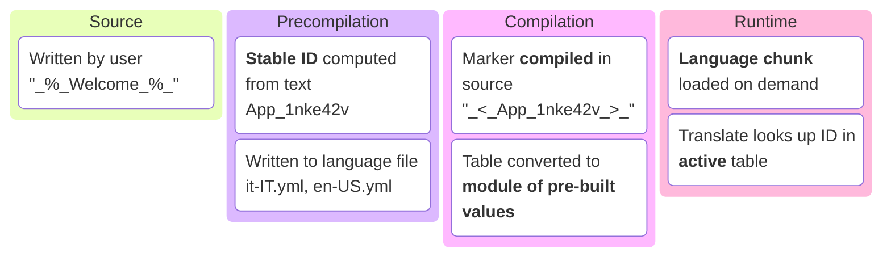
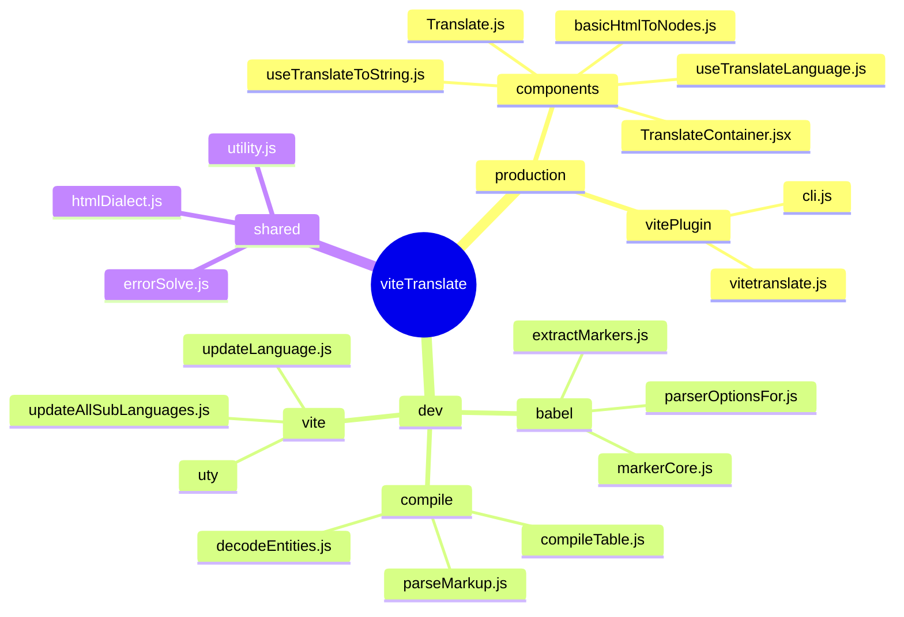
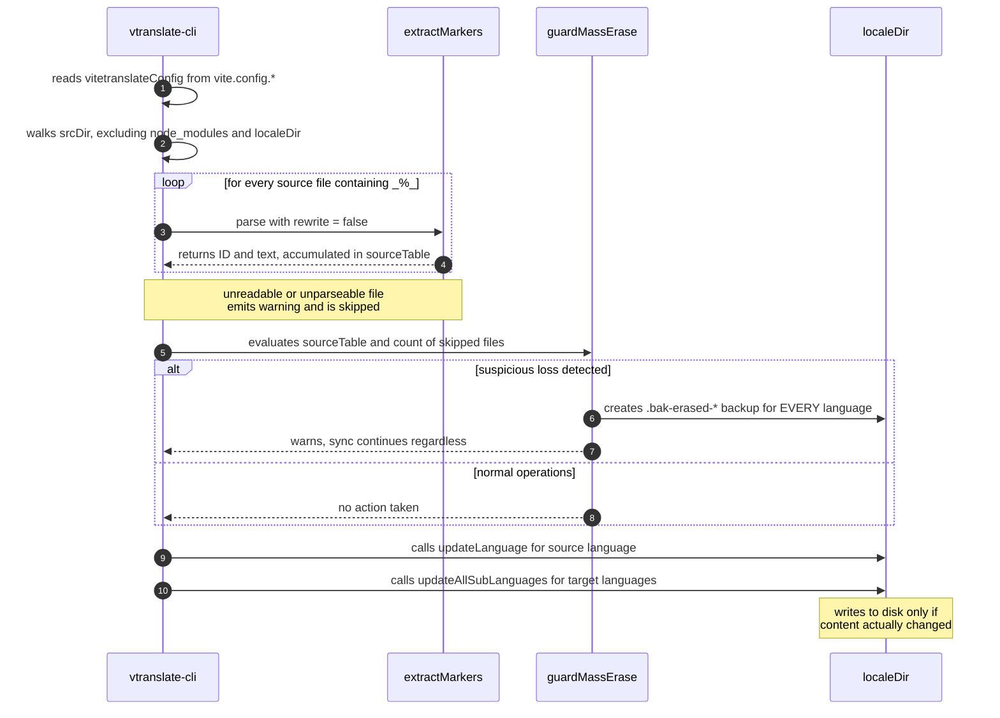
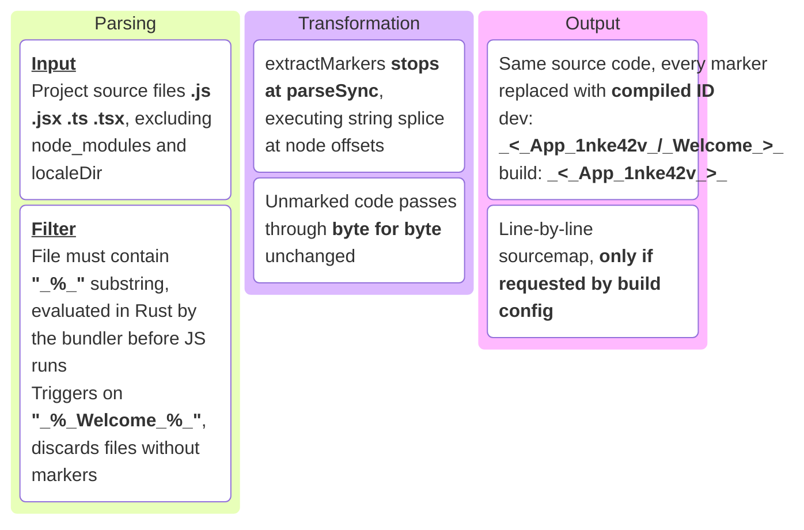
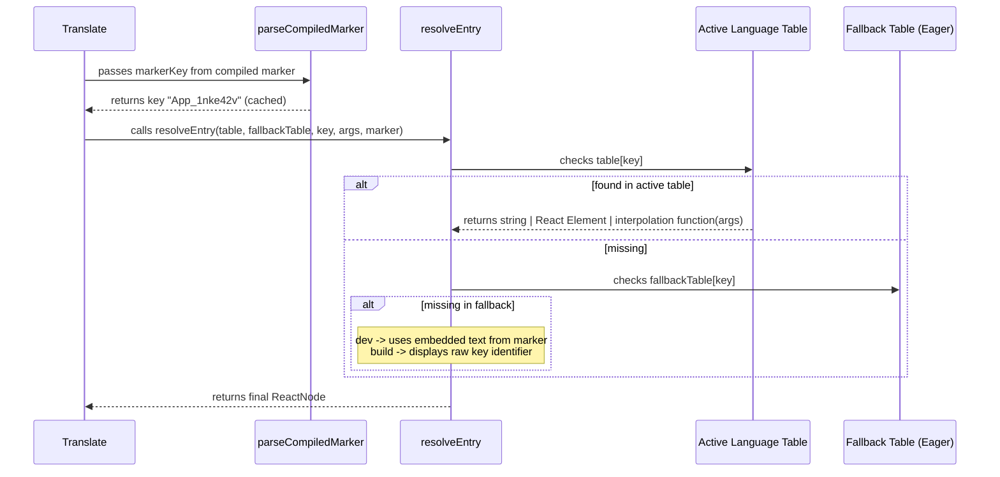
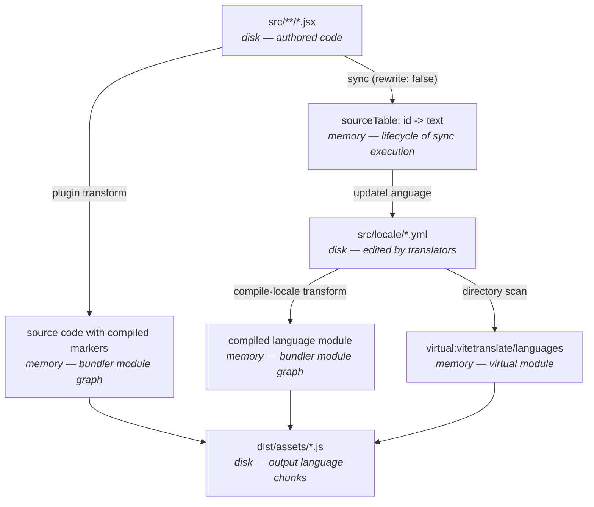
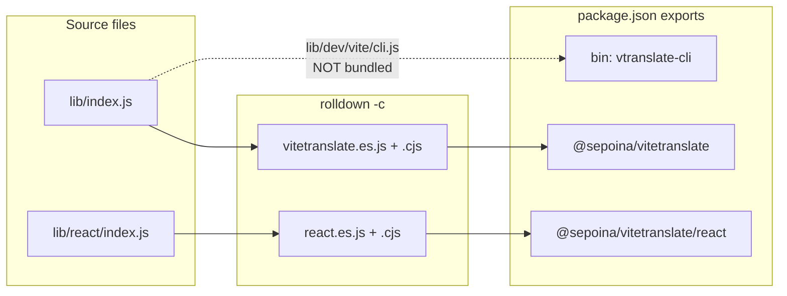

# How viteTranslate Works Under the Hood

> Architecture reference document: what happens to a marked string from the moment you write it to when the browser displays it, which files transform it, and what intermediate artifacts exist along the way.
>
> The [README](../README.md) covers _how to use_ the library; this document covers _how it is built_.

## Maintenance — read before modifying the library

**This document is the source of truth for the architecture and must be updated in the same commit as the code it describes.** Every source file in `lib/` carries a pointer at the top referencing the relevant section: if you are changing a file's behavior, updating the corresponding section is part of the change, not a follow-up task to remember later.

This applies to everyone, including LLM sessions: if you are asked to touch `lib/`, read the relevant section and the list of [invariants not to break](#invariants-not-to-break) first, then update the document alongside the code.

The order of truth when something doesn't match: **the code is what actually runs**, so if it diverges from the document, it's the document that needs to be fixed — not the other way around. Links always point directly to the file that makes the actual decision, making verification a single click away.

To find all pointers in the codebase: `grep -rn "doc/structure.md" lib/`.

---

## Table of Contents

- [Maintenance — read before modifying the library](#maintenance--read-before-modifying-the-library)
- [The core idea in one page](#the-core-idea-in-one-page)
- [File map](#file-map)
- [Phase 0 — Authoring: the marker](#phase-0--authoring-the-marker)
- [Phase 1 — Precompilation: the sync command](#phase-1--precompilation-the-sync-command)
- [Phase 2 — Compilation: the two Vite transforms](#phase-2--compilation-the-two-vite-transforms)
- [Phase 3 — The virtual module and code splitting](#phase-3--the-virtual-module-and-code-splitting)
- [Phase 4 — Runtime: the resolution chain](#phase-4--runtime-the-resolution-chain)
- [Intermediate files, in order](#intermediate-files-in-order)
- [Package distribution](#package-distribution)
- [Testing](#testing)
- [Invariants not to break](#invariants-not-to-break)
- [Quick reference](#quick-reference)

---

## The core idea in one page

All i18n libraries ask you to invent a key (`welcome.title`) and keep it manually aligned with a translation table. viteTranslate removes that step: **the key is computed during build** directly from the text itself.

You write `_%_Welcome_%_` in your source code. From there on:



The ID is `<sanitized name>_<FNV-1a base36 hash>`: the checksum covers the text **and the file's relative path** (normalized to `/`), while the prefix is the basename reduced to `[A-Za-z0-9]` — prefixed with `n` if it starts with a digit, or `unNamed` if it collapses to nothing. Deterministic: the same text in the same file always produces the same key, without anyone having to write it.

There are three phases, running at **different moments in time**. This is the most important concept to keep in mind:

| Phase | When it runs | Executed by | Output produced |
| --- | --- | --- | --- |
| **Precompilation** | before the build, via CLI command | [`cli.js`](../lib/dev/vite/cli.js) | language `.yml` files **on disk** |
| **Compilation** | during `vite dev` / `vite build` | Vite plugin | compiled markers + compiled tables **in memory** |
| **Runtime** | in the browser | React runtime | the React node to render |

Why two separate steps instead of one? Because they perform different tasks at different times. **Precompilation** writes language files to disk **before** the build starts. **Compilation** works **inside** the build: it reads those pre-built files and transforms them in memory, without ever touching the disk.

If these two tasks were combined into a single step inside the build process, the result would depend on an internal build detail that no one controls from the outside — the order in which the bundler executes its internal hooks. Keeping them separate removes that dependency: when the build starts, the language files are already written and stable, always, regardless of how the bundler is organized internally. (For implementation details, see [`vitetranslate.js`](../lib/dev/vite/vitetranslate.js#L14).)

---

## File map

First, the high-level picture: what the package **exposes** versus what remains internal machinery. The complete file-by-file list follows right below.



Now the literal map. Each file carries a header reference to its relevant section:

```text
lib/
├── index.js .................... plugin entry (exports vitetranslate)
├── htmlDialect.js .............. allowed HTML tags — single source of truth for both parsers
├── errorSolve.js ............... errorSolve option: default, checks, resolution, console gates
├── utility.js .................. color logging for the sync command
├── index.d.ts · react.d.ts ..... public types for the two entry points
├── virtual.d.ts ................ type declaration for "virtual:vitetranslate/languages"
│
├── dev/ ........................ everything running in Node, never sent to browser
│   ├── babel/
│   │   ├── markerCore.js ....... marker rules: hashing, ID format, compiled marker shape
│   │   ├── extractMarkers.js ... parse + splice of source code (the extraction core)
│   │   └── parserOptionsFor.js . parser plugins required for .js/.jsx/.ts/.tsx
│   ├── compile/
│   │   ├── compileTable.js ..... string table -> JS module of pre-built values
│   │   ├── parseMarkup.js ...... HTML dialect parser without DOM (build time)
│   │   └── decodeEntities.js ... HTML entities -> characters
│   └── vite/
│       ├── vitetranslate.js .... the two Vite plugins + the virtual module
│       ├── cli.js .............. "vtranslate-cli" CLI entry
│       ├── updateLanguage.js ... source language synchronization
│       ├── updateAllSubLanguages.js  sync for all target languages
│       └── uty/ ................ sync utilities (listing, reading, writing, backup, sorting)
│
├── react/ ...................... runtime included in user's bundle
│   ├── index.js ................ public surface of "@sepoina/vitetranslate/react"
│   ├── TranslateContainer.jsx .. language state, Suspense, transition logic
│   ├── TranslateContext.js ..... React context (intentionally NOT exported)
│   ├── Translate.js ............ main component
│   ├── useTranslateToString.js . ts() helper for string-only props
│   ├── useTranslateLanguage.js . current language, list of languages, language switcher
│   ├── languageResource.js ..... cache + Suspense + chunk loading
│   ├── resolveEntry.js ......... fallback resolution chain (and 🔸 / 🔹 diagnostic prefixes)
│   ├── parseCompiledMarker.js .. compiled marker -> key (cached)
│   ├── interpolate.js .......... %s replacement for uncompiled strings
│   ├── normalizeSource.js ...... object shape { t, a } -> string or tuple
│   ├── withPrefix.js ........... attaches diagnostic prefix to string or React node
│   └── basicHtmlToNodes.js ..... DOM-based HTML parser (dev mode + public API only)
│
└── dist/ ....................... output generated by Rolldown (do not edit manually)
```

Quick reading rule: **`dev/` never enters the browser, `react/` never touches the disk.** The two files shared between both worlds are [`htmlDialect.js`](../lib/htmlDialect.js) and [`errorSolve.js`](../lib/errorSolve.js), which accordingly import nothing — neither React nor Node. They represent logic with multiple consumers, written once so it cannot diverge.

---

## Phase 0 — Authoring: the marker

The author writes text inside `_%_..._%_`. Detection is intentionally strict: the value of the node must be **entirely** a marker.

```jsx
<Translate>_%_Welcome_%_</Translate>                    // ✔ JSXText
<Translate t={["_%_Hello %s_%_", name]} />                 // ✔ StringLiteral
ts(`_%_Hello_%_`)                                          // ✔ TemplateElement
<Translate t="prefix _%_Hello_%_" />                     // ✘ not the full value
```

The reason for this strictness lies in [`extractMarkers.js`](../lib/dev/babel/extractMarkers.js): because the node is replaced _in its entirety_, the rewriting can be implemented as an offset splice on the source string rather than full AST regeneration. Marker detection rules all live in [`markerCore.js`](../lib/dev/babel/markerCore.js), which is the single place defining what constitutes a marker and how its ID is generated.

Two edge cases trigger a `console.warn` instead of failing silently, as both would otherwise only be noticed late on screen:

- **Nested markers** (`"_%_one_%_ and _%_two_%_"`): the opening tag of the first pairs with the closing tag of the second, resulting in **one** single combined key;
- **ID collision**: two different texts, same file, same 32-bit hash → one of the two texts would vanish from the translation table.

---

## Phase 1 — Precompilation: the sync command

```bash
npx vtranslate-cli   # typically executed as a "prebuild" script
```

The bin is `vtranslate-cli` from 4.1; the previous name, `vitetranslate-prepare-translation-table`, stays registered in `"bin"` as an alias so existing `prebuild` scripts keep working. Only the new one appears in the messages: `CLI_NAME` in [`cli.js`](../lib/dev/vite/cli.js) is the single place it is written, because a command that names itself two different ways is worse than one that picks.

This is the only phase that **writes** into the localization directory.



Key aspects worth knowing:

**No separate config file.** The plugin exposes its resolved configuration directly on the object it returns (`vitetranslateConfig`), and the CLI re-reads it from there: a single source of truth. For this reason [`cli.js`](../lib/dev/vite/cli.js) imports `vite.config.*` and searches for the plugin with `name: "vitetranslate"` after applying `flat(Infinity)` — the plugin returns an **array** of two plugins, and flattening is necessary to find it.

Config loading is handled by Node, not Vite: it searches for the six file extensions accepted by Vite (`.js .mjs .ts .cjs .mts .cts`, using Vite's preference order) and accepts both raw config objects and the factory function form of `defineConfig` (invoked with `{ command: "build", mode: "production" }`). The remaining limitation is Node's own runtime capability: loading a TypeScript config requires a Node version capable of stripping type annotations (23.6+, or `--experimental-strip-types`), and non-type TS syntax will fail — throwing an explicit error message instead of an opaque `ERR_MODULE_NOT_FOUND`.

**A missing `@babel/core` is reported, not dumped.** It is an *optional* peer dependency — in a React+Vite project it arrives with `@vitejs/plugin-react` and nobody ever notices — but without it nothing can be extracted. The old failure was the worst kind: [`cli.js`](../lib/dev/vite/cli.js) imported `extractMarkers` at the top, so the module blew up before `main()` ran, before the `catch` that formats errors, and on `--help` too, which has nothing to do with Babel. What came out was Node's raw `ERR_MODULE_NOT_FOUND` stack. Now `extractMarkers` is loaded at first use (the first marked line found, so a project with no markers yet is not asked for Babel just to discover there is nothing to do), and `loadConfig` — which is where the missing package actually surfaces, since loading the config pulls in the plugin — names the package and the one-line cure instead of relaying the raw message.

**The sync reports, it does not narrate.** [`updateLanguage`](../lib/dev/vite/updateLanguage.js) and [`updateAllSubLanguages`](../lib/dev/vite/updateAllSubLanguages.js) no longer log their steps; they **return** what happened — the source file's action, and one `{ tag, missing, note }` per language — and the CLI turns that into three kinds of line: the source file and what changed in it, one grouped line for every language with nothing left to do, and one line per language that still has work. What used to be one line per language, all identical but for the name, hid the only thing worth reading: who still has keys to translate. Warnings and errors are the exception and stay immediate — they are not the account of a job that went right, and holding them back to the end would detach them from the file that caused them.

**Paths are written relative to the project root**, with forward slashes, by [`shortPath`](../lib/dev/vite/uty/shortPath.js) — `src/locale/it-IT.yml`, not `D:\L\…\playEdge\src\locale\it-IT.yml`. Two effects, and the second is the one that matters: the line stops spending half its width on the part nobody reads, and VS Code's terminal turns it into a link, because it resolves relative paths against its own cwd. That is also why the root is `process.cwd()` rather than the `package.json` directory found by walking up: they are the same directory in every supported invocation — the command demands `vite.config.*` in the cwd — and where they could differ, the cwd is the one that makes the link resolve. A path outside the project stays absolute: shortening it would produce a `../../..` of the same length, ambiguous about where the file actually is. The marker warnings get this for free — [`registerMarker`](../lib/dev/babel/markerCore.js) already computes the relative path for the checksum.

**Everything the command prints goes through one column.** [`logEchoColored`](../lib/utility.js) wraps at 120 columns and continues under the same gutter, indented by two so a wrapped line cannot be mistaken for a new message; `displayWidth` counts CJK and fullwidth characters as the two columns they occupy, so the alignment holds for the very languages this library exists for. Anything that went wrong goes through `logWarning` / `logError` instead: they open the block with an empty gutter line and light the label up — orange (256-colour, so it does not blend into the yellow of everything else in a terminal) for `WARNING`, red for `ERROR`. The blank line is as much of the signal as the colour: these are the two lines you look for by scanning the output, not by reading it, and a successful sync is twenty near-identical lines for them to hide in. Anything that opens a block of its own takes the label; the lines that belong to that block stay `logEchoColored("", …)` — hence the `detail` flag on [`backupLanguageFile`](../lib/dev/vite/uty/backupLanguageFile.js), so the guard's one-backup-per-language does not read as five separate problems. Warnings raised during extraction — nested markers, id collisions — used to reach the console on their own, with the `[vitetranslate]` prefix: the right shape inside Vite's output, but in the middle of a sync they landed out of column, reading like a line from another program. [`registerMarker`](../lib/dev/babel/markerCore.js) now takes a `warn` channel (default: the console with the plugin prefix) that [`extractMarkers`](../lib/dev/babel/extractMarkers.js) passes through, so the message says what happened and whoever receives it decides how to frame it. `--status` uses the same channel to collect them and report them in its own block instead.

**`--status` reports and exits, writing nothing.** It runs the same source scan as the sync — the reference is the table just extracted from the **code**, not the source language file — and then reads every language file to report keys, missing translations, tables out of sync with the code, and errors. That reference is the whole point: comparing the tables against each other would only say whether they agree, while the question worth asking is whether they agree with the source as it is now. It returns **before** the `mkdirSync` of `localeDir`, so a command meant to tell you what state things are in never changes that state — not even by creating an empty directory. The report prints through the same gutter as everything else, and the language code goes in the table's own `CODE` column, not in the label on the left: that label says *which part of the command is talking*, and a data field is not that. The cell is coloured by the row's level, which saves a column of symbols that would say the same thing — which is also why `displayWidth` skips ANSI sequences, since counting them would make a coloured cell measure twice its width and throw off the whole table around it. Levels, from mildest to worst, are `ok < incomplete < stale < warning < error`; a row shows every note but is summarised by its worst one, and the process exits `1` on `error` only. An incomplete table is not an error: it is the normal state of a project still being translated, and failing on it would mean turning the CI check off on day one. The checks live in [`languageStatus.js`](../lib/dev/vite/uty/languageStatus.js), split into `collectStatus` (what is true) and `formatStatus` (how it reads), because the two change for different reasons.

**`--add <tag>...` creates language files, falls through to the normal sync, and closes with the `--status` report.** The new file is written **empty** on purpose: that is the documented way to add a language (see the "empty file" branch in [`updateAllSubLanguages.js`](../lib/dev/vite/updateAllSubLanguages.js)), and the same run then fills it with every key set to `null` — no second command to remember, and no file format written in two places. The report at the end is there because it answers the question `--add` was run to ask: the language just added, with its keys waiting for a translator. The plain sync does not print it — there it would be a second reading of the same lines. A tag already present is left untouched, so the flag stays idempotent and re-adding an already translated language cannot wipe it.

Tags are checked by [`validateLanguageTag.js`](../lib/dev/vite/uty/validateLanguageTag.js), on two distinct axes: **form** (`^[a-z]{2,3}-[A-Z]{2}$` — our own convention, matching the file names and [doc/bcp47.md](bcp47.md); the `{2,3}` is there because `fil-PH` is in that list) and **existence** (`Intl.DisplayNames` echoes back a code it does not know, which is the only way to tell `xy-AB` from `fr-FR` — no enumerable list of languages or regions exists). Form alone would not be enough: a typo passing the regex becomes a language file like any other, synced, compiled and shipped in the bundle, and the only symptom is one extra entry in the language selector months later. Display names are resolved in `"en"`, the one locale a `small-icu` Node always carries; if the runtime cannot answer at all, the tag passes — a local ICU limitation is not a reason to reject a real language. Every tag is validated **before** the first file is written, so `--add fr-FR xy-AB` creates nothing rather than half the request.

**`--help` (or `-h`) short-circuits before config loading.** It prints usage and the two flags, then exits `0`. The order matters: help is most often asked for right after the command failed — typically because it was run from the wrong directory — and answering `no Vite config found` to a `--help` would be the worst possible moment to be pedantic.

**Scanning runs purely for its side effects.** Setting `rewrite: false` stops right after AST parsing: rewritten code is not needed here, so it is never generated.

**A broken source file does not abort the sync process.** It is skipped with a warning — but that skip count acts as one of the signals evaluating safety in the guard below.

**`guardMassErase`** ([file](../lib/dev/vite/uty/guardMassErase.js)) is the primary safety net of the command. The extracted translation table is the sole source of truth for key deletion: anything not present in it gets removed from all language files. This is intended, but assumes the scan succeeded cleanly. If any of three triggers fire — _no markers found_, _skipped source files_, _more than half of keys scheduled for deletion_ — the guard does not block execution, but **snapshots** the prior state by saving a `.bak-erased-*` file for every language and printing a prominent warning.

**A backup is a copy of the bytes, not a transcription.** [`backupLanguageFile`](../lib/dev/vite/uty/backupLanguageFile.js) uses `copyFileSync` and falls back to writing the text it was handed only if the copy fails. The difference is the whole value of the backup: a file saved in something other than UTF-8 — which is itself one of the reasons a file reads as corrupted — decoded as UTF-8 and written back is not the same file, because every byte the decoder could not read has become a replacement character. Since the caller is about to overwrite the original, that copy is the only one left. And when there is nothing to save at all, no backup is written: an empty file named `.bak-corrupted-*` is a copy in name only, and the caller has to be able to know one does not exist.

**Renames preserve translations.** If text moves to a new file (changing its ID) while keeping identical contents, `matchRenamedKeys` in [`updateLanguage.js`](../lib/dev/vite/updateLanguage.js) matches the deprecated key to the newly introduced key with identical value. Target languages inherit the existing translation instead of resetting to `null`.

**Disk writes occur only when necessary.** Content comparison uses [`stableStringify`](../lib/dev/vite/uty/stableStringify.js) (sorting keys at every nesting level) and [`splitAndSortEntries`](../lib/dev/vite/uty/splitAndSortEntries.js) (sorting with an **explicit** `"en"` locale, preventing identical files from sorting differently on machines configured with different system locales).

### Generated language file format

```yaml
#  -------------------------------------------------
#      Italian (Italy) (sourceLanguage)
#       |    code: it-IT
#       |    missing key: 1
#       |    processed: 2026-08-24 12:37
#  -------------------------------------------------
__builder__: {"v":260824,"languageName":"Italian (Italy)","incomplete":true}
#  -------------------------------------------------
App_1nke42v: "Welcome"

#  ----to be translated------------------------------------------
App_1wltsn1: "Hello %s, how are you?"
```

### Why `.yml` and not `.js` (since 4.0)

Up to 3.x the file was a JS module (`export default { … }`). It worked, but **reading** data required **executing** code, and an entire subsystem grew out of that: a globals-free `vm` context for the flat form, a fallback to `import()` for everything else, and with it Node's ESM module cache — which is never flushed, has no eviction API, and retained ~24 kB per translator file save — plus a cache-busting query that had to be a hash of the content rather than the mtime, because two writes within the same filesystem tick shared the key and Node silently served the previous version. A language file is data: it is now read with `readFileSync` and parsed, and that whole class of bug has nowhere left to live.

The extension only changes **who reads the file from disk**, not what ends up in the bundle: language files never enter the module graph as they are — the `vitetranslate:compile-locale` transform replaces them (see Phase 2). The output is still one `.js` per language, identical to before.

### The format: a STRICT subset of YAML

It is not YAML: it is a subset that **YAML reads the same way**. The difference is the whole point, because full YAML fails silently on this content — and these are values a translator really writes:

| written unquoted | what YAML makes of it |
| --- | --- |
| `App_a: %s is ready` | **syntax error** (`%` is a reserved indicator — and it is our placeholder) |
| `App_a: price 5 # discount` | `"price 5"` — **silently truncated** |
| `App_a: Note: important` | syntax error |
| `App_a: 1.20` / `007` | the number `1.2` / `7` |
| `App_a: null` | the "to be translated" `null`, not the text "null" |
| `App_a: [one, two]` | an array |
| `App_a:·· padded ··` (with edge spaces) | edge spaces lost |

So the parser accepts little, and strictly. The permitted forms, one per line, **all at column 0**:

```yaml
# whole-line comment                 (the generated header is made of these)
Key_abc: "text"                      # JSON.parse of the value
Key_abc: null                        # not yet translated
Key_abc:                             # same — what remains after deleting the null
__builder__: {"v":1,…}               # only this key may hold an object
```

Everything else is an error carrying the **line number**: unquoted value, indented line, colon without a following space (`Key:"x"` is a string to YAML, not a map), trailing comment on a line with a value, duplicate key (js-yaml itself rejects them, and a line-based parser would silently let the last one win). The parser is [`parseLanguageFile.js`](../lib/dev/vite/uty/parseLanguageFile.js), ~40 lines, no dependencies.

Three more rejections exist for one reason each — every one of them used to parse cleanly and fail somewhere else, far from the line that caused it:

| rejected | because |
| --- | --- |
| `__builder__:` / `: null` / `: "v1"` | it is the one entry the rest of the library dereferences without asking (`sourceTable.__builder__.v`). Clearing its value by hand read fine and dropped the build much later, on a `TypeError` with no line number. |
| `toString:`, `constructor:`, `__proto__:`, … | names every object already has. `__proto__` does not even create a property; the others do, but they were "present" before the file existed — and the sync decides with `key in table`, which walks the prototype. Such a key never counts as surplus, so it is never removed: it stays in the file forever. `sanitizeName` cannot produce any of them. |
| a NUL byte anywhere | the file is not UTF-8. A language file saved as UTF-16 (Windows Notepad, "Unicode") reads back as the right text with a NUL between every character; the error used to talk about syntax, and the encoding was unguessable. |

Error messages quote the offending line, and that quote is stripped of control characters first: the text comes from a file that is by definition not what we expected, and an ANSI sequence left in it would not appear in the message — it would recolour it, or erase the line it is being written on.

The rule that holds it all together lives on the writing side: **every value goes through `JSON.stringify` and nothing else**. JSON is a subset of YAML 1.2, so what we write is read identically by both sides. It only takes "prettifying" a line by hand — dropping the quotes around a key inside `__builder__`, say — for the two to start reading different things without saying so. `languageFileIO.test.mjs` checks exactly this: it serializes a table of hostile values and compares our parser against `js-yaml`, line by line.

Keys need no quotes and cannot ever need them: `sanitizeName` in [`markerCore.js`](../lib/dev/babel/markerCore.js) reduces them to `[A-Za-z0-9]` plus the checksum, so they never contain `:` — and that is what makes it safe to cut the line at the first `:` character.

The header and `__builder__` are bookkeeping regenerated on every sync — look, don't edit; `incomplete` is written only when `true`, because `false` is the implicit value restored on reading.

### Empty, emptied, unreadable

Three states that look alike from a distance and lead to three different decisions:

- **empty file** (zero bytes, or whitespace only) → this is the documented way to add a language: it gets populated with the source keys set to `null`, with no backup, because there is nothing to lose;
- **file with content but no entries** (entries deleted, header left behind) → this is **not** a new language, it is an emptied one. `parseLanguageFile` reports it as an error on purpose, so it lands in the `.bak-corrupted-*` backup branch instead of being silently repopulated;
- **file that does not open at all** (a *directory* named `fr-FR.yml`, permissions, a dangling symlink) → we do not know what is in it, so it is neither backed up nor rewritten: **nothing that could not be read is ever overwritten**. It is reported and left exactly where it is, while every other language syncs as usual. Backing it up would have written an empty file and called it a copy; rewriting it would have replaced unknown content with a table reconstructed from the scan.

The three are told apart by [`readLanguageFile`](../lib/dev/vite/uty/readLanguageFile.js), which returns `undefined` for the first and throws for the other two — with `unreadable: true` on the third. The error also carries the text it was parsing (`sourceText`), so the caller that has to back it up does not read the file a second time: between the two reads the file can change, and the backup would then snapshot something other than what caused it.

### Migrating from 3.x

`vtranslate-cli --migrate` converts the `<tag>.js` files in `localeDir` into `<tag>.yml` and renames the originals to `.bak-migrated-*` instead of deleting them; then you re-run the command without the flag to resync. It runs only on explicit request — it rewrites files, and doing that on its own inside a `prebuild` nobody is watching would be the wrong thing. If the plugin finds `localeDir` still full of `.js`, it stops and says exactly that instead of the generic "sourceLanguage not found". [`migrateLegacyLanguages.js`](../lib/dev/vite/uty/migrateLegacyLanguages.js) is the only place left in the library where code is still executed to read data, and it lives in a command you run by hand, once.

In target languages, untranslated keys hold `null` values. In the source language file, keys are never `null`, but missing translations remain listed below the separator comment as long as they lack translation **in at least one other target language**: this provides a documented shortcut to copy the block of missing source strings directly to a translator (human or LLM).

---

## Phase 2 — Compilation: the two Vite transforms

[`vitetranslate(defs)`](../lib/dev/vite/vitetranslate.js) returns **two** plugins, not one. This is an architectural boundary: they operate on **disjoint** sets of files using different filters, and each plugin completely ignores the other's targets.

### Plugin 1 — `vitetranslate`: transforms your source files

Runs on project source files (`.js`, `.jsx`, `.ts`, `.tsx`) and replaces every marker string with its compiled representation. Text like `_%_Welcome_%_` becomes `_<_App_1nke42v_/_Welcome_>_` in dev mode (embedding the fallback string) or `_<_App_1nke42v_>_` in production build.



### Plugin 2 — `vitetranslate:compile-locale`: transforms language files

Runs on the `.yml` files inside `localeDir` and converts them from a string table into a JS module of ready-to-use values. The file on disk is never touched: the conversion lives only in the bundler's module graph.

```mermaid
kanban
  lin[Selection]
    l1[<b><u>Input</u></b><br/>Language files in localeDir — the <b>string table</b> edited by translators]
    l2[<b><u>Filter</u></b><br/>Module ID must reside inside <b>localeDir</b> and end in .yml — no subdirectories, the same convention the plugin uses to discover languages<br/>Matches "src/locale/en-US.yml", ignores "src/locale/old/en-US.yml"]
  llavoro[Transformation]
    l3[parseLanguageFile reads the table from the content Vite already loaded — <b>parsed, not executed</b>: no import(), no vm, nothing left behind]
    l4[compileLanguageModule converts each entry into <b>string, React element, or interpolation function</b>]
    l5[Source language table fills untranslated keys, rendering the module <b>self-contained</b>]
  lout[Output]
    l6[Pre-compiled value module, residing <b>exclusively in module graph</b><br/>from translation text to <b>pre-constructed</b> React values]
    l7[<b>No sourcemap emitted</b> — transformed module no longer correlates line-by-line with disk representation]
```

### Why two plugins instead of one

A Vite/Rollup plugin exposes **one** `transform` hook, bound to **one** filter. The two compilation steps cannot share a single transform for two independent reasons:

1. **The first plugin's filter is content-based, not path-based.** It is declared as `filter: { code: "_%_" }`: the bundler evaluates this in Rust before invoking JavaScript, discarding any file whose code lacks that substring. A language translation file contains translated text (`"Hello %s"`), never the marker syntax `_%_`: by definition, it would **never** pass that filter regardless of handler logic. Attaching translation table compilation there would result in dead code.
2. **Even with a wider filter, a single handler would have to process two opposite transformations.** Source files need a surgical `parseSync` modifying only markers (2a); language files need to read full tables and rebuild them completely from scratch (2b). These are different algorithms operating on different inputs: combining them into one `transform` would force manual JS dispatching for work that Rust filters execute natively.

Therefore, [`vitetranslate(defs)`](../lib/dev/vite/vitetranslate.js) exports **two distinct plugin objects** — each with its dedicated `transform` hook and filter — avoiding complex conditional dispatch logic inside a single handler.

### 2a. Extraction: parse and splice, not a transform pipeline

The conventional AST transformation approach in Babel is: parse code, traverse the full AST using visitor patterns (`NodePath`, scope tracking), replace nodes, and re-generate code with `generate()`. [`extractMarkers.js`](../lib/dev/babel/extractMarkers.js) skips everything after parsing: it identifies exact character offsets of marked nodes in the AST and replaces them via string `splice` on the original source code.

This is feasible because replacements are strictly bounded — affecting only nodes whose value is **entirely** a marker string — requiring only start/end character offsets. Benchmarked on playground sources: **2.3 ms** for parse-only versus **18.7 ms** for full AST visitor transformation with `generate()` and sourcemaps. Parsing was never the bottleneck; AST traversal and code generation were.

A side benefit is that unmarked code remains **byte-for-byte identical** to the source input: retaining original comments, formatting, and annotations (`@__PURE__`, `@vite-ignore`) that AST code generation might otherwise mutate or strip.

Using string slicing instead of AST regeneration requires three specific handling rules to maintain syntax validity:

- **Inside JSX text nodes (`JSXText`), replacements cannot be raw strings.** A compiled marker contains literal `<` characters (e.g., `_<_App_1nke42v_>_`). A literal `<` inside JSX text would be parsed as an opening element tag rather than text. It must be wrapped in a JSX expression — `{"_<_App_1nke42v_>_"}` — which JSX treats as a standard string expression, preserving valid markup syntax.
- **Newlines spanned by a replaced `JSXText` node are re-appended at the end of the replacement string.** Replacing a multi-line string block with a single-line replacement expression would shift subsequent line numbers upward. While sourcemaps handle position mapping for many tools, React's compilation plugin injects source line numbers directly as *literal runtime arguments* inside `jsxDEV(...)` calls. If line counts shifted, DevTools and error stack traces would point to incorrect source lines. Re-injecting swallowed newline characters preserves exact line counts at zero cost (as JSX collapses trailing whitespace newlines anyway).
- **The plugin does not compile JSX syntax; it configures Babel parser plugins solely to *parse* it.** Running with `enforce: "pre"`, it executes before the project's React transformation plugin. Its sole duty is substituting marker syntax while leaving JSX intact. Consequently, [`parserOptionsFor.js`](../lib/dev/babel/parserOptionsFor.js) enables syntax parsing options for JSX/TypeScript without applying `@babel/preset-react`. This leaves decisions regarding `jsxDEV`, `jsxImportSource`, and Fast Refresh entirely to the project's configured React plugin.

### 2b. Table compilation: pre-building values

This step converts raw text tables on disk into optimized JavaScript module structures. [`compileTable.js`](../lib/dev/compile/compileTable.js) converts entries into one of four representation shapes:

| Input text structure | Compiled module representation |
| --- | --- |
| plain text | literal string |
| plain text with `%s` placeholders | `a => _cat(["...", _arg(a, 0), "..."])` |
| HTML markup | pre-constructed React element tree (built **once**) |
| HTML markup with `%s` | `a => jsxs(...)` with placeholders as React JSX children |

Concrete consequences:

1. **HTML parser execution is removed from runtime.** Markup syntax is parsed at build time by [`parseMarkup.js`](../lib/dev/compile/parseMarkup.js) without needing a DOM environment — enabling `<Translate>` to render seamlessly during Server-Side Rendering (SSR).
2. **Arguments can be arbitrary React nodes.** Calling `t={["_%_Logged in as <b>%s</b>_%_", <Link/>]}` inserts the actual React element inside the `<b>` element, because `%s` compiles into a JSX child rather than string concatenation. Values are handled safely without unescaped HTML injection.
3. **Static markup entries maintain stable identity across renders**, allowing React to bypass subtree re-rendering automatically. `<Translate>` requires no internal `useMemo`: reference stability is guaranteed by the compiled module structure.
4. **Every compiled language module is self-contained.** By cross-referencing `sourceTable`, any key that is `null` or missing in a target language is automatically populated with the compiled source language fallback value. Consumers do not need to load the source language bundle separately to display fallback content.

However, point 4 introduces a constraint: **after compilation, an untranslated fallback entry is indistinguishable from a genuinely translated string.** To preserve diagnostic capabilities, enabling `emitUntranslated` (active when the diagnostic mark `errorSolve.mark.untranslated` is enabled) embeds an internal tracking map inside the compiled module:

```js
export default {
  "App_1nke42v": "Hello world",
  "App_1wltsn1": "Ciao %s",                      // populated from source fallback: untranslated
  "__untranslated__": { "App_1wltsn1": 1 },      // explicit tracking key
};
```

This map records keys that were `null` or omitted in the source translation file. The structure uses a key-to-`1` map object so runtime checks ([`prefixFor`](../lib/react/resolveEntry.js)) perform $O(1)$ property lookups on render instead of array scans. In default production builds, this object is omitted entirely.

Helper functions `_arg` and `_cat` are **inlined directly within each compiled chunk** rather than imported from the package runtime. This ensures language chunks remain completely self-contained without relying on module path resolution from user output directories, while bundler minifiers compress helper definitions down to single-character identifiers.

`_cat` handles string concatenation when placeholders are resolved: if all arguments are primitive types, it returns a plain string; if **any** argument is a non-primitive value (such as a React element), it constructs a React Fragment. Standard `+` string concatenation would produce stringified `"[object Object]"` output.

> Source files on disk **are never altered** during this compilation phase. Table compilation exists strictly in the bundler's module graph.

### HTML dialect specification

Allowed tags are restricted to: `<b> <strong> <i> <em> <u> <small> <code> <br> <hr> <wbr>`. Any other tag is **stripped while retaining its inner text content** (`<div>hello</div>` → `hello`); attributes are stripped unconditionally.

Tag lists are defined in [`htmlDialect.js`](../lib/htmlDialect.js), consumed by both the build-time parser and the runtime DOM parser. Shared definition prevents discrepancies between development behavior and compiled production bundles.

The single known structural difference between parsers involves **overlapping/misnested tags** (`<b>x <i>y</b> z</i>`): browser DOM parsing automatically repairs markup by re-opening `<i>` on subsequent text nodes (HTML5 adoption agency algorithm), whereas the build parser does not. A build-time warning is logged when misnested tags are detected.

---

## Phase 3 — The virtual module and code splitting

`virtual:vitetranslate/languages` serves as the primary bridge between build execution and browser runtime. Generated by `generateLanguagesModule()` in [`vitetranslate.js`](../lib/dev/vite/vitetranslate.js), it outputs the following structure:

```js
import __vt_pre_0 from "/path/to/src/locale/it-IT.yml"; // eager language: STATIC import

export const languages = {
  "it-IT": { name: "Italian (Italy)", preloaded: true, table: __vt_pre_0, load: () => Promise.resolve({ default: __vt_pre_0 }) },
  "en-US": { name: "English (US)", preloaded: false, load: () => import("/path/to/src/locale/en-US.yml") }, // dynamic chunk
};
export const sourceLanguage = "it-IT";
export const fallbackTable = __vt_pre_0;
export const errorSolve = { badData: "🚫", malformed: "‼️", untranslated: "🔸", notFullyTranslated: "🔹", absentDataInArray: "⁇", warn: true };
export const partiallyTranslated = { "App_1wltsn1": 1 };
```

Each configured language is represented by an entry containing its loading state and metadata.

The diagnostic options exported (`errorSolve`) contain pre-resolved values: options like `markOnlyDev` and decisions between `warningDev`/`warningBuild` are evaluated at build time based on `isProduction`. The runtime consumes plain configuration values directly without reading `import.meta.env`. Empty strings indicate disabled diagnostic marks, which is what default production builds output.

`errorSolve` mirrors the configuration structure of `errorSolve.mark` in `vite.config.js`. The exported `warn` boolean represents the active console logging state.

`partiallyTranslated` identifies keys that lack translation in **at least one** configured language. Computing this requires inspecting all language tables concurrently during build. (While individual compiled tables track their own missing keys via `__untranslated__`, cross-language completeness requires a holistic view.) The manifest builds this map using the tables already loaded in memory, avoiding extra disk I/O. If the corresponding diagnostic indicator is disabled, an empty object is emitted.

**Eager language bundling behavior** varies by environment:

| Environment | Eagerly loaded languages |
| --- | --- |
| **dev** | `[...preloadedLanguages, sourceLanguage]` — source language is always included statically to avoid React Suspense triggers during active feature development |
| **build** | `preloadedLanguages` if non-empty; otherwise `sourceLanguage` |

In production builds, forcing the source language to load eagerly is unnecessary because compiled target tables are already self-contained.

Array ordering is strictly preserved: `sourceLanguage` is placed **at the end** of the eager list, ensuring "first preloaded language" consistently evaluates to `preloadedLanguages[0] ?? sourceLanguage` in both development and production. This guarantees that applications without an explicit `initialLanguage` start on the same language in dev as in production.

The `preloaded` boolean flag is bundled directly into language descriptors, enabling `TranslateContainer` to issue warnings in production if an initial language was requested without being preloaded.

### Dependency optimization exclusion

`lib/dist/react.es.js` imports `virtual:vitetranslate/languages`, a virtual ID that exists **only** via this plugin. Esbuild's dependency pre-bundling step runs in a separate process that does not execute Vite project plugins. On Vite ≤ 7, the development server would fail on startup with:

```text
✘ [ERROR] Could not resolve "virtual:vitetranslate/languages"
    node_modules/@sepoina/vitetranslate/lib/dist/react.es.js:6:57
Error: Error during dependency optimization
```

To prevent this, the plugin's `config()` hook automatically sets `optimizeDeps: { exclude: ["@sepoina/vitetranslate"] }` (covering `/react` as well). The plugin handles this exclusion automatically, requiring no manual consumer setup.

⚠️ **Local workspace testing note**: If a test playground uses local path dependencies (`"@sepoina/vitetranslate": "file:.."`), linked packages bypass dependency pre-bundling. Resolution errors of this type are only reproducible when testing packages installed as npm registry dependencies. Always test build artifacts against registry-installed packages before releasing.

### Dev server hot reload behavior

`configureServer` sets up file system watching on `localeDir` and handles updates as follows:

- **Language file added or deleted** → changes the set of available languages → invalidates the virtual module;
- **Language file content modified** → virtual module manifest remains valid, but a full browser reload is triggered because client-side modules cache compiled tables in memory. If the modified file is the **source language**, *all* compiled language modules are invalidated: target language transforms embed source fallback strings into their compiled output, a dependency Vite cannot infer automatically from module import graphs.

An **exception** to full reloads occurs when the `🔹` (`partiallyTranslated`) indicator is active: changing translations alters cross-language completeness. When this diagnostic mark is enabled, modifying any language file re-compiles the virtual manifest immediately to clear the `🔹` indicator on newly translated strings without requiring a server restart.

The `.yml` extension filter is not cosmetic: without it, the `.bak-corrupted-*` / `.bak-erased-*` / `.bak-migrated-*` backups left alongside by the sync command triggered page reloads.

### Automatic language file creation

The plugin handles file creation gracefully based on configuration rules:

- A `.yml` file found in the directory but **empty** → recognized as a new language, populated on the fly with all source keys set to `null`;
- An **invalid** `.yml` file (a malformed line, or no entries at all) → excluded with an error reporting the line number, never blindly overwritten: it may contain recoverable work;
- A language listed in `preloadedLanguages` whose file **does not exist at all** → created on the fly, because it is an explicit declaration in `vite.config.js`, not a discovery.

---

## Phase 4 — Runtime: the resolution chain



Lookup resolution precedence: **Active language table → Eager fallback table → Marker-embedded text (dev only) → Raw key string.** The system guarantees rendering output under all circumstances: even network failures when loading language chunks fall back gracefully to the eager table without crashing.

Embedded fallback text exists specifically for development workflows: when a developer writes a new string, the compiled marker contains the text immediately, but locale files on disk only receive the key after running the sync command. In production builds, `includeFallback` defaults to `false` (since prebuild scripts execute sync prior to bundling), stripping fallback text parsing code and `basicHtmlToNodes` imports from the client bundle.

### Diagnostic prefixes

To prevent missing translations from silently rendering fallback text unnoticed during development, `errorSolve` prepends visible diagnostic indicator characters in development builds by default:

| Prefix | Condition | Source of truth |
| --- | --- | --- |
| `‼️` | String was not wrapped in a translation marker (unless `skipMark` is passed), or invalid property combinations were passed | Evaluated directly inside `Translate.js` / `useTranslateToString.js` |
| `🔸` | Active language lacks a translation for this key | Checked against `table.__untranslated__` (§ 2b) or missing key entry |
| `🔹` | Key is translated in active language, but missing in at least one other language | Checked against `partiallyTranslated` map (§ Phase 3) |
| `🚫` | Non-textual value passed where text was expected: nothing to display | Evaluated inside `Translate.js` (see section below) |

**Only one prefix is rendered per string, adhering strictly to priority order.** If a translation is missing in the currently viewed language (`🔸`), showing that it is also missing in another language (`🔹`) adds no value. During recovery paths, when `‼️` triggers, text passes through using `diag.malformedOnly`, which suppresses lower-priority prefixes. `🚫` does not participate in precedence ordering because it only applies when there is no text content to display.

`‼️` alters runtime behavior for unmarked strings: **unmarked text no longer throws fatal render errors.** Previously, passing unmarked text to `<Translate>` in dev mode threw an error and rendered `[...]`. However, string properties often receive non-translatable dynamic data (e.g., phone numbers, dynamic IDs, backend response values). Forcing callers to check marker presence before rendering placed internal library format checks onto user code. Component rendering now inspects inputs gracefully:

Invalid usage attempts recovery: `salvage()` extracts the best available text candidate among `o`, `t`, and `children` properties — returning string content prepended with `‼️`. Passing an object lacking a `t` property is not recognized as a valid `{ t, a }` tuple structure and renders empty string output without prefixes.

#### Missing text data: `🚫[type]`

When `salvage()` evaluates `o`, `t`, and `children` without finding valid text (e.g., functions, symbols, React elements passed as translation keys, or empty tuples), no text content exists to display. The runtime identifies the unexpected data type instead:

| Provided Input Value | Rendered Output (Dev Mode) |
| --- | --- |
| `t={() => {}}` | `🚫[func]` |
| `t={Symbol("x")}` | `🚫[symbol]` |
| `t={true}` | `🚫[true]` |
| `t={[]}` | `🚫[array]` |
| `t={[null]}` | `🚫[nullArray]` |
| `t={[<i/>]}`, `t`+`children` both elements, `o`+`t` both elements | `🚫[badDom]` |
| any other unrenderable shape | `🚫[badData]` |

Type names are extracted by inspecting the **first argument position** (e.g., `t` inside objects or first tuple item). For `t={[<i/>]}`, the relevant error is that an element was supplied where text belonged. `array` and `nullArray` identify tuple structures whose target text position is missing or null. Inspection depth is strictly limited to guard against cyclic structures (e.g. `const a = []; a[0] = a;`), preventing `RangeError` call stack overflows during rendering.

These indicators are controlled by `markOnlyDev` like all diagnostic marks. **When disabled, they render an empty string**: displaying internal data type names directly to end users in production is undesirable. In default production builds, invalid inputs render as `""` (where older versions rendered `[...]`). Warnings continue logging to the browser console according to `warningDev`/`warningBuild` settings.

### Dynamic non-marked values: `skipMark`

String inspection alone cannot determine intent: an unmarked string could be an accidentally omitted marker or intentionally non-translatable dynamic text (e.g. API field values, URLs, user names).

Passing `skipMark` explicitly declares that an unmarked string is expected. It suppresses `‼️` indicators and duplicate console reporting while retaining standard placeholder interpolation and marker stripping behavior:

```jsx
<Translate t={row.label} skipMark />
ts(row.label, args, { skipMark: true })   // functional API counterpart
```

On **marked** strings, `skipMark` has no effect: standard translation lookup occurs, and missing translation indicators (`🔸` / `🔹`) continue to display normally. `skipMark` does not mean "bypass translation"; it means "unmarked string input is valid here".

Setting `errorSolve.mark.malformed: false` globally disables malformed string warnings across the entire application, masking genuinely forgotten markers. `skipMark` selectively suppresses warnings at specific call sites while keeping global diagnostics active.

### Console logging control

`warningDev` and `warningBuild` govern **all** console logging produced by the library at runtime via `report()` in [`errorSolve.js`](../lib/errorSolve.js).

⚠️ Note: Setting `warningBuild: false` suppresses all production console output, including critical runtime warnings (such as failed chunk downloads or missing preloaded languages). Setting `warningBuild: true` re-enables production console logging.

Build-time plugin warnings logged in Node during compilation (prefixed with `[vitetranslate]`) operate independently of runtime console settings.

### Suspense integration and language switching

[`languageResource.js`](../lib/react/languageResource.js) maintains a module-level cache shared across container instances, enabling seamless React Suspense integration: `readLanguage` executes **during the render phase** and throws a loading Promise if the target language chunk is pending — matching `React.lazy` semantics.

Failed network requests **are not stored permanently in the cache**: a failed chunk download (e.g., due to temporary network failure) can be retried later without permanently locking the user out of selecting that language.

Language changes execute within `React.startTransition`: React keeps rendering the current language UI until the newly requested language chunk resolves. Because render passes evaluate current state, stale promises from outdated rapid language switches are discarded automatically.

#### Retry handling and state structure

Container state is stored as an object `{ tag, epoch }` rather than a plain string tag. `epoch` serves specifically to generate a **new object reference**, forcing React to schedule a re-render.

This structure handles manual retry actions. If a language chunk download fails, the active state `tag` matches the requested tag. Calling `setLang(sameTag)` directly would trigger React's state bail-out optimization, skipping re-rendering. `ensureLanguage` resets the failed cache state, and updating `epoch` forces a fresh render pass that re-executes `readLanguage`.

[`nextLanguageState`](../lib/react/languageResource.js) evaluates state transitions, returning the existing state reference `prev` only when no observable UI change would occur. `hasFailedLanguage(tag)` is checked **before** calling `ensureLanguage`, as re-arming the resource clears error state records.

#### Rendered language identifier vs requested language tag

If a language chunk fails to download, `readLanguage` falls back to rendering the eager fallback table. The component context exposes `firstPreloadedLanguage` as the active display tag rather than the failed requested tag: this ensures `useTranslateLanguage().id` accurately reflects what is currently rendered on screen.

### Private APIs

`TranslateContext` is intentionally kept private: context value structures expose `table` maps whose internal schema must remain free to evolve. Applications should interact with language state exclusively via `useTranslateLanguage()`.

### Immutable runtime structures

Shared runtime objects exposed to external application code are protected using `Object.freeze`:

| Structure | Location |
| --- | --- |
| `languages` array and items | [`useTranslateLanguage.js`](../lib/react/useTranslateLanguage.js) |
| Object returned by `useTranslateLanguage()` | [`useTranslateLanguage.js`](../lib/react/useTranslateLanguage.js) |
| `preloadedLanguages` array | [`languageResource.js`](../lib/react/languageResource.js) |

`languages` is a module-level singleton: mutating its properties directly would corrupt language state globally across the application lifetime. Freezing these structures ensures accidental mutations (such as array sorting or assignment typos like `filter(l => l.tag = id)`) throw explicit `TypeError` exceptions immediately at the mutation site rather than causing silent runtime bugs.

Object freezing remains active in production builds. The performance cost is limited to initial module evaluation.

`languages.sort()` and `languages.reverse()` mutate arrays in-place and will throw on frozen arrays. Code that sorts language lists must operate on a copied array (`[...languages]`).

---

## Intermediate files, in order

Understanding **which artifacts exist physically on disk versus those residing purely in memory**:



| Artifact | Location | Written by | Hand-edited? |
| --- | --- | --- | --- |
| `src/locale/it-IT.yml` (source) | disk | sync command, entirely | **no**, fully auto-generated |
| `src/locale/xx-XX.yml` (targets) | disk | sync command (keys), **human** (values) | yes, translation values only |
| Top header comment + `__builder__` | disk, inside locale files | sync command | **no**, overwritten on sync |
| `.bak-corrupted-*` / `.bak-erased-*` | disk, alongside locale files | safety backup routines | backup copies for inspection |
| Compiled language tables | bundler module graph only | `compile-locale` plugin | does not exist as physical file |
| Virtual language manifest module | bundler module graph only | `vitetranslate` plugin | does not exist as physical file |
| `lib/dist/*` | disk, inside package repo | `rolldown -c` | **no**, build output |

To **inspect** compiled translation tables as transformed by the bundler:

```bash
npm run dump   # outputs test/exampleLangCompile.mjs to test/exampleCompiled/ (git-ignored)
```

---

## Package distribution



Bundled into four distribution outputs via [`rolldown.config.js`](../rolldown.config.js) across two entry points and one executable binary:

- **CLI executable remains unbundled**: `bin` points directly to [`lib/dev/vite/cli.js`](../lib/dev/vite/cli.js), running as native ESM in Node;
- **Plugin externals**: `path`, `fs`, `url`, `vm`, `@babel/core` — Babel is an **optional** peer dependency and is never bundled into client output;
- **Runtime externals**: `react`, `react/jsx-runtime`, `react/jsx-dev-runtime`, and `virtual:vitetranslate/languages`;
- **JSX compilation**: processed via Babel during build using `runtime: "automatic"`;
- **CJS fallback environments**: sets `import.meta.env` to `{}` to ensure clean execution without bundler injection;
- **Version string inlining**: package version is injected directly from `package.json` at build time, avoiding runtime file system access.

The `files: ["lib"]` manifest rule includes `lib/` in published npm packages, containing both production assets and `dev/` source files required by the CLI. Directories like `playground/`, `test/`, and `doc/` are omitted from published npm tarballs.

Releases publish via GitHub Actions using npm OIDC trusted publishing, linking published package tarballs directly to source commit SHAs.

---

## Testing

Running `npm test` executes [`test/run.mjs`](../test/run.mjs), invoking each test script in `test/list/*.test.mjs` in isolated processes without test framework dependencies: a test succeeds if its process exits with code `0`. Test discovery runs automatically against directory contents.

```bash
npm test                    # run full suite
npm test -- markup marker   # run tests whose names match search terms
npm test -- -v              # verbose output including passing assertions
```

Where behavior correlates with external standards, tests validate against reference implementations:

| Test suite | Validated reference source |
| --- | --- |
| `decodeEntities` | validated against [`entities`](https://github.com/fb55/entities) package output |
| `markupParity` | verified against recorded Chrome DOM parser output in `list/markupExpected.mjs` |
| `babelTranslate` | verified against standard AST implementation in `list/babelTranslateReference.mjs` |

`extractMarkers` uses string slicing for performance. A conventional AST visitor implementation is maintained in tests as a comparative baseline. Core translation rules reside in [`markerCore.js`](../lib/dev/babel/markerCore.js) shared by both approaches, ensuring fast slicing algorithms remain behaviorally identical to standard AST transformations.

### React runtime test coverage

Three focused test suites validate the runtime resolution layer:

| Test file | Scope |
| --- | --- |
| `translateComponent` | verifies `<Translate>` props, `ts()` execution, and HTML output rendering |
| `languageResource` | verifies manifest integration and resource loading mechanics |
| `translateContainer` | mounts full container trees verifying Suspense state, initial language selection, and network failure paths |

`translateContainer` compiles `.jsx` test fixtures via Babel dynamically, injecting mock manifests with controllable `load()` promises to simulate chunk load failures on demand. Tests import isolated module instances to prevent state pollution across test runs.

---

## Invariants not to break

Architectural constraints that must be preserved to prevent subtle or silent failures:

1. **`markerCore.js` is the sole authority for what a marker is and how its ID is computed.** The checksum covers the text **and the relative path**: plugin and CLI must relativize from the same root (`baseDir`), otherwise the same string produces different keys on the two sides. Changing the hash invalidates every existing key — translations survive only if `matchRenamedKeys` re-matches them by value.
2. **`htmlDialect.js` is the single source of truth for allowed HTML tags.** Both parsers must read it, never restate it. The same holds for [`errorSolve.js`](../lib/errorSolve.js), which has four readers — whoever writes the option, the plugin that normalizes it, the plugin that resolves it, and the runtime that reads the outcome.
3. **The first eager language must resolve identically in development and production** (`preloadedLanguages[0] ?? sourceLanguage`), otherwise the app starts in a different language once published.
4. **The sync command writes; the plugin does not.** If the plugin started writing language files during the build, the hook-order dependency that led to extracting the CLI would come right back.
5. **Source code transformation must never touch `localeDir`**, not even if a translated string happens to contain `_%_`: those are data, not source.
6. **A language file is read, not executed.** No `import()`, no `vm`: reading goes through [`parseLanguageFile.js`](../lib/dev/vite/uty/parseLanguageFile.js) and nothing else. This is the reason for 4.0: as long as the file was a JS module, Node's ESM module cache was involved — never released and with no eviction API (measured: 24 kB retained per translator file save, 7 MB after 300). The only exception is `--migrate`, a manual command you run once, whose whole purpose is getting the JS modules out of the way.
   A corollary that carries as much weight as the rule: **whatever the parser accepts, a real YAML parser must read the same way.** That holds as long as every value is written by `JSON.stringify`; the parity test in `languageFileIO.test.mjs` exists to notice if it stops holding.
   And further: **empty file ≠ emptied file ≠ unreadable file.** The first is a new language to populate, the second is an error that must trigger the backup, the third must be reported and left untouched. Collapsing the first two means repopulating with `null` a file that held translations, with no safety net; collapsing the third into the second means writing an empty file, calling it a backup, and overwriting content nobody ever read.
7. **`splitAndSortEntries` must sort with an explicit locale (`"en"`).** Without it, the same table sorts differently between a development machine and CI, and files look "changed" without being so.
8. **Every divergence between build and runtime must be reported, not hidden.** This is the rule that produced the warnings about nested markers, ID collisions, and crossed tags.
9. **Diagnostics must cost nothing where they are off.** `errorSolve` is resolved at build time, so with the defaults a production build ships neither the prefixes nor the data feeding them: `__untranslated__` is not emitted in the language chunks and `partiallyTranslated` stays empty. Anyone adding a new prefix also adds the condition that avoids emitting it — otherwise every visitor pays bytes for information nobody will read. The same goes for **messages**: a template literal is evaluated before the call, so a message containing `describeValue()` — that is, a `JSON.stringify` — must be passed to `reportOnce` as a lambda together with a static key, otherwise it runs on every render even with the console off, which is the production default.
10. **Never write over what could not be read.** It applies to a language file that does not open and to the directory that holds them: `readdirSync` returns names, and a name says nothing about what is behind it — a directory called `fr-FR.yml` used to become a language like any other. [`listLanguageFiles.js`](../lib/dev/vite/uty/listLanguageFiles.js) is the one place that asks, and every scan of `localeDir` goes through it.
11. **At most one prefix per string.** Priority is `‼️` → `🔸` → `🔹`, and the saving path uses `diag.malformedOnly` precisely to avoid stacking a second one. Two glyphs in front of the same text say nothing more than the first, and make unreadable the very thing they were trying to show.

---

## Quick reference

| Topic | Primary implementation file |
| --- | --- |
| How a marker is recognized | [`markerCore.js`](../lib/dev/babel/markerCore.js) |
| How source code is rewritten | [`extractMarkers.js`](../lib/dev/babel/extractMarkers.js) |
| What shape a compiled entry has | [`compileTable.js`](../lib/dev/compile/compileTable.js) |
| The language file format | [`parseLanguageFile.js`](../lib/dev/vite/uty/parseLanguageFile.js) · [`serializeLanguageFile.js`](../lib/dev/vite/uty/serializeLanguageFile.js) |
| The allowed HTML dialect | [`htmlDialect.js`](../lib/htmlDialect.js) · [`parseMarkup.js`](../lib/dev/compile/parseMarkup.js) |
| The two plugins and the virtual module | [`vitetranslate.js`](../lib/dev/vite/vitetranslate.js) |
| The sync command | [`cli.js`](../lib/dev/vite/cli.js) · [`updateLanguage.js`](../lib/dev/vite/updateLanguage.js) |
| The safety nets on data | [`guardMassErase.js`](../lib/dev/vite/uty/guardMassErase.js) · [`backupLanguageFile.js`](../lib/dev/vite/uty/backupLanguageFile.js) · [`listLanguageFiles.js`](../lib/dev/vite/uty/listLanguageFiles.js) |
| Suspense and language switching | [`languageResource.js`](../lib/react/languageResource.js) · [`TranslateContainer.jsx`](../lib/react/TranslateContainer.jsx) |
| The fallback chain | [`resolveEntry.js`](../lib/react/resolveEntry.js) |
| Diagnostic prefixes and the console switch | [`errorSolve.js`](../lib/errorSolve.js) · [`withPrefix.js`](../lib/react/withPrefix.js) |
| BCP 47 tags | [`bcp47.md`](bcp47.md) |
| How to contribute, how tests run | [`CONTRIBUTING.md`](../CONTRIBUTING.md) |
